# APISIX Integration Architecture Diagram

The following diagram illustrates how Apache APISIX integrates as a key component in the Enterprise Agentic AI Executive Platform:

```mermaid
flowchart TB
    %% External Clients
    Client[Client Applications] --> APISIX

    %% APISIX Gateway Layer
    subgraph "API Gateway Layer"
    APISIX[Apache APISIX] --> MCPServer["MCP Server\n(Model Context Protocol)"]
    APISIX --> APISIXDashboard["APISIX Dashboard"]

    subgraph "APISIX Plugins"
        Authentication["Authentication\n(key-auth, jwt, oauth)"]
        RateLimiting["Rate Limiting"]
        CircuitBreaker["Circuit Breaker"]
        Logging["Logging & Monitoring"]
        Proxy["Proxy Rewrite"]
        CORS["CORS"]
    end

    APISIX --- Authentication
    APISIX --- RateLimiting
    APISIX --- CircuitBreaker
    APISIX --- Logging
    APISIX --- Proxy
    APISIX --- CORS
    end

    %% External AI Services
    subgraph "External LLM Providers"
        OpenAI["OpenAI API"]
        Anthropic["Anthropic API"]
        Cohere["Cohere API"]
        OtherLLMs["Other LLM APIs"]
    end

    %% Backend Services
    subgraph "Enterprise Agentic AI Platform"
        ETOrchestrator["Executive Team\nOrchestrator"]
        Executives["Executive Agents\n(Strategy, Legal, Ethics, etc.)"]
        DecisionFrameworks["Decision Frameworks"]
        DataServices["Data Services"]
    end

    %% Multi-tenant Management
    subgraph "Multi-tenant Management"
        TenantAdmin["Tenant Administration"]
        SecurityAudit["Security & Audit"]
        Governance["Governance Controls"]
    end

    %% Connections
    APISIX --> OpenAI
    APISIX --> Anthropic
    APISIX --> Cohere
    APISIX --> OtherLLMs

    MCPServer --> OpenAI
    MCPServer --> Anthropic
    MCPServer --> Cohere

    APISIX --> ETOrchestrator
    APISIX --> DataServices
    ETOrchestrator --> Executives
    ETOrchestrator --> DecisionFrameworks

    APISIX --> TenantAdmin
    TenantAdmin --> Governance
    TenantAdmin --> SecurityAudit
```

## Key Benefits of This Architecture

1. **Centralized API Management**
   - Single entry point for all external API interactions including LLM providers
   - Unified authentication and authorization across all services
   - Consistent error handling and logging

2. **Enhanced Security**
   - Advanced authentication mechanisms (Key Auth, JWT, OAuth)
   - Rate limiting and traffic control to prevent abuse
   - IP restriction and request validation to enhance security

3. **Model Context Protocol (MCP) Integration**
   - Standardized interface for diverse LLM providers
   - More efficient resource utilization
   - Extended AI capabilities through plugin architecture

4. **Multi-tenant Support**
   - Tenant isolation at the gateway level
   - Tenant-specific rate limits and quotas
   - Tenant-level configuration overrides

5. **Observability**
   - Real-time API metrics and usage statistics
   - Detailed logging of API calls
   - Performance tracking for AI model invocations

This architecture positions APISIX as more than just an API gateway - it becomes a strategic component that enables scalable, secure, and observable AI capabilities across the enterprise platform.
