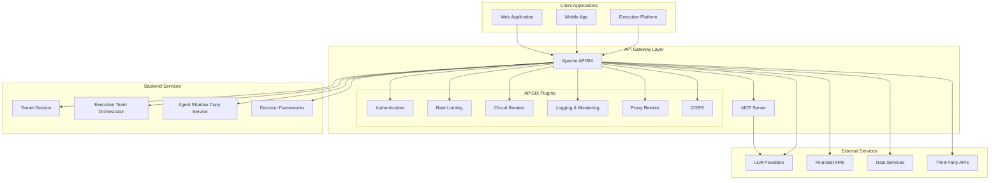
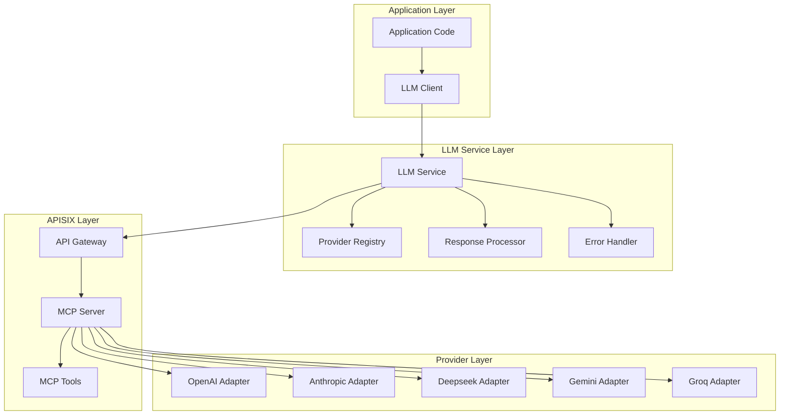
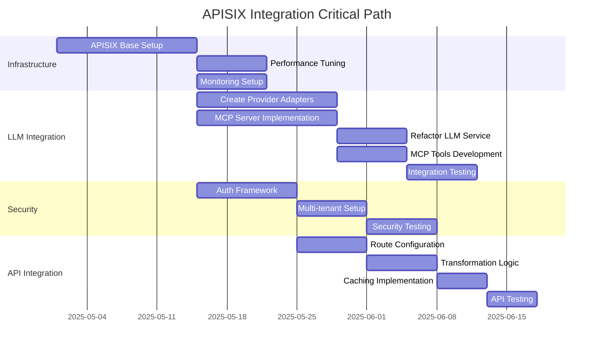

# Apache APISIX Integration Plan for Enterprise Agentic AI Executive Platform

## Overview

This document outlines the implementation plan for integrating Apache APISIX as an API gateway layer into the Enterprise Agentic AI Executive Platform. The integration aims to enhance the system's capabilities for accessing different resources while providing crucial enterprise features including security, scalability, and observability.

## Background

The Enterprise Agentic AI Executive Platform currently uses direct API calls to various services including:

- LLM providers (OpenAI, Anthropic, DeepSeek, Gemini, Groq)
- Financial data services
- Other enterprise data sources

Apache APISIX is a dynamic, real-time, high-performance API gateway that offers:
- Traffic management
- Security features
- Observability tools
- Support for Model Context Protocol (MCP) server hosting

## Benefits

Integrating APISIX will provide:

1. **Centralized API Management**
   - Single entry point for all external API interactions
   - Unified authentication and authorization
   - Consistent error handling and logging

2. **Enhanced Security**
   - Advanced authentication mechanisms
   - Rate limiting and traffic control
   - IP restriction and request validation

3. **Observability and Monitoring**
   - Real-time API metrics
   - Detailed logging
   - Performance tracking

4. **Model Context Protocol (MCP) Server Integration**
   - Standardized interface for diverse model providers
   - More efficient resource utilization
   - Enhanced capabilities through MCP tools

5. **Resilience and Reliability**
   - Circuit breaking for failing services
   - Automatic retries and failover
   - Request timeout management

## Architecture Diagram



## Work Packages for Distributed Development

The implementation is divided into four main work packages that can be assigned to different LLMs acting in specific roles:

### WP1: APISIX Infrastructure Setup (LLM1 - Infrastructure Specialist)

**Dependencies**: None

**Responsibilities**:
- APISIX installation and configuration
- Infrastructure setup and networking
- Integration with existing systems
- Performance optimization
- Monitoring and logging setup

**Deliverables**:
- Functional APISIX gateway deployment
- Configuration management approach
- Load balancing and scaling setup
- Monitoring dashboards
- Infrastructure documentation

### WP2: LLM Service Layer & MCP Integration (LLM2 - AI Integration Specialist)

**Dependencies**: WP1 (basic APISIX setup)

**Responsibilities**:
- Refactor existing LLM service layer
- MCP server implementation
- Provider adapter development
- Integration testing with LLM providers
- MCP tool development

**Deliverables**:
- Enhanced LLM service with APISIX routing
- Functional MCP server
- Provider-specific adapters
- MCP tool implementations
- Integration tests and documentation

### WP3: Security & Multi-tenancy (LLM3 - Security Specialist)

**Dependencies**: WP1 (basic APISIX setup)

**Responsibilities**:
- Authentication and authorization implementation
- Multi-tenant isolation
- Security policy configuration
- Rate limiting and quota management
- Security testing and documentation

**Deliverables**:
- Authentication framework
- Multi-tenant routing rules
- Security policies and configurations
- Testing and validation reports
- Security documentation

### WP4: Financial & External API Integration (LLM4 - API Integration Specialist)

**Dependencies**: WP1 (basic APISIX setup), WP3 (security framework)

**Responsibilities**:
- Financial API routing configuration
- External service integration
- Response transformation
- Caching strategies
- Service reliability patterns

**Deliverables**:
- API routes configuration
- Transformation plugins
- Caching policies
- Failover configurations
- Integration documentation

## MCP Server Integration with LLM Service Layer

### Current LLM Service Architecture

The current LLM service implementation in `src/llm/models.py` and `src/utils/llm.py` has several limitations:

1. Direct API calls to provider-specific endpoints
2. Provider logic mixed with service implementation
3. Limited error handling and resilience
4. No standardized interface for model interactions
5. Hard-coded provider selection
6. Lack of observability and metrics

### Proposed MCP-Enhanced Architecture



### Required Code Changes

#### 1. Create a New LLMService Class

```python
# src/llm/service.py
from typing import Any, Dict, List, Optional, Type, TypeVar, Union
from pydantic import BaseModel
from enum import Enum

T = TypeVar('T', bound=BaseModel)

class LLMProvider(str, Enum):
    ANTHROPIC = "anthropic"
    DEEPSEEK = "deepseek"
    GEMINI = "gemini"
    GROQ = "groq"
    OPENAI = "openai"
    MCP = "mcp"  # New MCP provider type

class ContentType(str, Enum):
    TEXT = "text"
    JSON = "json"
    STRUCTURED = "structured"

class LLMRequest:
    """Standardized request format for LLM calls"""
    def __init__(
        self,
        prompt: Any,
        model_name: str,
        provider: Union[str, LLMProvider],
        temperature: float = 0.7,
        max_tokens: Optional[int] = None,
        response_format: Optional[ContentType] = None,
        pydantic_model: Optional[Type[BaseModel]] = None,
        stream: bool = False,
        additional_params: Optional[Dict[str, Any]] = None
    ):
        self.prompt = prompt
        self.model_name = model_name
        self.provider = provider if isinstance(provider, LLMProvider) else LLMProvider(provider)
        self.temperature = temperature
        self.max_tokens = max_tokens
        self.response_format = response_format
        self.pydantic_model = pydantic_model
        self.stream = stream
        self.additional_params = additional_params or {}

class LLMResponse:
    """Standardized response format for LLM calls"""
    def __init__(
        self,
        content: Any,
        model: str,
        provider: Union[str, LLMProvider],
        usage: Optional[Dict[str, int]] = None,
        metadata: Optional[Dict[str, Any]] = None
    ):
        self.content = content
        self.model = model
        self.provider = provider if isinstance(provider, LLMProvider) else LLMProvider(provider)
        self.usage = usage or {}
        self.metadata = metadata or {}

class LLMService:
    """Central service for handling LLM requests"""

    def __init__(self, default_provider: Optional[LLMProvider] = None):
        self.default_provider = default_provider or LLMProvider.MCP
        self.provider_registry = self._initialize_providers()

    def _initialize_providers(self):
        # In a real implementation, this would dynamically load providers
        from llm.providers.mcp_provider import MCPProviderAdapter
        from llm.providers.direct_provider import DirectProviderAdapter

        registry = {
            LLMProvider.MCP: MCPProviderAdapter(),
        }

        # For fallback and transition period, keep direct provider adapters
        for provider in LLMProvider:
            if provider != LLMProvider.MCP:
                registry[provider] = DirectProviderAdapter(provider)

        return registry

    async def generate(
        self,
        request: LLMRequest
    ) -> LLMResponse:
        """Generate a response from an LLM"""
        provider = self.provider_registry.get(
            request.provider,
            self.provider_registry[self.default_provider]
        )

        try:
            response = await provider.generate(request)
            return response
        except Exception as e:
            # Implement retry logic, fallback, or error handling
            return await self._handle_error(e, request)

    async def _handle_error(self, error, request):
        # Implementation of error handling, retries, etc.
        raise error
```

#### 2. Create Provider Adapters

```python
# src/llm/providers/base_provider.py
from abc import ABC, abstractmethod
from typing import Any, Dict, Optional, Type, TypeVar
from pydantic import BaseModel

from llm.service import LLMRequest, LLMResponse

T = TypeVar('T', bound=BaseModel)

class ProviderAdapter(ABC):
    """Base class for all LLM provider adapters"""

    @abstractmethod
    async def generate(self, request: LLMRequest) -> LLMResponse:
        """Generate a response from the LLM provider"""
        pass

    @abstractmethod
    async def structured_output(
        self,
        request: LLMRequest,
        model_class: Type[T]
    ) -> T:
        """Generate a structured output using a Pydantic model"""
        pass
```

```python
# src/llm/providers/mcp_provider.py
import os
import json
import httpx
from typing import Any, Dict, Optional, Type, TypeVar
from pydantic import BaseModel

from llm.providers.base_provider import ProviderAdapter
from llm.service import LLMRequest, LLMResponse, LLMProvider, ContentType

T = TypeVar('T', bound=BaseModel)

class MCPProviderAdapter(ProviderAdapter):
    """Adapter for MCP-based providers through APISIX"""

    def __init__(self, base_url: Optional[str] = None):
        self.base_url = base_url or os.environ.get("MCP_API_URL", "http://localhost:9080/mcp")
        self.timeout = httpx.Timeout(30.0, connect=10.0)

    async def generate(self, request: LLMRequest) -> LLMResponse:
        """Generate a response from the LLM via MCP"""

        # Transform request to MCP format
        mcp_request = self._create_mcp_request(request)

        async with httpx.AsyncClient(timeout=self.timeout) as client:
            response = await client.post(
                f"{self.base_url}/generate",
                json=mcp_request
            )
            response.raise_for_status()

            data = response.json()
            return self._create_response_from_mcp(data, request)

    async def structured_output(self, request: LLMRequest, model_class: Type[T]) -> T:
        """Generate a structured output using a Pydantic model via MCP"""

        # Set up request for structured output
        request.response_format = ContentType.JSON
        request.additional_params["schema"] = model_class.model_json_schema()

        # Get response
        response = await self.generate(request)

        # Parse response into model
        if isinstance(response.content, dict):
            return model_class(**response.content)
        elif isinstance(response.content, str):
            try:
                content_dict = json.loads(response.content)
                return model_class(**content_dict)
            except json.JSONDecodeError:
                # Handle parsing errors
                raise ValueError(f"Failed to parse structured output: {response.content[:100]}...")
        else:
            raise TypeError(f"Unexpected response type: {type(response.content)}")

    def _create_mcp_request(self, request: LLMRequest) -> Dict[str, Any]:
        """Transform LLMRequest to MCP request format"""

        mcp_request = {
            "model": request.model_name,
            "provider": request.provider.value,
            "messages": self._format_prompt(request.prompt),
            "temperature": request.temperature,
            "stream": request.stream
        }

        if request.max_tokens:
            mcp_request["max_tokens"] = request.max_tokens

        if request.response_format:
            if request.response_format == ContentType.JSON:
                mcp_request["response_format"] = {"type": "json_object"}

                if "schema" in request.additional_params:
                    mcp_request["response_format"]["schema"] = request.additional_params["schema"]

        # Add any additional parameters
        for key, value in request.additional_params.items():
            if key != "schema":  # Already handled above
                mcp_request[key] = value

        return mcp_request

    def _format_prompt(self, prompt: Any) -> List[Dict[str, str]]:
        """Format various prompt types to MCP message format"""

        if isinstance(prompt, list) and all(isinstance(item, dict) for item in prompt):
            # Already in message format
            return prompt
        elif isinstance(prompt, str):
            # Simple string prompt
            return [{"role": "user", "content": prompt}]
        else:
            # Try to convert to string
            return [{"role": "user", "content": str(prompt)}]

    def _create_response_from_mcp(self, mcp_response: Dict[str, Any], original_request: LLMRequest) -> LLMResponse:
        """Transform MCP response to LLMResponse"""

        content = None
        if "choices" in mcp_response and mcp_response["choices"]:
            message = mcp_response["choices"][0].get("message", {})
            content = message.get("content", "")

            # Handle structured output if needed
            if original_request.response_format == ContentType.JSON:
                try:
                    content = json.loads(content)
                except (json.JSONDecodeError, TypeError):
                    pass  # Keep as string if parsing fails

        usage = mcp_response.get("usage", {})

        return LLMResponse(
            content=content,
            model=mcp_response.get("model", original_request.model_name),
            provider=original_request.provider,
            usage=usage,
            metadata={"mcp_response": mcp_response}
        )
```

#### 3. Create MCP-Compatible Utils Function

```python
# src/utils/llm.py (updated version)
from typing import TypeVar, Type, Optional, Any, Union, Dict
from pydantic import BaseModel
from utils.progress import progress

from llm.service import LLMRequest, LLMService, LLMProvider, ContentType

T = TypeVar('T', bound=BaseModel)

# Global LLM service instance
_llm_service = LLMService()

async def call_llm(
    prompt: Any,
    model_name: str,
    model_provider: str,
    pydantic_model: Type[T],
    agent_name: Optional[str] = None,
    max_retries: int = 3,
    default_factory = None
) -> T:
    """
    Makes an LLM call with retry logic.

    Args:
        prompt: The prompt to send to the LLM
        model_name: Name of the model to use
        model_provider: Provider of the model
        pydantic_model: The Pydantic model class to structure the output
        agent_name: Optional name of the agent for progress updates
        max_retries: Maximum number of retries (default: 3)
        default_factory: Optional factory function to create default response on failure

    Returns:
        An instance of the specified Pydantic model
    """
    # Create a standardized request
    request = LLMRequest(
        prompt=prompt,
        model_name=model_name,
        provider=model_provider,
        response_format=ContentType.JSON,
        pydantic_model=pydantic_model
    )

    # Call the LLM with retries
    for attempt in range(max_retries):
        try:
            if agent_name:
                progress.update_status(agent_name, None, f"Generating with {model_name}")

            # Use the LLM service for structured output
            result = await _llm_service.provider_registry[LLMProvider(model_provider)].structured_output(
                request,
                pydantic_model
            )
            return result

        except Exception as e:
            if agent_name:
                progress.update_status(agent_name, None, f"Error - retry {attempt + 1}/{max_retries}")

            if attempt == max_retries - 1:
                print(f"Error in LLM call after {max_retries} attempts: {e}")
                # Use default_factory if provided, otherwise create a basic default
                if default_factory:
                    return default_factory()
                return create_default_response(pydantic_model)

    # This should never be reached due to the retry logic above
    return create_default_response(pydantic_model)

def create_default_response(model_class: Type[T]) -> T:
    """Creates a safe default response based on the model's fields."""
    default_values = {}
    for field_name, field in model_class.model_fields.items():
        if field.annotation == str:
            default_values[field_name] = "Error in analysis, using default"
        elif field.annotation == float:
            default_values[field_name] = 0.0
        elif field.annotation == int:
            default_values[field_name] = 0
        elif hasattr(field.annotation, "__origin__") and field.annotation.__origin__ == dict:
            default_values[field_name] = {}
        else:
            # For other types (like Literal), try to use the first allowed value
            if hasattr(field.annotation, "__args__"):
                default_values[field_name] = field.annotation.__args__[0]
            else:
                default_values[field_name] = None

    return model_class(**default_values)
```

### APISIX Configuration for MCP Server

```yaml
# apisix_mcp_config.yaml
routes:
  - id: mcp-server-route
    uri: /mcp/*
    upstream_id: mcp-server
    plugins:
      key-auth:
        header: X-API-Key
        query: api_key
      prometheus:
        prefer_name: true
      proxy-rewrite:
        regex_uri: ["/mcp/(.*)", "/$1"]
      request-validation:
        body_schema:
          type: object
          required: ["model", "messages"]
      limit-req:
        rate: 10
        burst: 20
        key_type: "var"
        key: remote_addr
        rejected_code: 429
      response-rewrite:
        headers:
          set:
            X-Served-By: "apisix-mcp"
      serverless-post-function:
        phase: access
        functions:
        - "return function(conf, ctx)
            local tenant_id = ctx.var.http_x_tenant_id
            if tenant_id then
              ctx.var.upstream_uri = '/' .. tenant_id .. ctx.var.uri
            end
          end"

upstreams:
  - id: mcp-server
    nodes:
      "mcp-server:8080": 1
    type: roundrobin
    retries: 2
    timeout:
      connect: 2
      send: 30
      read: 30

consumers:
  - username: tenant1
    plugins:
      key-auth:
        key: TENANT1_API_KEY
  - username: tenant2
    plugins:
      key-auth:
        key: TENANT2_API_KEY
```

## MCP Server Implementation

### Core Components

1. **MCP Server**:
   - Implements Model Context Protocol
   - Provides standardized endpoint for model interactions
   - Manages provider-specific adapters

2. **Provider Adapters**:
   - Translate between MCP format and provider-specific APIs
   - Handle authentication and rate limiting
   - Format responses consistently

3. **MCP Tools**:
   - Extend capabilities beyond basic text generation
   - Provide specialized functionality (code generation, RAG, etc.)
   - Support server-side tool execution

### Implementation Steps

1. Create Docker-based MCP server setup
2. Implement core MCP protocol handlers
3. Develop provider adapters for each LLM service
4. Configure APISIX routes and plugins
5. Implement MCP tools for specialized functionality
6. Integrate with tenant management system

## Parallellization Strategy

The implementation can be accelerated by dividing responsibilities among the four LLMs:

1. **LLM1 (Infrastructure)**: Focus on APISIX installation, configuration, networking, and monitoring
2. **LLM2 (AI Integration)**: Focus on MCP server, provider adapters, and refactoring LLM service layer
3. **LLM3 (Security)**: Focus on authentication, multi-tenancy, and security policies
4. **LLM4 (API Integration)**: Focus on integrating financial and external APIs

Each LLM can work in parallel on their assigned work package with coordination at specific integration points.

## Critical Path and Dependencies



## Recommendation

The integration should be approached incrementally, with each LLM focusing on their area of expertise while maintaining communication through shared documentation and coordination points. The critical path runs through the infrastructure setup, followed by parallel work on the various integration components.

By structuring the work this way, we can maximize parallel development while ensuring that dependencies are properly managed.
