# APISIX Integration Component Architecture

## Introduction

This document provides a detailed description of the components that make up the Apache APISIX integration with the Enterprise Agentic AI Executive Platform. It covers component responsibilities, interactions, dependencies, and implementation details with a particular focus on security and multi-tenancy aspects.

The component architecture is designed to be modular, scalable, and resilient, allowing for phased implementation and future enhancements while providing immediate benefits in terms of API management, security, and standardization.

## Core Components Overview

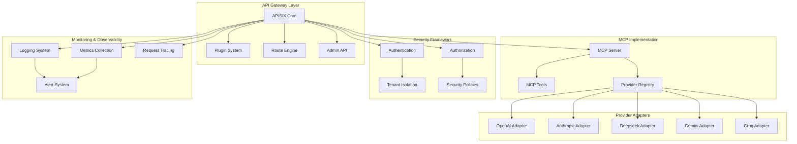

## APISIX Core Components

### APISIX Core

**Responsibilities:**

- Process incoming API requests
- Apply configured plugins
- Route requests to appropriate upstream services
- Handle responses and errors
- Manage connections and concurrency

**Implementation Details:**

- Built on NGINX and OpenResty
- Leverages etcd for configuration storage
- Asynchronous processing for high throughput
- Dynamic configuration updates without restarts
- Hot reloading of routes and plugins

### Plugin System

**Responsibilities:**

- Extend APISIX functionality through plugins
- Execute plugins in configured order
- Provide hooks into request/response lifecycle
- Enable conditional plugin execution
- Support custom plugin development

**Key Plugins:**

1. **Authentication plugins** (key-auth, jwt-auth, oauth)
2. **Security plugins** (ip-restriction, cors, response-rewrite)
3. **Traffic control plugins** (limit-req, limit-count, limit-conn)
4. **Transformation plugins** (proxy-rewrite, response-rewrite)
5. **Observability plugins** (prometheus, skywalking, zipkin)
6. **Custom plugins** for specific platform requirements

**Diagram of Plugin Execution Flow:**

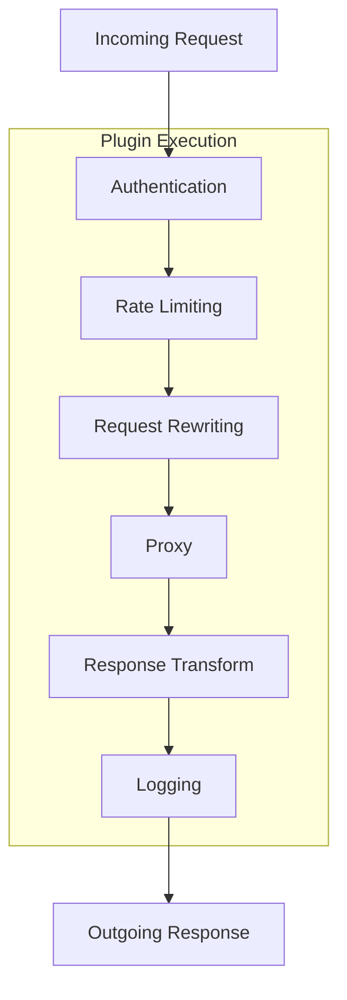

### Route Engine

**Responsibilities:**

- Match incoming requests to configured routes
- Apply route-specific plugins and policies
- Handle versioning of API endpoints
- Support complex routing rules (regex, headers, query params)
- Provide service discovery integration

**Implementation Details:**

- High-performance matching algorithms
- Support for multiple match conditions (path, host, headers)
- Priority-based route selection
- Versioning support through route rules
- Tenant-aware routing capabilities

### Admin API

**Responsibilities:**

- Provide management interface for APISIX configuration
- Support CRUD operations for routes, services, and plugins
- Handle configuration versioning and rollbacks
- Control access to management functions
- Enable automated configuration through API calls

**Security Considerations:**

- Restricted network access to Admin API
- Strong authentication requirements
- Role-based access control
- Audit logging of all configuration changes
- Support for configuration as code

## MCP Server Implementation

### MCP Server

**Responsibilities:**

- Implement the Model Context Protocol specification
- Provide standardized interfaces for LLM interactions
- Handle model-specific parameter mapping
- Manage streaming responses
- Support tool use across different LLM providers

**Implementation Details:**

- RESTful API implementation
- WebSocket support for streaming
- Standardized request/response formats
- Error handling and normalization
- Performance optimization for high throughput

**Diagram of MCP Server Architecture:**

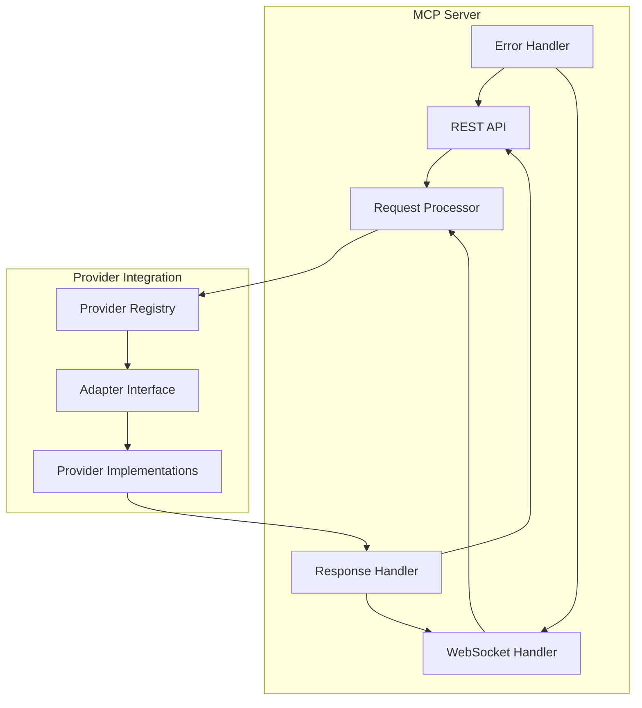

### MCP Tools

**Responsibilities:**

- Implement standardized tools for LLM interactions
- Provide interfaces for tool registration and discovery
- Handle tool execution and result processing
- Support synchronous and asynchronous tool execution
- Enable complex workflows through tool chaining

**Key Tools:**

1. **Search tools** for data retrieval
2. **Calculation tools** for numerical processing
3. **API interaction tools** for external service access
4. **Data transformation tools** for format conversion
5. **Visualization tools** for data presentation

### Provider Registry

**Responsibilities:**

- Maintain registry of available LLM providers
- Handle provider capabilities discovery
- Support dynamic provider addition/removal
- Implement provider selection logic
- Track provider health and availability

**Implementation Details:**

- Dynamic provider registration
- Capability-based provider selection
- Failover and load balancing support
- Caching of provider metadata
- Health check mechanisms

## Security Framework

### Authentication

**Responsibilities:**

- Verify identity of API clients
- Support multiple authentication methods
- Integrate with enterprise identity providers
- Implement token validation and management
- Handle authentication failures securely

**Authentication Methods:**

1. **API Keys** for simple authentication
2. **JWT Tokens** for stateless authentication with claims
3. **OAuth 2.0** for delegated authentication
4. **OIDC** for integration with identity providers
5. **TLS Client Certificates** for mutual TLS authentication

**Implementation Details:**

- Configurable authentication per route
- Multiple auth method support in single deployment
- Token revocation and refresh
- Rate limiting of authentication attempts
- Audit logging of authentication events

### Authorization

**Responsibilities:**

- Determine if authenticated users can access resources
- Enforce access control policies
- Support role-based and attribute-based access control
- Handle scopes and permissions
- Integrate with policy engines

**Implementation Details:**

- Granular permission model
- Support for complex authorization rules
- Policy-based access control
- Dynamic policy evaluation
- Tenant-aware authorization decisions

**Authorization Decision Flow:**

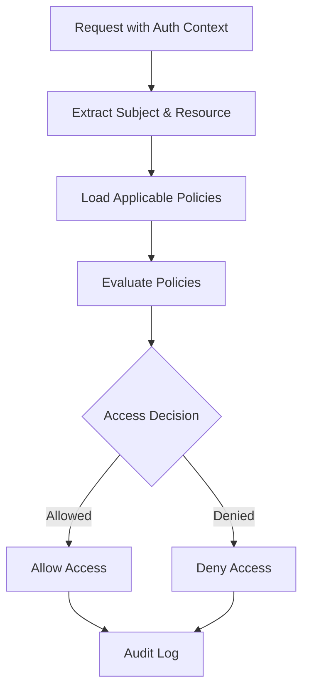

### Tenant Isolation

**Responsibilities:**

- Enforce strict separation between tenant resources
- Implement tenant-specific routing
- Manage tenant-specific configurations
- Control resource allocation per tenant
- Prevent cross-tenant access

**Implementation Details:**

- Tenant identification through tokens or headers
- Tenant-specific route tables
- Namespace isolation for configuration
- Per-tenant plugin configuration
- Resource quotas and limits

**Multi-tenancy Model:**

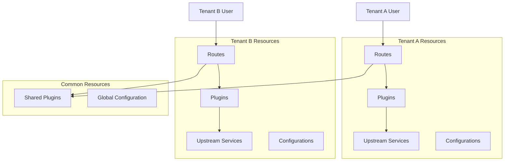

### Security Policies

**Responsibilities:**

- Define and enforce security rules
- Implement rate limiting and quota management
- Protect against common API attacks
- Support IP-based access controls
- Manage API keys and credentials

**Key Security Features:**

1. **Rate Limiting** - Prevent abuse and ensure fair resource allocation
2. **IP Restriction** - Control access based on client IP
3. **Request Validation** - Validate request parameters and payloads
4. **Response Filtering** - Prevent sensitive data leakage
5. **Circuit Breaking** - Protect services from cascading failures

**Implementation Details:**

- Per-tenant and per-route security policies
- Hierarchical policy application
- Configurable policy enforcement
- Real-time policy updates
- Comprehensive security logging

## Provider Adapters

### Adapter Design

**Responsibilities:**

- Translate between standardized MCP format and provider-specific APIs
- Handle provider-specific authentication
- Map common parameters to provider-specific parameters
- Process provider-specific responses
- Implement fallback and retry mechanisms

**Implementation Details:**

- Adapter interface definition with common methods
- Provider-specific adapter implementations
- Error mapping and normalization
- Streaming response handling
- Capability discovery and feature mapping

**Adapter Pattern Implementation:**

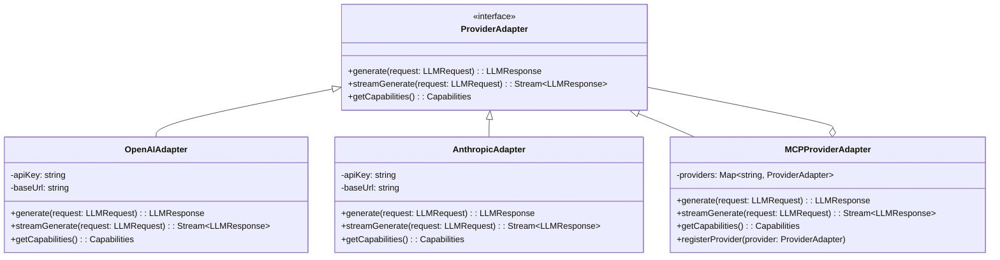

### Provider-Specific Adapters

**OpenAI Adapter:**

- Handles OpenAI API authentication and endpoints
- Maps MCP parameters to OpenAI-specific parameters
- Processes OpenAI response format
- Implements OpenAI-specific tools and capabilities
- Handles rate limits and quotas

**Anthropic Adapter:**

- Handles Anthropic API authentication and endpoints
- Maps MCP parameters to Anthropic-specific parameters
- Processes Anthropic response format
- Implements Anthropic-specific capabilities
- Handles streaming responses

**Deepseek Adapter:**

- Handles Deepseek API authentication and endpoints
- Maps MCP parameters to Deepseek-specific parameters
- Processes Deepseek response format
- Implements specific capabilities and limitations
- Handles error retries

**Gemini Adapter:**

- Handles Google Gemini API authentication and endpoints
- Maps MCP parameters to Gemini-specific parameters
- Processes Gemini response format
- Implements Gemini-specific capabilities
- Handles quota management

**Groq Adapter:**

- Handles Groq API authentication and endpoints
- Maps MCP parameters to Groq-specific parameters
- Processes Groq response format
- Implements Groq-specific capabilities
- Handles high-performance streaming

## Monitoring & Observability

### Logging System

**Responsibilities:**

- Capture detailed logs of all API requests and responses
- Implement structured logging for machine processing
- Support different log levels for various environments
- Enable log shipping to centralized storage
- Provide tenant-specific log separation

**Implementation Details:**

- JSON-formatted structured logs
- Configurable log levels and filters
- Log rotation and management
- Integration with log aggregation systems
- Tenant context in all log entries

### Metrics Collection

**Responsibilities:**

- Gather performance and operational metrics
- Track request rates, latencies, and error rates
- Monitor system resource utilization
- Provide insights into tenant usage patterns
- Feed data to alerting and visualization systems

**Key Metrics:**

1. **Request volume** - Overall and per-tenant/route
2. **Latency** - Processing time breakdown
3. **Error rates** - By error type and source
4. **Upstream service health** - Availability and response times
5. **Resource utilization** - CPU, memory, connections

**Implementation Details:**

- Prometheus integration for metrics collection
- Custom metric definitions for business needs
- Dimensional metrics with tenant tags
- Real-time metrics streaming
- Historical metrics storage

### Request Tracing

**Responsibilities:**

- Track request flow across components
- Enable end-to-end visibility of requests
- Support distributed tracing across services
- Measure timing of different processing stages
- Assist in performance bottleneck identification

**Implementation Details:**

- OpenTelemetry integration for tracing
- Correlation IDs for request tracking
- Span collection and propagation
- Tracing context in logs and metrics
- Integration with visualization tools

### Alert System

**Responsibilities:**

- Monitor system health and performance
- Detect anomalies and service degradation
- Trigger alerts based on defined thresholds
- Provide notification through multiple channels
- Support escalation paths for critical issues

**Implementation Details:**

- Rule-based alert definitions
- Multiple severity levels
- Notification channels (email, SMS, chat)
- Alert aggregation and deduplication
- Alert acknowledgment and resolution tracking

## Integration with LLM Service Layer

The LLM Service Layer is refactored to leverage the APISIX Gateway and MCP Server for standardized LLM interactions:

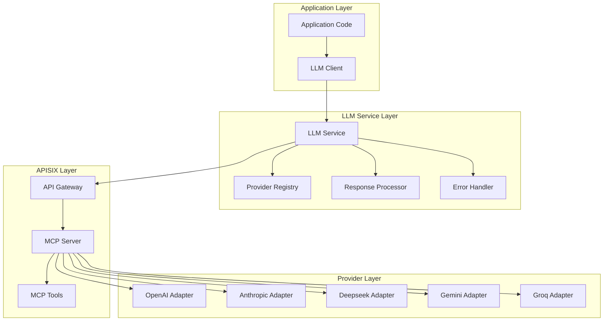

**Key Components:**

1. **LLM Client** - Provides a simple interface for applications to generate LLM responses
2. **LLM Service** - Centralizes LLM interaction logic and coordinates with other components
3. **Provider Registry** - Maintains information about available providers and their capabilities
4. **Response Processor** - Handles formatting and post-processing of LLM responses
5. **Error Handler** - Implements retry logic, fallbacks, and error reporting

**Data Flow:**

1. Application code calls LLM Client with a request
2. LLM Client passes request to LLM Service
3. LLM Service validates request and prepares for processing
4. LLM Service routes request to APISIX Gateway
5. APISIX Gateway applies authentication, rate limiting, and other plugins
6. Request is routed to MCP Server
7. MCP Server determines the appropriate provider and passes request to Provider Adapter
8. Provider Adapter converts request to provider-specific format
9. Provider processes request and returns response
10. Response flows back through the same path with appropriate transformations

## Security and Multi-tenancy Implementation Details

### Authentication Flow

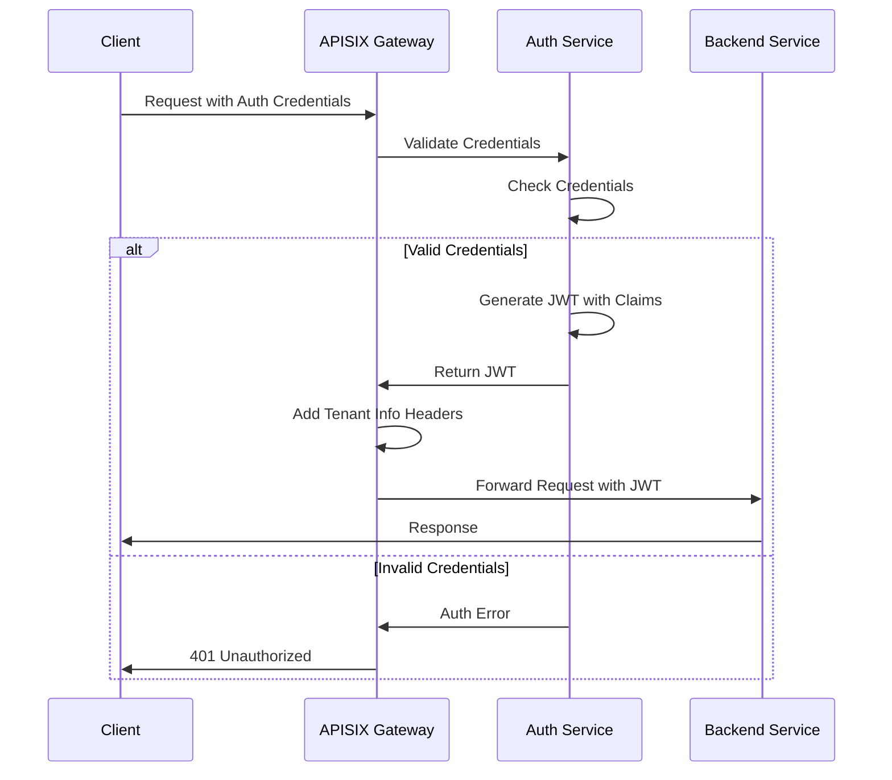

### Multi-tenancy Implementation

The multi-tenancy model is implemented through several layers of isolation:

1. **Tenant Identification**

   - JWT claims with tenant ID
   - Tenant-specific API keys
   - Header-based tenant identification (with validation)

2. **Route Isolation**

   - Tenant-specific route prefixes (e.g., `/tenants/{tenant_id}/...`)
   - Route metadata with tenant ownership
   - Tenant-specific upstream services

3. **Resource Isolation**

   - Tenant-specific rate limits and quotas
   - Separate connection pools per tenant
   - Tenant-tagged metrics and logs

4. **Data Isolation**
   - Request/response transformation for tenant-specific data
   - Tenant context in all backend calls
   - Response filtering to prevent data leakage

**Tenant-Aware Request Processing:**

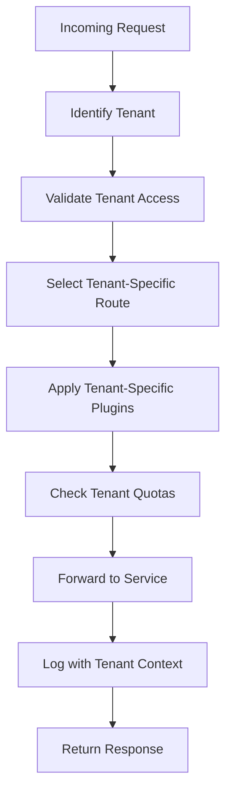

### Security Policy Management

Security policies are managed through a hierarchical approach:

1. **Global Policies**

   - Apply to all requests
   - Basic protection and monitoring
   - System-wide rate limits

2. **Tenant Policies**

   - Apply to all tenant requests
   - Tenant-specific rate limits and rules
   - Custom security requirements

3. **Route-Level Policies**
   - Specific to individual API endpoints
   - Fine-grained access control
   - Specialized validation rules

**Policy Evaluation Process:**

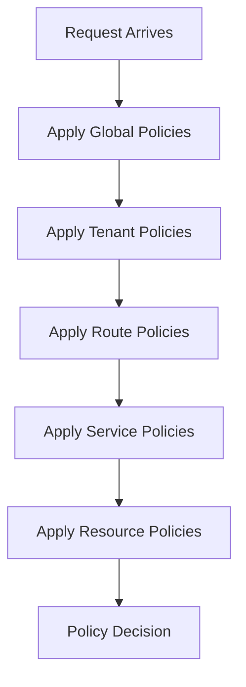

## Component Dependencies

The following diagram illustrates the dependencies between the APISIX integration components:

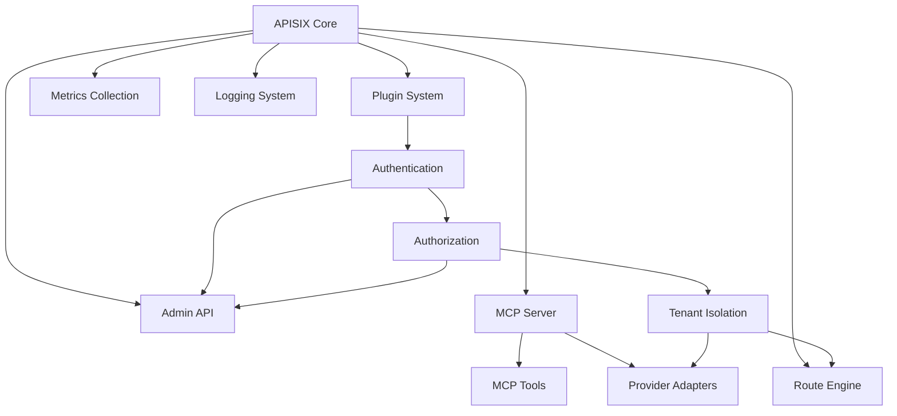

## Conclusion

The component architecture for the APISIX integration with the Enterprise Agentic AI Executive Platform provides a comprehensive and modular approach to API management, security, and standardization. The focus on security and multi-tenancy ensures that the platform can meet enterprise requirements while providing the flexibility needed for future enhancements.

Each component is designed with clear responsibilities and interfaces, enabling distributed development and incremental implementation. The architecture supports the key goals of centralized API management, enhanced security, improved observability, and standardized LLM interactions through the MCP server.

By implementing this component architecture, the platform will gain significant capabilities in terms of security, scalability, and integration standardization while addressing the current limitations of direct API connections.
