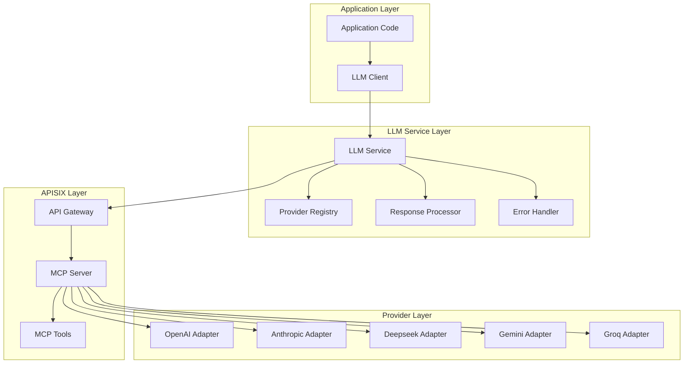
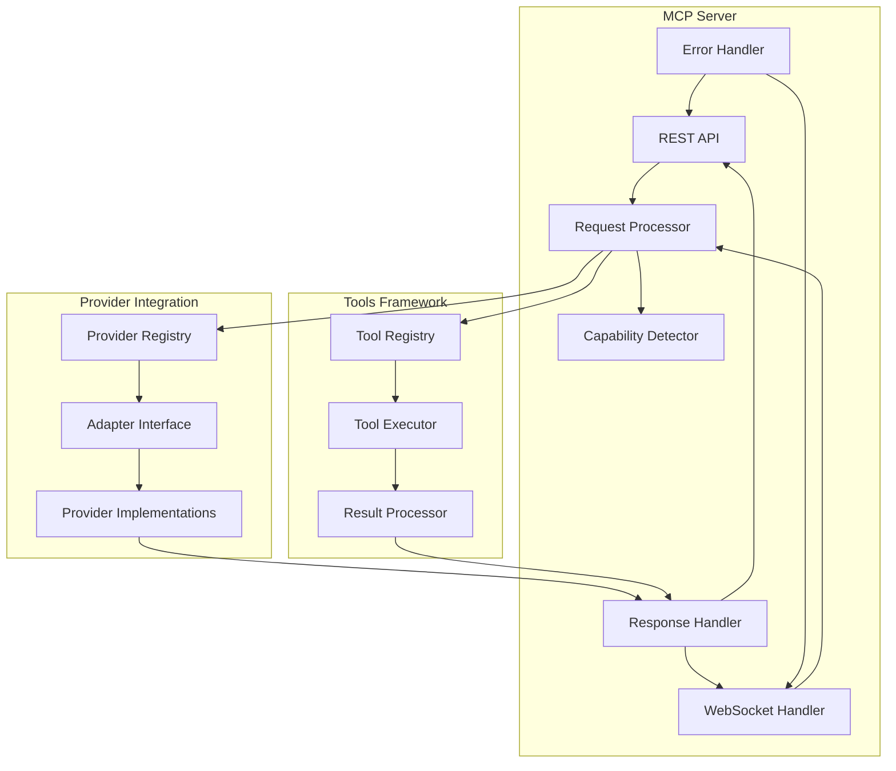
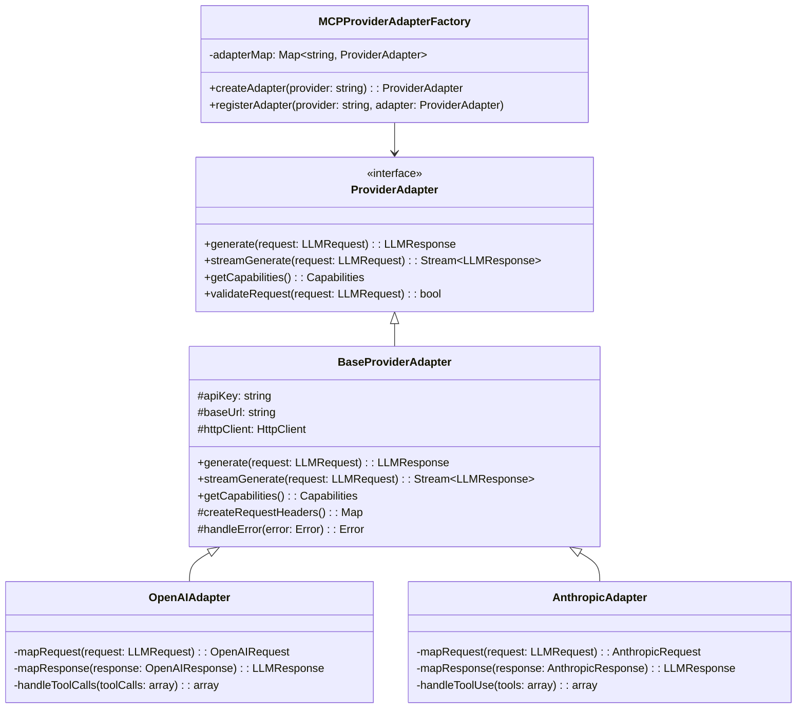
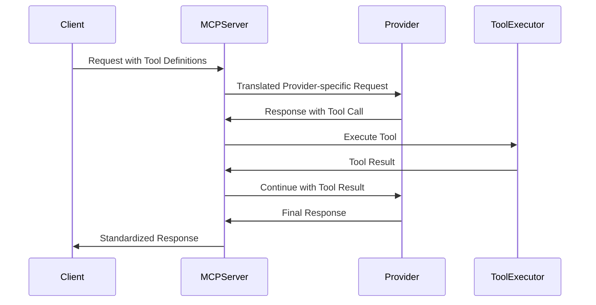
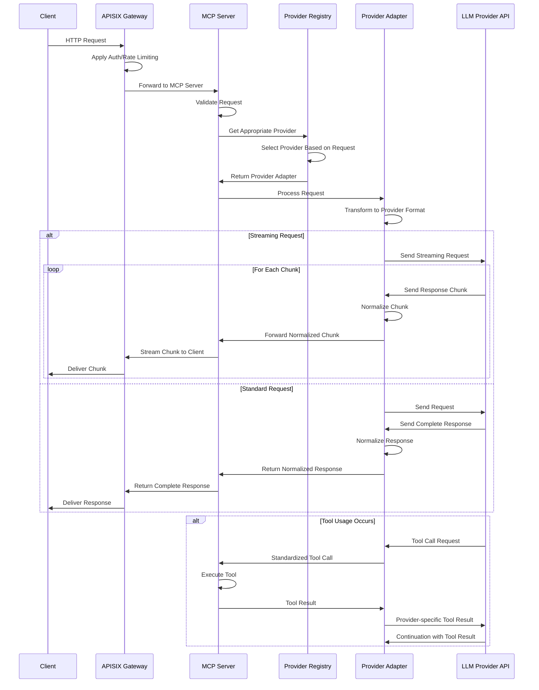

# MCP Server Architecture Design

## Overview

The Model Context Protocol (MCP) server is a core component of the Apache APISIX integration for the Enterprise Agentic AI Executive Platform. It provides a standardized interface for interacting with various Large Language Model (LLM) providers through a unified protocol. This document details the architectural design of the MCP server, including its components, responsibilities, interactions, and the protocol specification.

The MCP server addresses several key challenges in working with multiple LLM providers:

- **Standardization**: Eliminates provider-specific code in applications
- **Feature Parity**: Provides consistent capabilities across different providers
- **Resilience**: Implements error handling and fallback mechanisms
- **Efficiency**: Optimizes resource utilization and performance
- **Observability**: Enables monitoring and tracking of LLM usage

## Architecture Overview

The MCP server sits within the API Gateway Layer of the Enterprise Agentic AI Executive Platform, serving as an intermediary between client applications and various LLM providers.



## Core Components

### MCP Server

**Responsibilities**:
- Implement the Model Context Protocol specification
- Provide standardized interfaces for LLM interactions
- Handle model-specific parameter mapping
- Manage streaming responses
- Support tool use across different LLM providers

**Internal Architecture**:



### Provider Registry

**Responsibilities**:
- Maintain registry of available LLM providers
- Handle provider capabilities discovery
- Support dynamic provider addition/removal
- Implement provider selection logic
- Track provider health and availability

**Key Features**:
- Dynamic provider registration
- Capability-based provider selection
- Failover and load balancing support
- Caching of provider metadata
- Health check mechanisms

### MCP Tools

**Responsibilities**:
- Implement standardized tools for LLM interactions
- Provide interfaces for tool registration and discovery
- Handle tool execution and result processing
- Support synchronous and asynchronous tool execution
- Enable complex workflows through tool chaining

**Key Tools**:
1. **Search Tools** - For data retrieval from various sources
2. **Calculation Tools** - For numerical processing and computations
3. **API Interaction Tools** - For external service access
4. **Data Transformation Tools** - For format conversion and data processing

## Provider Adapter Framework

The Provider Adapter Framework enables the MCP server to communicate with different LLM providers using a consistent interface while handling the specific requirements of each provider.

### Adapter Interface



### Key Adapter Responsibilities

1. **Request Translation** - Convert standardized MCP requests to provider-specific formats
2. **Response Normalization** - Convert provider-specific responses to standardized MCP format
3. **Authentication Management** - Handle provider-specific authentication requirements
4. **Error Handling** - Process and normalize provider-specific errors
5. **Capability Reporting** - Expose provider capabilities to the MCP server
6. **Tool Handling** - Translate between standardized tool formats and provider-specific implementations

### Feature Parity Management

The adapter framework implements several strategies to handle provider-specific features:

1. **Capability Discovery** - Dynamically detect and register provider capabilities
2. **Feature Emulation** - Implement missing provider features in the adapter layer when possible
3. **Graceful Degradation** - Provide fallback behavior when features are unavailable
4. **Feature Flagging** - Explicitly mark feature availability in capability metadata
5. **Optimized Routing** - Direct requests to providers that support the required features

## MCP Protocol Specification

The MCP protocol standardizes interactions between applications and LLM providers, defining request and response formats, error handling, and tool usage.

### Request Format Standardization

Standard MCP requests follow this structure:

```json
{
  "model": "model-name",
  "provider": "provider-name",
  "messages": [
    {"role": "system", "content": "System message"},
    {"role": "user", "content": "User message"}
  ],
  "temperature": 0.7,
  "max_tokens": 500,
  "stream": false,
  "tools": [
    {
      "type": "function",
      "function": {
        "name": "get_weather",
        "description": "Get current weather for a location",
        "parameters": {
          "type": "object",
          "properties": {
            "location": {
              "type": "string",
              "description": "City and state or country"
            },
            "unit": {
              "type": "string",
              "enum": ["celsius", "fahrenheit"]
            }
          },
          "required": ["location"]
        }
      }
    }
  ],
  "response_format": {
    "type": "json_object",
    "schema": {
      "type": "object",
      "properties": {
        "result": { "type": "string" }
      }
    }
  },
  "additional_parameters": {}
}
```

### Response Format Standardization

Standard MCP responses follow this structure:

```json
{
  "id": "resp_123abc456def",
  "object": "completion",
  "created": 1677858242,
  "model": "model-name",
  "provider": "provider-name",
  "choices": [
    {
      "index": 0,
      "message": {
        "role": "assistant",
        "content": "Response content",
        "tool_calls": [
          {
            "id": "call_abc123",
            "type": "function",
            "function": {
              "name": "get_weather",
              "arguments": "{\"location\":\"San Francisco\",\"unit\":\"celsius\"}"
            }
          }
        ]
      },
      "finish_reason": "stop"
    }
  ],
  "usage": {
    "prompt_tokens": 42,
    "completion_tokens": 31,
    "total_tokens": 73
  },
  "metadata": {
    "latency_ms": 250,
    "provider_specific": {}
  }
}
```

### Streaming Protocol Details

For streaming responses, the MCP server uses Server-Sent Events (SSE) compatible with both HTTP and WebSocket connections:

```
event: completion
data: {"id":"resp_123abc456def","object":"completion.chunk","created":1677858242,"model":"model-name","provider":"provider-name","choices":[{"index":0,"delta":{"role":"assistant","content":"Hello"},"finish_reason":null}]}

event: completion
data: {"id":"resp_123abc456def","object":"completion.chunk","created":1677858242,"model":"model-name","provider":"provider-name","choices":[{"index":0,"delta":{"content":" world"},"finish_reason":null}]}

event: completion
data: {"id":"resp_123abc456def","object":"completion.chunk","created":1677858242,"model":"model-name","provider":"provider-name","choices":[{"index":0,"delta":{},"finish_reason":"stop"}]}

event: done
data: {}
```

The streaming protocol ensures:
- Compatible format across all providers
- Chunked delivery of responses
- Tool calls handled consistently across streaming
- Proper error propagation during streaming

### Tool Usage Standardization

The MCP protocol standardizes tool definition, invocation, and result handling across providers with different native tool implementations:

1. **Tool Definition** - Common schema for declaring available tools
2. **Tool Invocation** - Standardized format for tool calls from LLMs
3. **Tool Execution** - Consistent execution pattern for called tools
4. **Result Passing** - Uniform way to provide tool results back to LLMs

#### Tool Call and Response Flow



### Error Handling and Normalization

The MCP protocol defines standardized error responses:

```json
{
  "error": {
    "code": "provider_error",
    "message": "Error message",
    "type": "rate_limit_exceeded",
    "param": "parameter_name",
    "provider_specific": {},
    "request_id": "req_abc123"
  }
}
```

Common error types are normalized across providers:
- `authentication_error` - API key or authentication issues
- `rate_limit_exceeded` - Provider rate limits reached
- `quota_exceeded` - Usage quota exceeded
- `invalid_request` - Malformed request
- `model_not_found` - Requested model unavailable
- `context_length_exceeded` - Input too long for model
- `content_policy_violation` - Content violates provider policies
- `provider_error` - Generic provider errors

## Request Flow Through MCP Server

The following sequence diagram illustrates the complete request flow through the MCP server:



## Handling Provider-Specific Features

The MCP server employs several strategies to handle provider-specific features and capabilities:

### 1. Capability Registry

Each provider adapter registers its capabilities with the Provider Registry:

```json
{
  "provider": "openai",
  "models": ["gpt-3.5-turbo", "gpt-4", "..."],
  "features": {
    "streaming": true,
    "tool_calls": true,
    "json_mode": true,
    "vision": true,
    "function_calling": true
  },
  "max_context_length": {
    "gpt-3.5-turbo": 16385,
    "gpt-4": 8192,
    "gpt-4-32k": 32768
  },
  "rate_limits": {
    "requests_per_minute": 3000,
    "tokens_per_minute": 60000
  }
}
```

### 2. Feature Emulation Layer

For providers lacking certain features, the MCP server implements emulation where possible:

- **JSON Mode** - Post-processing to ensure valid JSON output
- **Function Calling** - Prompt engineering to emulate structured output
- **Tool Usage** - Format conversion between different tool formats
- **Streaming** - Buffering and chunking for providers without native streaming

### 3. Dynamic Routing

The Provider Registry selects the most appropriate provider based on:

1. Explicitly requested provider
2. Required features for the request
3. Current availability and health
4. Cost optimization rules
5. Tenant-specific routing rules

### 4. Graceful Degradation

When a requested feature is unavailable, the system:

1. Returns clear error messages about unsupported features
2. Suggests alternative providers that support the feature
3. Offers degraded functionality where possible
4. Provides developer guidance on working with limitations

## Security Considerations

The MCP server implementation includes several security measures:

1. **Credential Management**
   - Provider API keys stored securely
   - Key rotation capabilities
   - Granular access control for provider credentials

2. **Request Validation**
   - Input sanitization
   - Content filtering capabilities
   - Rate limiting per tenant

3. **Response Filtering**
   - Content policy enforcement
   - PII detection and redaction options
   - Security headers

4. **Authentication and Authorization**
   - Integration with APISIX authentication
   - Role-based access control
   - Tenant isolation

## Monitoring and Observability

The MCP server includes comprehensive monitoring capabilities:

1. **Performance Metrics**
   - Request latency
   - Token usage
   - Error rates
   - Provider-specific metrics

2. **Usage Analytics**
   - Cost tracking per provider
   - Request volume by model
   - Feature usage statistics
   - Tenant-specific analytics

3. **Logging**
   - Detailed request/response logging (with PII protection)
   - Error tracking with context
   - Audit logging for security events
   - Structured logs for analysis

## Conclusion

The MCP server architecture provides a robust foundation for standardized interaction with multiple LLM providers. By implementing a consistent protocol specification, flexible provider adapter framework, and powerful tool usage capabilities, it enables applications to leverage LLM capabilities without being tied to specific providers.

The design prioritizes:

- **Standardization** - Consistent interfaces across providers
- **Flexibility** - Adapting to provider-specific features
- **Resilience** - Handling errors and fallbacks gracefully
- **Performance** - Optimizing for efficient LLM usage
- **Security** - Protecting sensitive data and enforcing policies

This architecture allows the Enterprise Agentic AI Executive Platform to maintain provider independence while taking full advantage of the unique capabilities of each LLM provider.
