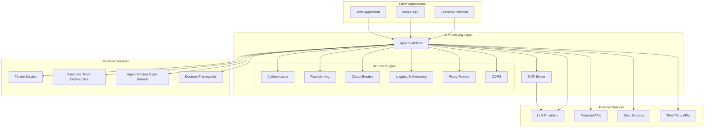
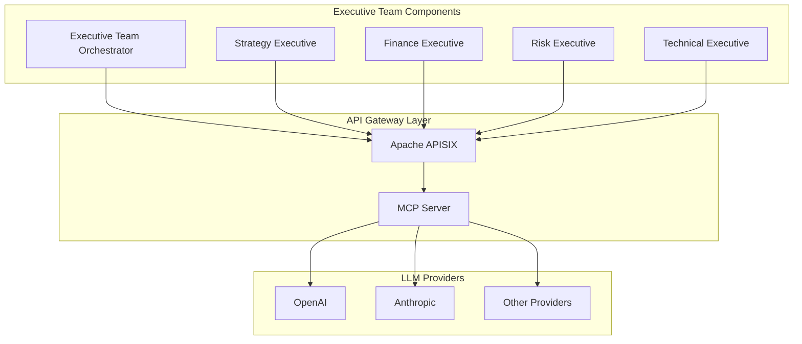

# APISIX Integration Architecture Overview

## Introduction

The Enterprise Agentic AI Executive Platform is enhancing its capabilities by integrating Apache APISIX as an API gateway layer. This document provides a comprehensive overview of the architecture for this integration, including its key components, benefits, system boundaries, and constraints.

Apache APISIX is a dynamic, real-time, high-performance API gateway that offers traffic management, security features, observability tools, and support for Model Context Protocol (MCP) server hosting. By integrating APISIX into our platform, we aim to create a centralized management layer for all external API interactions while providing enterprise-grade security, scalability, and standardized integration points.

## Background

The Enterprise Agentic AI Executive Platform currently uses direct API calls to various services including:

- LLM providers (OpenAI, Anthropic, DeepSeek, Gemini, Groq)
- Financial data services
- Other enterprise data sources

This direct connection approach has several limitations:

1. Provider logic mixed with service implementation
2. Limited error handling and resilience
3. No standardized interface for model interactions
4. Hard-coded provider selection
5. Lack of observability and metrics

The APISIX integration addresses these limitations by providing a unified gateway layer that standardizes interactions, enhances security, and improves observability.

## Architecture Diagram

## Key Benefits

### 1. Centralized API Management

- Single entry point for all external API interactions
- Unified authentication and authorization
- Consistent error handling and logging
- Standard interfaces for all service integrations

### 2. Enhanced Security

- Advanced authentication mechanisms
- Rate limiting and traffic control
- IP restriction and request validation
- Multi-tenant isolation with granular access controls
- Comprehensive security policy enforcement

### 3. Observability and Monitoring

- Real-time API metrics collection
- Detailed logging with structured formats
- Performance tracking and anomaly detection
- Integrated monitoring dashboards
- End-to-end request tracing

### 4. Model Context Protocol (MCP) Server Integration

- Standardized interface for diverse model providers
- More efficient resource utilization
- Enhanced capabilities through MCP tools
- Provider-agnostic interactions
- Consistent handling of model-specific features

### 5. Resilience and Reliability

- Circuit breaking for failing services
- Automatic retries and failover mechanisms
- Request timeout management
- Caching strategies for improved performance
- Graceful degradation during outages

## Integration with Existing Platform Components

The APISIX integration interfaces with existing Enterprise Agentic AI Executive Platform components in several key ways:

### Executive Team Orchestrator

The Executive Team Orchestrator communicates with LLM providers through APISIX, which standardizes these interactions via the MCP server. This provides:

- Enhanced resilience for executive agent operations
- Consistent monitoring of LLM usage across all executive agents
- Centralized authentication and authorization
- Standardized error handling and retry logic

### Decision Frameworks

Decision frameworks benefit from APISIX integration through:
- Secure access to external data sources required for analysis
- Standardized data retrieval patterns
- Caching of frequently accessed data
- Rate limiting to prevent API overuse
- Error handling for external dependencies

### Financial Data Services

The financial data integration through APISIX provides:
- Unified authentication for multiple financial data providers
- Response transformation and normalization
- Traffic shaping to manage API costs
- Failover mechanisms for critical financial data
- Audit logging for compliance purposes

### Multi-tenancy Support

APISIX provides enterprise-grade multi-tenancy capabilities:
- Tenant-specific routing rules
- Isolation of tenant resources
- Per-tenant rate limits and quotas
- Tenant-aware authentication and authorization
- Traffic segregation between tenants

## System Boundaries

The APISIX integration encompasses:

- **In Scope**:
  - API Gateway infrastructure and configuration
  - MCP server implementation
  - LLM provider adapters
  - Security and authentication framework
  - Monitoring and observability setup
  - Financial API routing
  - Multi-tenant isolation

- **Out of Scope**:
  - Client application changes (they only need to point to the new gateway endpoints)
  - Internal implementation details of executive agents
  - Decision framework logic
  - Data storage and persistence mechanisms
  - User interface components

## Constraints and Limitations

### Technical Constraints

- **Performance Impact**: The additional API gateway layer introduces some latency (typically 5-20ms) to requests
- **Learning Curve**: Requires team familiarity with APISIX configuration and management
- **Dependency Management**: Creates a new infrastructure dependency that requires maintenance
- **Configuration Complexity**: Advanced features require careful configuration to avoid security issues

### Phase 1 Limitations

The following capabilities are deferred to future phases:

1. **Advanced Analytics and Observability**:
   - Complex metrics aggregation and visualization
   - Advanced anomaly detection
   - Custom dashboards beyond basic monitoring

2. **Complex Transformation Plugins**:
   - Advanced data transformation between services
   - Custom protocol adapters beyond standard REST/JSON

3. **Global Deployment and Geographic Routing**:
   - Multi-region deployment architecture
   - Geo-based routing and failover
   - Global load balancing

4. **Advanced Multi-tenancy Features**:
   - Tenant-specific customizations beyond basic isolation
   - Tenant-level analytics and reporting
   - Custom tenant policy engines

## Conclusion

The APISIX integration architecture provides a robust foundation for enhancing the Enterprise Agentic AI Executive Platform with enterprise-grade API management capabilities. By centralizing API interactions, standardizing provider interfaces through MCP, and implementing comprehensive security and monitoring features, the architecture addresses current limitations while providing a platform for future enhancements.

The modular nature of the architecture allows for phased implementation and incremental adoption of advanced features, making it a flexible and future-proof solution for the platform's API management needs.
