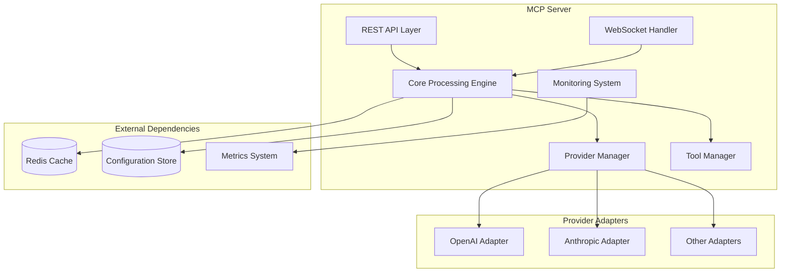

# MCP Server Implementation Guide

## Introduction

This guide provides detailed instructions for implementing the Model Context Protocol (MCP) server as part of the APISIX integration. The MCP server standardizes interactions with various Large Language Model (LLM) providers through a unified protocol, enabling consistent interfaces, enhanced resilience, and provider-agnostic applications.

This document covers:

1. Setup and configuration instructions
2. Component implementation details
3. Integration with APISIX
4. Best practices and patterns
5. Testing and validation approaches

## Prerequisites

Before implementing the MCP server, ensure the following prerequisites are met:

- Apache APISIX (version 2.15 or later) installed and configured
- Access to LLM provider API credentials (OpenAI, Anthropic, etc.)
- Node.js (version 18 or later) for the MCP server implementation
- Redis (optional, for caching and session management)
- Docker and Docker Compose for containerized deployment

## System Architecture

The MCP server consists of several interconnected components:



## Directory Structure

Organize the MCP server implementation using the following directory structure:

```
mcp-server/
├── config/
│   ├── default.yaml          # Default configuration
│   ├── production.yaml       # Production overrides
│   └── local.yaml            # Local development overrides (gitignored)
├── src/
│   ├── index.ts              # Application entry point
│   ├── server.ts             # Express/HTTP server setup
│   ├── ws-server.ts          # WebSocket server setup
│   ├── core/
│   │   ├── request-processor.ts
│   │   ├── response-handler.ts
│   │   └── error-handler.ts
│   ├── providers/
│   │   ├── provider-interface.ts
│   │   ├── base-provider.ts
│   │   ├── provider-registry.ts
│   │   └── adapters/
│   │       ├── openai.ts
│   │       ├── anthropic.ts
│   │       ├── deepseek.ts
│   │       ├── gemini.ts
│   │       └── groq.ts
│   ├── tools/
│   │   ├── tool-interface.ts
│   │   ├── tool-registry.ts
│   │   ├── tool-executor.ts
│   │   └── implementations/
│   │       ├── search-tools.ts
│   │       ├── calculation-tools.ts
│   │       ├── api-tools.ts
│   │       └── data-tools.ts
│   ├── utils/
│   │   ├── logger.ts
│   │   ├── metrics.ts
│   │   ├── cache.ts
│   │   └── validation.ts
│   └── types/
│       ├── requests.ts
│       ├── responses.ts
│       ├── errors.ts
│       └── tools.ts
├── test/
│   ├── unit/
│   ├── integration/
│   └── e2e/
├── Dockerfile
├── docker-compose.yml
├── package.json
└── tsconfig.json
```

## Configuration Templates

### MCP Server Configuration (YAML)

Create a `default.yaml` configuration file:

```yaml
server:
  port: 3000
  host: "0.0.0.0"
  apiPrefix: "/mcp"
  cors:
    enabled: true
    origin: "*"
  rateLimit:
    enabled: true
    windowMs: 60000
    max: 100

websocket:
  enabled: true
  path: "/mcp/ws"
  pingInterval: 30000
  maxPayloadSize: "1mb"

providers:
  default: "openai"  # Default provider if none specified
  openai:
    enabled: true
    baseUrl: "https://api.openai.com/v1"
    defaultModel: "gpt-3.5-turbo"
    timeout: 60000
    models:
      - id: "gpt-3.5-turbo"
        contextWindow: 16384
        supportsFunctions: true
        supportsVision: false
      - id: "gpt-4"
        contextWindow: 8192
        supportsFunctions: true
        supportsVision: true
  anthropic:
    enabled: true
    baseUrl: "https://api.anthropic.com/v1"
    defaultModel: "claude-3-sonnet"
    timeout: 120000
    models:
      - id: "claude-3-sonnet"
        contextWindow: 200000
        supportsFunctions: true
        supportsVision: true

tools:
  search:
    enabled: true
    maxResults: 10
  calculation:
    enabled: true
    timeout: 5000
  api:
    enabled: true
    allowedDomains: ["api.example.com"]
    timeout: 10000
  data:
    enabled: true
    maxDataSize: "10mb"

cache:
  enabled: true
  type: "redis"  # Options: "memory", "redis"
  redis:
    host: "localhost"
    port: 6379
    ttl: 3600  # Default TTL in seconds

monitoring:
  logging:
    level: "info"  # Options: debug, info, warn, error
    format: "json"  # Options: json, text
  metrics:
    enabled: true
    path: "/mcp/metrics"

security:
  requestValidation:
    enabled: true
    maxContentLength: "5mb"
  responseFiltering:
    enabled: true
    piiDetection: false
```

### APISIX Route Configuration (YAML)

Configure APISIX routes to the MCP server:

```yaml
routes:
  - id: mcp_server_api
    uri: /mcp/*
    upstream:
      type: roundrobin
      nodes:
        "mcp-server:3000": 1  # Docker service name and port
    plugins:
      proxy-rewrite:
        regex_uri: "^/mcp/(.*)"
        template_uri: "/$1"
      key-auth:
        header: "X-API-Key"
      prometheus:
        prefer_name: true
      cors:
        allow_origins: "*"
        allow_methods: "GET,POST,OPTIONS"
        allow_headers: "Content-Type,Authorization,X-API-Key"
      response-rewrite:
        headers:
          set:
            X-MCP-Version: "1.0.0"
      limit-req:
        rate: 100
        burst: 50
        rejected_code: 429
        key: remote_addr

  - id: mcp_server_websocket
    uri: /mcp/ws
    upstream:
      type: roundrobin
      nodes:
        "mcp-server:3000": 1
    plugins:
      proxy-rewrite:
        regex_uri: "^/mcp/(.*)"
        template_uri: "/$1"
      key-auth:
        header: "X-API-Key"
      prometheus:
        prefer_name: true

consumers:
  - username: client1
    plugins:
      key-auth:
        key: "EXAMPLE-SECRET-KEY-CHANGE-ME"
```

## Core Components Implementation

### Server Setup

The main entry point for the MCP server (`src/index.ts`):

```typescript
import { createServer } from './server';
import { setupWebSocketServer } from './ws-server';
import { config } from './utils/config';
import { logger } from './utils/logger';

async function start() {
  try {
    // Initialize the HTTP server
    const app = await createServer();

    // Start the server
    const httpServer = app.listen(config.server.port, config.server.host, () => {
      logger.info(`MCP server listening on ${config.server.host}:${config.server.port}`);
      logger.info(`API endpoints available at ${config.server.apiPrefix}`);
    });

    // Setup WebSocket if enabled
    if (config.websocket.enabled) {
      setupWebSocketServer(httpServer);
      logger.info(`WebSocket server enabled at ${config.websocket.path}`);
    }

    // Handle graceful shutdown
    process.on('SIGTERM', () => {
      logger.info('SIGTERM received, shutting down gracefully');
      httpServer.close(() => {
        logger.info('HTTP server closed');
        process.exit(0);
      });
    });
  } catch (error) {
    logger.error('Failed to start server', { error });
    process.exit(1);
  }
}

start();
```

### HTTP Server Setup (`src/server.ts`):

```typescript
import express from 'express';
import cors from 'cors';
import helmet from 'helmet';
import compression from 'compression';
import { json, urlencoded } from 'body-parser';
import { setupRoutes } from './routes';
import { errorMiddleware } from './middleware/error';
import { requestLoggerMiddleware } from './middleware/request-logger';
import { config } from './utils/config';
import { setupMetrics } from './utils/metrics';

export async function createServer() {
  const app = express();

  // Basic middleware
  app.use(helmet());
  app.use(compression());

  // Configure CORS
  if (config.server.cors.enabled) {
    app.use(cors({
      origin: config.server.cors.origin,
      methods: ['GET', 'POST', 'OPTIONS'],
      allowedHeaders: ['Content-Type', 'Authorization']
    }));
  }

  // Request parsing
  app.use(json({ limit: '5mb' }));
  app.use(urlencoded({ extended: true, limit: '5mb' }));

  // Logging and metrics
  app.use(requestLoggerMiddleware);
  setupMetrics(app);

  // Routes setup
  setupRoutes(app);

  // Error handling
  app.use(errorMiddleware);

  return app;
}
```

### Provider Interface (`src/providers/provider-interface.ts`):

```typescript
import { LLMRequest, LLMResponse, StreamingResponse } from '../types/requests';

export interface ProviderCapabilities {
  supportsFunctionCalling: boolean;
  supportsStreaming: boolean;
  supportsVision: boolean;
  supportsJsonMode: boolean;
  maxContextLength: number;
  tokenCountingAvailable: boolean;
}

export interface ProviderStats {
  requestCount: number;
  errorCount: number;
  avgLatency: number;
}

export interface Provider {
  /**
   * Unique identifier for this provider
   */
  readonly id: string;

  /**
   * List of models supported by this provider
   */
  readonly models: string[];

  /**
   * Get provider capabilities
   */
  getCapabilities(model: string): ProviderCapabilities;

  /**
   * Get provider statistics
   */
  getStats(): ProviderStats;

  /**
   * Generate a completion using this provider
   */
  generate(request: LLMRequest): Promise<LLMResponse>;

  /**
   * Generate a streaming completion using this provider
   */
  streamGenerate(request: LLMRequest): AsyncIterableIterator<StreamingResponse>;

  /**
   * Check health status of the provider
   */
  checkHealth(): Promise<boolean>;

  /**
   * Validate if a request can be handled by this provider
   */
  validateRequest(request: LLMRequest): Promise<{ valid: boolean, reason?: string }>;
}
```

### Base Provider Implementation (`src/providers/base-provider.ts`):

```typescript
import { LLMRequest, LLMResponse, StreamingResponse } from '../types/requests';
import { Provider, ProviderCapabilities, ProviderStats } from './provider-interface';
import { logger } from '../utils/logger';
import { metrics } from '../utils/metrics';

export abstract class BaseProvider implements Provider {
  public readonly id: string;
  public readonly models: string[];
  protected apiKey: string;
  protected baseUrl: string;
  private stats: ProviderStats = {
    requestCount: 0,
    errorCount: 0,
    avgLatency: 0
  };

  constructor(id: string, models: string[], apiKey: string, baseUrl: string) {
    this.id = id;
    this.models = models;
    this.apiKey = apiKey;
    this.baseUrl = baseUrl;
  }

  abstract getCapabilities(model: string): ProviderCapabilities;

  abstract generate(request: LLMRequest): Promise<LLMResponse>;

  abstract streamGenerate(request: LLMRequest): AsyncIterableIterator<StreamingResponse>;

  async checkHealth(): Promise<boolean> {
    try {
      // Implement a lightweight health check
      // This will vary by provider
      return true;
    } catch (error) {
      logger.error(`Health check failed for provider ${this.id}`, { error });
      return false;
    }
  }

  async validateRequest(request: LLMRequest): Promise<{ valid: boolean, reason?: string }> {
    // Check if the requested model is supported
    if (!this.models.includes(request.model)) {
      return {
        valid: false,
        reason: `Model ${request.model} is not supported by provider ${this.id}`
      };
    }

    // Check if the provider supports streaming if requested
    if (request.stream) {
      const capabilities = this.getCapabilities(request.model);
      if (!capabilities.supportsStreaming) {
        return {
          valid: false,
          reason: `Streaming is not supported by model ${request.model} on provider ${this.id}`
        };
      }
    }

    return { valid: true };
  }

  getStats(): ProviderStats {
    return { ...this.stats };
  }

  protected updateStats(startTime: number, error: boolean = false): void {
    const latency = Date.now() - startTime;
    this.stats.requestCount++;
    if (error) {
      this.stats.errorCount++;
    }
    // Update average latency
    this.stats.avgLatency =
      (this.stats.avgLatency * (this.stats.requestCount - 1) + latency) /
      this.stats.requestCount;

    // Record metrics
    metrics.recordProviderRequest(this.id, latency, error);
  }

  protected handleError(error: any, context: any): Error {
    logger.error(`Error in provider ${this.id}`, { error, context });
    // Normalize error format
    return new Error(`Provider ${this.id} error: ${error.message}`);
  }
}
```

### Provider Registry (`src/providers/provider-registry.ts`):

```typescript
import { Provider } from './provider-interface';
import { LLMRequest } from '../types/requests';
import { config } from '../utils/config';
import { logger } from '../utils/logger';
import { MCPError } from '../types/errors';

export class ProviderRegistry {
  private providers: Map<string, Provider> = new Map();
  private defaultProvider: string;

  constructor() {
    this.defaultProvider = config.providers.default || 'openai';
  }

  registerProvider(provider: Provider): void {
    logger.info(`Registering provider: ${provider.id}`);
    this.providers.set(provider.id, provider);
  }

  getProvider(providerId: string): Provider {
    const provider = this.providers.get(providerId);
    if (!provider) {
      throw new MCPError(
        'provider_not_found',
        `Provider ${providerId} not found`,
        404
      );
    }
    return provider;
  }

  getDefaultProvider(): Provider {
    return this.getProvider(this.defaultProvider);
  }

  getAllProviders(): Provider[] {
    return Array.from(this.providers.values());
  }

  async getProviderForRequest(request: LLMRequest): Promise<Provider> {
    // If provider is specified in request, use that
    if (request.provider) {
      return this.getProvider(request.provider);
    }

    // If model is specified, find appropriate provider
    if (request.model) {
      for (const provider of this.providers.values()) {
        if (provider.models.includes(request.model)) {
          return provider;
        }
      }
    }

    // Fall back to default provider
    return this.getDefaultProvider();
  }

  async getBestProviderForRequest(request: LLMRequest): Promise<Provider> {
    // First try to get explicitly requested provider or provider for the model
    try {
      const provider = await this.getProviderForRequest(request);
      // Validate the request against the provider
      const validation = await provider.validateRequest(request);
      if (validation.valid) {
        return provider;
      }

      logger.warn(`Provider ${provider.id} rejected request: ${validation.reason}`);
    } catch (error) {
      logger.warn(`Error getting requested provider: ${error.message}`);
    }

    // If that fails, find a provider that can handle the request
    for (const provider of this.providers.values()) {
      try {
        const validation = await provider.validateRequest(request);
        if (validation.valid) {
          logger.info(`Selected alternate provider ${provider.id} for request`);
          return provider;
        }
      } catch (error) {
        continue;
      }
    }

    // No suitable provider found
    throw new MCPError(
      'no_suitable_provider',
      'No suitable provider found for the request',
      400
    );
  }

  async checkProvidersHealth(): Promise<Map<string, boolean>> {
    const results = new Map<string, boolean>();
    for (const [id, provider] of this.providers.entries()) {
      results.set(id, await provider.checkHealth());
    }
    return results;
  }
}
```

### Request Processing (`src/core/request-processor.ts`):

```typescript
import { LLMRequest, LLMResponse, StreamingResponse } from '../types/requests';
import { ProviderRegistry } from '../providers/provider-registry';
import { ToolRegistry } from '../tools/tool-registry';
import { logger } from '../utils/logger';
import { metrics } from '../utils/metrics';
import { cache } from '../utils/cache';
import { validateRequest } from '../utils/validation';
import { MCPError } from '../types/errors';

export class RequestProcessor {
  private providerRegistry: ProviderRegistry;
  private toolRegistry: ToolRegistry;

  constructor(providerRegistry: ProviderRegistry, toolRegistry: ToolRegistry) {
    this.providerRegistry = providerRegistry;
    this.toolRegistry = toolRegistry;
  }

  async processRequest(request: LLMRequest): Promise<LLMResponse> {
    const startTime = Date.now();

    try {
      // Validate the request
      validateRequest(request);

      // Check cache if enabled
      const cacheKey = this.generateCacheKey(request);
      if (!request.stream && cache.isEnabled) {
        const cachedResponse = await cache.get(cacheKey);
        if (cachedResponse) {
          logger.debug('Cache hit for request');
          metrics.recordCacheHit();
          return cachedResponse;
        }
      }

      // Prepare tools if specified
      if (request.tools && request.tools.length > 0) {
        this.prepareTools(request);
      }

      // Get the best provider for the request
      const provider = await this.providerRegistry.getBestProviderForRequest(request);

      // Process the request
      logger.info(`Processing request with provider ${provider.id}`);
      const response = await provider.generate(request);

      // Cache the response if appropriate
      if (!request.stream && cache.isEnabled) {
        await cache.set(cacheKey, response);
      }

      // Record metrics
      metrics.recordRequestProcessed(Date.now() - startTime);

      return response;
    } catch (error) {
      metrics.recordRequestError();
      logger.error('Error processing request', { error });

      if (error instanceof MCPError) {
        throw error;
      }

      throw new MCPError(
        'request_processing_error',
        error.message || 'Error processing request',
        500
      );
    }
  }

  async *processStreamingRequest(request: LLMRequest): AsyncIterableIterator<StreamingResponse> {
    const startTime = Date.now();

    try {
      // Validate the request
      validateRequest(request);
      request.stream = true; // Ensure stream flag is set

      // Prepare tools if specified
      if (request.tools && request.tools.length > 0) {
        this.prepareTools(request);
      }

      // Get the best provider for the request
      const provider = await this.providerRegistry.getBestProviderForRequest(request);

      logger.info(`Processing streaming request with provider ${provider.id}`);

      // Stream the response
      for await (const chunk of provider.streamGenerate(request)) {
        yield chunk;
      }

      // Record metrics
      metrics.recordStreamingRequestProcessed(Date.now() - startTime);
    } catch (error) {
      metrics.recordRequestError();
      logger.error('Error processing streaming request', { error });

      // Yield error as a special chunk
      yield {
        error: {
          code: error instanceof MCPError ? error.code : 'streaming_error',
          message: error.message || 'Error in streaming request'
        }
      };
    }
  }

  private prepareTools(request: LLMRequest): void {
    // Validate and prepare tools for execution
    if (!request.tools) return;

    request.tools = request.tools.map(tool => {
      const toolDef = this.toolRegistry.getToolDefinition(tool.type);
      if (!toolDef) {
        throw new MCPError(
          'invalid_tool',
          `Tool type '${tool.type}' is not supported`,
          400
        );
      }
      // Tool-specific validation and preparation
      return toolDef.prepare(tool);
    });
  }

  private generateCacheKey(request: LLMRequest): string {
    // Generate a deterministic cache key based on request content
    // Exclude non-deterministic fields like timestamps
    const cacheableRequest = {
      model: request.model,
      provider: request.provider,
      messages: request.messages,
      temperature: request.temperature,
      max_tokens: request.max_tokens,
      response_format: request.response_format
    };

    return `mcp:request:${JSON.stringify(cacheableRequest)}`;
  }
}
```

## Docker Deployment

Create a `Dockerfile` for the MCP server:

```dockerfile
FROM node:18-alpine AS builder

WORKDIR /app

COPY package.json package-lock.json ./
RUN npm ci

COPY tsconfig.json ./
COPY src/ ./src/

RUN npm run build

FROM node:18-alpine

WORKDIR /app

COPY package.json package-lock.json ./
RUN npm ci --production

COPY --from=builder /app/dist ./dist
COPY config ./config

EXPOSE 3000

CMD ["node", "dist/index.js"]
```

Create a `docker-compose.yml` file for local development:

```yaml
version: '3.8'

services:
  apisix:
    image: apache/apisix:2.15.0-alpine
    ports:
      - "9080:9080"
      - "9443:9443"
    volumes:
      - ./apisix-config:/usr/local/apisix/conf
    environment:
      - APISIX_STAND_ALONE=true
    networks:
      - mcp-network
    depends_on:
      - mcp-server

  mcp-server:
    build:
      context: .
      dockerfile: Dockerfile
    ports:
      - "3000:3000"
    environment:
      - NODE_ENV=development
      - OPENAI_API_KEY=${OPENAI_API_KEY}
      - ANTHROPIC_API_KEY=${ANTHROPIC_API_KEY}
    volumes:
      - ./config:/app/config
    networks:
      - mcp-network
    depends_on:
      - redis

  redis:
    image: redis:7-alpine
    ports:
      - "6379:6379"
    networks:
      - mcp-network

networks:
  mcp-network:
```

## Integration with APISIX

### APISIX Configuration

Ensure APISIX is properly configured for MCP Server integration:

1. Create the necessary configuration files in your APISIX configuration directory:

`apisix-config/config.yaml`:

```yaml
apisix:
  node_listen: 9080
  enable_admin: true
  admin_key: edd1c9f034335f136f87ad84b625c8f1

plugin_attr:
  prometheus:
    export_addr:
      ip: "0.0.0.0"
      port: 9091

plugins:
  - proxy-rewrite
  - key-auth
  - cors
  - prometheus
  - response-rewrite
  - limit-req
```

2. Configure APISIX routes for MCP Server integration:

`apisix-config/routes.yaml`:

```yaml
routes:
  - id: mcp_server_api
    uri: /mcp/*
    upstream:
      type: roundrobin
      nodes:
        "mcp-server:3000": 1
    plugins:
      proxy-rewrite:
        regex_uri: "^/mcp/(.*)"
        template_uri: "/$1"
      key-auth:
        header: "X-API-Key"
      prometheus:
        prefer_name: true
      cors:
        allow_origins: "*"
        allow_methods: "GET,POST,OPTIONS"
        allow_headers: "Content-Type,Authorization,X-API-Key"

  - id: mcp_server_websocket
    uri: /mcp/ws
    upstream:
      type: roundrobin
      nodes:
        "mcp-server:3000": 1
    plugins:
      proxy-rewrite:
        regex_uri: "^/mcp/(.*)"
        template_uri: "/$1"
      key-auth:
        header: "X-API-Key"
```

### Integration Testing

Create an integration test for the APISIX-MCP connection:

`test/integration/apisix-mcp-integration.test.ts`:

```typescript
import axios from 'axios';
import WebSocket from 'ws';

describe('APISIX-MCP Integration', () => {
  const APISIX_URL = 'http://localhost:9080';
  const API_KEY = 'EXAMPLE-SECRET-KEY-CHANGE-ME';

  test('MCP server is accessible through APISIX', async () => {
    const response = await axios.get(`${APISIX_URL}/mcp/health`, {
      headers: {
        'X-API-Key': API_KEY
      }
    });

    expect(response.status).toBe(200);
    expect(response.data).toHaveProperty('status', 'ok');
  });

  test('LLM request flows through APISIX to MCP', async () => {
    const request = {
      model: 'gpt-3.5-turbo',
      messages: [{ role: 'user', content: 'Say hello' }]
    };

    const response = await axios.post(`${APISIX_URL}/mcp/generate`, request, {
      headers: {
        'X-API-Key': API_KEY,
        'Content-Type': 'application/json'
      }
    });

    expect(response.status).toBe(200);
    expect(response.data).toHaveProperty('choices');
    expect(response.data.choices[0]).toHaveProperty('message');
  });

  test('WebSocket streaming works through APISIX', (done) => {
    const ws = new WebSocket(`ws://localhost:9080/mcp/ws`, {
      headers: {
        'X-API-Key': API_KEY
      }
    });

    ws.on('open', () => {
      ws.send(JSON.stringify({
        type: 'generate',
        payload: {
          model: 'gpt-3.5-turbo',
          messages: [{ role: 'user', content: 'Say hello' }],
          stream: true
        }
      }));
    });

    let receivedChunks = 0;

    ws.on('message', (data) => {
      const message = JSON.parse(data.toString());

      if (message.type === 'chunk') {
        receivedChunks++;
      } else if (message.type === 'done') {
        expect(receivedChunks).toBeGreaterThan(0);
        ws.close();
        done();
      }
    });

    ws.on('error', (error) => {
      done(error);
    });
  });
});
```

## Best Practices

### Error Handling

1. **Normalize Error Formats**: Ensure all errors returned from the MCP server follow the standardized format.

2. **Graceful Degradation**: When a provider fails, attempt to fall back to another provider if possible.

3. **Detailed Logging**: Log detailed error information for debugging while protecting sensitive data.

Example implementation of an error handler middleware:

```typescript
import { Request, Response, NextFunction } from 'express';
import { MCPError } from '../types/errors';
import { logger } from '../utils/logger';

export function errorMiddleware(
  error: Error,
  req: Request,
  res: Response,
  next: NextFunction
) {
  logger.error('Error processing request', {
    error,
    path: req.path,
    method: req.method,
    requestId: req.headers['x-request-id']
  });

  if (error instanceof MCPError) {
    return res.status(error.statusCode).json({
      error: {
        code: error.code,
        message: error.message,
        type: error.type,
        param: error.param,
        request_id: req.headers['x-request-id']
      }
    });
  }

  // For unexpected errors, return a generic error
  return res.status(500).json({
    error: {
      code: 'internal_server_error',
      message: 'An unexpected error occurred',
      request_id: req.headers['x-request-id']
    }
  });
}
```

### Performance Optimization

1. **Caching**: Implement response caching for identical non-streaming requests.

2. **Connection Pooling**: Use HTTP connection pooling for provider requests.

3. **Request Timeout Management**: Set appropriate timeouts for all external requests.

Example implementation of cache middleware:

```typescript
import { redis } from './redis';
import { config } from './config';

class CacheManager {
  private enabled: boolean;
  private ttl: number;

  constructor() {
    this.enabled = config.cache.enabled;
    this.ttl = config.cache.redis.ttl;
  }

  get isEnabled(): boolean {
    return this.enabled;
  }

  async get<T>(key: string): Promise<T | null> {
    if (!this.enabled) return null;

    try {
      const value = await redis.get(key);
      if (!value) return null;

      return JSON.parse(value) as T;
    } catch (error) {
      return null;
    }
  }

  async set<T>(key: string, value: T, ttl?: number): Promise<void> {
    if (!this.enabled) return;

    try {
      const serialized = JSON.stringify(value);
      await redis.set(key, serialized, 'EX', ttl || this.ttl);
    } catch (error) {
      // Silently fail cache operations
    }
  }

  async invalidate(key: string): Promise<void> {
    if (!this.enabled) return;

    try {
      await redis.del(key);
    } catch (error) {
      // Silently fail cache operations
    }
  }
}

export const cache = new CacheManager();
```

### Security Best Practices

1. **API Key Rotation**: Implement automatic rotation of provider API keys.

2. **Request Validation**: Thoroughly validate all incoming requests.

3. **Rate Limiting**: Apply rate limiting at the APISIX layer.

4. **Sanitize Responses**: Filter sensitive information from responses.

Example implementation for request validation:

```typescript
import { LLMRequest } from '../types/requests';
import { MCPError } from '../types/errors';

export function validateRequest(request: LLMRequest): void {
  // Check required fields
  if (!request.messages || !Array.isArray(request.messages) || request.messages.length === 0) {
    throw new MCPError(
      'invalid_request',
      'Messages array is required and must not be empty',
      400,
      'messages'
    );
  }

  // Validate message format
  for (const [index, message] of request.messages.entries()) {
    if (!message.role || typeof message.role !== 'string') {
      throw new MCPError(
        'invalid_request',
        `Message at index ${index} has invalid or missing role`,
        400,
        `messages[${index}].role`
      );
    }

    if (message.content === undefined || message.content === null) {
      throw new MCPError(
        'invalid_request',
        `Message at index ${index} has missing content`,
        400,
        `messages[${index}].content`
      );
    }
  }

  // Validate temperature if provided
  if (request.temperature !== undefined) {
    if (typeof request.temperature !== 'number' ||
        request.temperature < 0 ||
        request.temperature > 2) {
      throw new MCPError(
        'invalid_request',
        'Temperature must be a number between 0 and 2',
        400,
        'temperature'
      );
    }
  }

  // Validate max_tokens if provided
  if (request.max_tokens !== undefined) {
    if (typeof request.max_tokens !== 'number' ||
        request.max_tokens <= 0 ||
        request.max_tokens > 100000) {
      throw new MCPError(
        'invalid_request',
        'max_tokens must be a positive number',
        400,
        'max_tokens'
      );
    }
  }

  // Validate tools if provided
  if (request.tools) {
    if (!Array.isArray(request.tools)) {
      throw new MCPError(
        'invalid_request',
        'tools must be an array',
        400,
        'tools'
      );
    }

    for (const [index, tool] of request.tools.entries()) {
      if (!tool.type) {
        throw new MCPError(
          'invalid_request',
          `Tool at index ${index} has missing type`,
          400,
          `tools[${index}].type`
        );
      }
    }
  }
}
```

## Testing and Validation

### Unit Testing

Example unit test for the OpenAI provider adapter:

```typescript
import { OpenAIAdapter } from '../../src/providers/adapters/openai';
import { LLMRequest } from '../../src/types/requests';

// Mock the OpenAI API
jest.mock('openai', () => {
  return {
    OpenAI: jest.fn().mockImplementation(() => {
      return {
        chat: {
          completions: {
            create: jest.fn().mockResolvedValue({
              id: 'test-id',
              object: 'chat.completion',
              created: Date.now(),
              model: 'gpt-3.5-turbo',
              choices: [
                {
                  index: 0,
                  message: {
                    role: 'assistant',
                    content: 'This is a test response'
                  },
                  finish_reason: 'stop'
                }
              ],
              usage: {
                prompt_tokens: 10,
                completion_tokens: 20,
                total_tokens: 30
              }
            })
          }
        }
      };
    })
  };
});

describe('OpenAI Provider Adapter', () => {
  const adapter = new OpenAIAdapter('test-api-key', 'https://api.openai.com/v1');

  test('should translate MCP request to OpenAI format', async () => {
    const request: LLMRequest = {
      model: 'gpt-3.5-turbo',
      messages: [{ role: 'user', content: 'Hello' }],
      temperature: 0.7
    };

    const result = await adapter.generate(request);

    expect(result).toHaveProperty('choices');
    expect(result.choices[0].message.content).toBe('This is a test response');
    expect(result.usage.total_tokens).toBe(30);
  });

  test('should correctly map capabilities', () => {
    const capabilities = adapter.getCapabilities('gpt-3.5-turbo');

    expect(capabilities.supportsFunctionCalling).toBe(true);
    expect(capabilities.supportsStreaming).toBe(true);
  });
});
```

### Integration Testing

For integration testing, use Docker Compose to set up a test environment:

`docker-compose.test.yml`:

```yaml
version: '3.8'

services:
  apisix:
    image: apache/apisix:2.15.0-alpine
    ports:
      - "9080:9080"
    volumes:
      - ./test/apisix-config:/usr/local/apisix/conf
    environment:
      - APISIX_STAND_ALONE=true
    networks:
      - test-network

  mcp-server:
    build:
      context: .
      dockerfile: Dockerfile.test
    ports:
      - "3000:3000"
    environment:
      - NODE_ENV=test
      - OPENAI_API_KEY=mock-key
      - ANTHROPIC_API_KEY=mock-key
    volumes:
      - ./test/config:/app/config
    networks:
      - test-network

  test-runner:
    build:
      context: .
      dockerfile: Dockerfile.test
    volumes:
      - .:/app
    command: npm run test:integration
    depends_on:
      - apisix
      - mcp-server
    networks:
      - test-network

networks:
  test-network:
```

## Monitoring and Observability

Implement comprehensive monitoring:

1. **Prometheus Metrics**: Expose key metrics about request volume, latency, and errors.

2. **Structured Logging**: Use JSON-formatted logs for easier analysis.

3. **Health Check Endpoints**: Create endpoints for health and readiness checks.

Example health check endpoint:

```typescript
import { Router } from 'express';
import { ProviderRegistry } from '../providers/provider-registry';

export function createHealthRouter(providerRegistry: ProviderRegistry) {
  const router = Router();

  // Basic health check
  router.get('/', async (req, res) => {
    res.json({ status: 'ok', timestamp: Date.now() });
  });

  // Detailed health check
  router.get('/detailed', async (req, res) => {
    try {
      // Check provider health
      const providerHealth = await providerRegistry.checkProvidersHealth();

      // Get statistics
      const stats = {
        providers: Array.from(providerRegistry.getAllProviders()).map(provider => ({
          id: provider.id,
          health: providerHealth.get(provider.id),
          stats: provider.getStats()
        }))
      };

      res.json({
        status: 'ok',
        timestamp: Date.now(),
        stats
      });
    } catch (error) {
      res.status(500).json({
        status: 'error',
        message: error.message
      });
    }
  });

  return router;
}
```

## Conclusion

This implementation guide provides the foundation for building a robust MCP server integrated with APISIX. The server architecture offers a standardized approach to LLM interactions while ensuring high availability, security, and monitoring capabilities.

Key success criteria for your implementation:

1. **Provider Independence**: Applications interact with LLMs through a standardized interface
2. **Resilience**: The system handles errors gracefully with fallbacks
3. **Security**: All interactions are authenticated and monitored
4. **Observability**: Comprehensive metrics and logging
5. **Performance**: Minimal latency overhead compared to direct provider calls

Follow the best practices outlined in this document to ensure your MCP server implementation meets enterprise requirements for security, scalability, and reliability.
