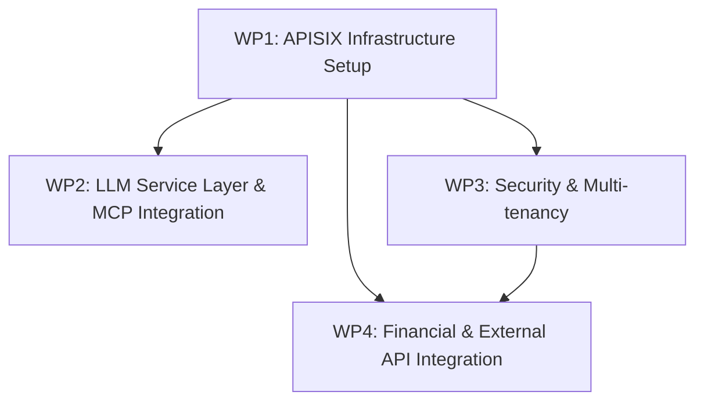

# APISIX Integration Work Package Tracking

## Introduction

This document outlines the work package structure for implementing the APISIX integration with the Enterprise Agentic AI Executive Platform. It defines the dependencies between work packages, ownership roles and responsibilities, and tracking mechanisms for implementation progress.

The work package structure is designed to enable parallel development where possible while respecting critical dependencies. Each work package has clearly defined deliverables, responsibilities, and quality criteria to ensure successful implementation.

## Work Package Structure

### 1. WP1: APISIX Infrastructure Setup

**Owner Role:** Infrastructure Specialist

**Description:** Establish the core APISIX infrastructure required for all subsequent work packages.

**Key Responsibilities:**

- APISIX installation and configuration
- Infrastructure setup and networking
- Integration with existing systems
- Performance optimization
- Monitoring and logging setup

**Deliverables:**

- Functional APISIX gateway deployment
- Configuration management approach
- Load balancing and scaling setup
- Monitoring dashboards
- Infrastructure documentation

**Quality Criteria:**

- APISIX responds to basic requests with <50ms latency
- Configuration changes apply without downtime
- Infrastructure is deployed with high availability
- Logging and monitoring provide adequate visibility
- Documentation enables operational management

**Dependencies:** None (this is a foundational work package)

### 2. WP2: LLM Service Layer & MCP Integration

**Owner Role:** AI Integration Specialist

**Description:** Implement the Model Context Protocol (MCP) server and refactor the LLM service layer to use the standardized interfaces.

**Key Responsibilities:**

- Refactor existing LLM service layer
- MCP server implementation
- Provider adapter development
- Integration testing with LLM providers
- MCP tool development

**Deliverables:**

- Enhanced LLM service with APISIX routing
- Functional MCP server
- Provider-specific adapters
- MCP tool implementations
- Integration tests and documentation

**Quality Criteria:**

- Successful routing of LLM requests through APISIX
- All provider-specific functionality preserved
- Response latency comparable to or better than direct calls
- Graceful handling of provider errors
- Comprehensive test coverage

**Dependencies:**

- WP1: APISIX Infrastructure Setup (basic APISIX functionality)

### 3. WP3: Security & Multi-tenancy

**Owner Role:** Security Specialist

**Description:** Implement comprehensive security features and multi-tenant isolation capabilities.

**Key Responsibilities:**

- Authentication and authorization implementation
- Multi-tenant isolation
- Security policy configuration
- Rate limiting and quota management
- Security testing and documentation

**Deliverables:**

- Authentication framework
- Multi-tenant routing rules
- Security policies and configurations
- Testing and validation reports
- Security documentation

**Quality Criteria:**

- Strong authentication with multiple methods
- Complete tenant isolation with no data leakage
- Effective rate limiting under load
- Comprehensive security logging
- Passes penetration testing

**Dependencies:**

- WP1: APISIX Infrastructure Setup (basic APISIX functionality)

### 4. WP4: Financial & External API Integration

**Owner Role:** API Integration Specialist

**Description:** Configure routing for financial APIs and external services through the APISIX gateway.

**Key Responsibilities:**

- Financial API routing configuration
- External service integration
- Response transformation
- Caching strategies
- Service reliability patterns

**Deliverables:**

- API routes configuration
- Transformation plugins
- Caching policies
- Failover configurations
- Integration documentation

**Quality Criteria:**

- Successful routing to all external services
- Accurate response transformation
- Effective caching improving performance
- Resilience during service disruptions
- Complete documentation for operations

**Dependencies:**

- WP1: APISIX Infrastructure Setup (basic APISIX functionality)
- WP3: Security & Multi-tenancy (security framework)

## Work Package Dependencies

The following diagram illustrates the dependencies between work packages:

### Critical Path Analysis

The critical path for implementation consists of:

1. **WP1: APISIX Infrastructure Setup** - This is the foundation for all other work packages
2. **WP3: Security & Multi-tenancy** - Required for financial and external API integration
3. **WP4: Financial & External API Integration** - The final dependent work package

Work Package 2 (LLM Service Layer & MCP Integration) can proceed in parallel with WP3 after WP1 is complete, as it has no dependency on security features for initial implementation.

## Ownership Roles and Responsibilities

### Role: Infrastructure Specialist

**Skills Required:**

- NGINX and APISIX expertise
- Container orchestration (Docker, Kubernetes)
- Linux systems administration
- Network configuration
- Observability tools

**Responsibilities:**

- Design and implement APISIX infrastructure
- Ensure high availability and performance
- Configure monitoring and alerting
- Document infrastructure
- Support other teams with infrastructure needs

### Role: AI Integration Specialist

**Skills Required:**

- LLM API expertise
- API design and implementation
- Async programming
- MCP specification knowledge
- Testing methodologies

**Responsibilities:**

- Design and implement MCP server
- Develop provider adapters
- Refactor LLM service layer
- Document integration patterns
- Ensure performance and reliability

### Role: Security Specialist

**Skills Required:**

- Authentication systems expertise
- Authorization frameworks
- Security best practices
- Multi-tenant architecture
- Security testing

**Responsibilities:**

- Design security architecture
- Implement authentication and authorization
- Configure multi-tenant isolation
- Document security policies
- Validate security implementation

### Role: API Integration Specialist

**Skills Required:**

- API gateway configuration
- Financial API knowledge
- Response transformation
- Caching strategies
- Reliability patterns

**Responsibilities:**

- Configure API routing
- Implement transformation logic
- Design caching strategies
- Ensure service reliability
- Document integration patterns

## RACI Matrix

The following matrix defines Responsible, Accountable, Consulted, and Informed roles for each work package:

| Work Package                              | Infrastructure Specialist | AI Integration Specialist | Security Specialist | API Integration Specialist |
| ----------------------------------------- | ------------------------- | ------------------------- | ------------------- | -------------------------- |
| WP1: APISIX Infrastructure Setup          | R/A                       | C                         | C                   | C                          |
| WP2: LLM Service Layer & MCP Integration  | C                         | R/A                       | C                   | I                          |
| WP3: Security & Multi-tenancy             | C                         | C                         | R/A                 | I                          |
| WP4: Financial & External API Integration | C                         | I                         | C                   | R/A                        |

- **R**: Responsible - Does the work
- **A**: Accountable - Ensures completion and quality
- **C**: Consulted - Provides input and expertise
- **I**: Informed - Kept up-to-date on progress

## Progress Tracking Mechanisms

### Work Package Status Tracking

The implementation progress is tracked through a standardized status framework:

1. **Planning** - Requirements gathering and design
2. **In Progress** - Active implementation
3. **Testing** - Validation and quality assurance
4. **Review** - Final review and approval
5. **Complete** - Fully implemented and operational

### Key Milestones

Progress is measured against the following key milestones for each work package:

#### WP1: APISIX Infrastructure Setup

1. Infrastructure design approved
2. Basic APISIX deployment operational
3. Configuration management implemented
4. Monitoring and alerting in place
5. Documentation completed
6. Production readiness achieved

#### WP2: LLM Service Layer & MCP Integration

1. MCP server design approved
2. Initial MCP server implementation
3. Provider adapters completed
4. LLM service refactoring complete
5. Integration tests passed
6. Production readiness achieved

#### WP3: Security & Multi-tenancy

1. Security architecture approved
2. Authentication framework implemented
3. Multi-tenant isolation achieved
4. Security testing completed
5. Documentation finalized
6. Production readiness achieved

#### WP4: Financial & External API Integration

1. Integration design approved
2. Initial route configuration completed
3. Transformation and caching implemented
4. Reliability testing completed
5. Documentation finalized
6. Production readiness achieved

### Quality Gates

Each work package must pass through defined quality gates:

1. **Design Review** - Architecture and approach validation
2. **Implementation Review** - Code and configuration quality
3. **Testing Validation** - Functional, performance, and security testing
4. **Documentation Review** - Completeness and accuracy check
5. **Operational Readiness** - Monitoring, alerting, and support preparations

### Reporting Structure

Progress is reported through:

1. **Daily Standup** - Brief status updates and blockers
2. **Weekly Status Report** - Detailed progress against milestones
3. **Bi-weekly Demo** - Demonstration of implemented functionality
4. **Monthly Review** - Comprehensive assessment of overall progress

## Risk Management

Each work package includes specific risks and mitigation strategies:

### WP1: APISIX Infrastructure Setup

- **Risk**: Performance impact of adding gateway layer

  - **Mitigation**: Performance testing and optimization early in implementation

- **Risk**: Configuration complexity leading to errors
  - **Mitigation**: Automated testing of configuration changes

### WP2: LLM Service Layer & MCP Integration

- **Risk**: Provider API changes breaking adapters

  - **Mitigation**: Versioned interfaces and comprehensive testing

- **Risk**: MCP specification evolving during implementation
  - **Mitigation**: Modular design to accommodate changes

### WP3: Security & Multi-tenancy

- **Risk**: Security vulnerabilities in configuration

  - **Mitigation**: Security reviews and penetration testing

- **Risk**: Multi-tenant isolation failures
  - **Mitigation**: Comprehensive testing with tenant boundary cases

### WP4: Financial & External API Integration

- **Risk**: External API availability affecting testing

  - **Mitigation**: Mock services for testing and development

- **Risk**: Complex transformation requirements
  - **Mitigation**: Incremental implementation with validation

## Implementation Tracking Board

The following tracking board structure is used to visualize progress:

| Work Package            | Planning | In Progress | Testing | Review | Complete |
| ----------------------- | -------- | ----------- | ------- | ------ | -------- |
| **WP1: Tasks**          |
| APISIX installation     |          |             |         |        |          |
| Configuration setup     |          |             |         |        |          |
| Networking integration  |          |             |         |        |          |
| Monitoring setup        |          |             |         |        |          |
| **WP2: Tasks**          |
| MCP server design       |          |             |         |        |          |
| Provider adapters       |          |             |         |        |          |
| LLM service refactoring |          |             |         |        |          |
| Integration testing     |          |             |         |        |          |
| **WP3: Tasks**          |
| Auth framework          |          |             |         |        |          |
| Multi-tenant isolation  |          |             |         |        |          |
| Security policies       |          |             |         |        |          |
| Security testing        |          |             |         |        |          |
| **WP4: Tasks**          |
| API route configuration |          |             |         |        |          |
| Transformation plugins  |          |             |         |        |          |
| Caching implementation  |          |             |         |        |          |
| Reliability testing     |          |             |         |        |          |

## Conclusion

This work package tracking document provides a comprehensive framework for managing the implementation of the APISIX integration. By clearly defining the work package structure, dependencies, ownership, and tracking mechanisms, the implementation team can coordinate effectively to deliver the integration on schedule and with high quality.

The modular approach, with well-defined interfaces between work packages, allows for parallel development while ensuring that critical dependencies are respected. Regular tracking and reporting mechanisms provide visibility into progress and enable early identification of any issues that may affect the implementation timeline.
