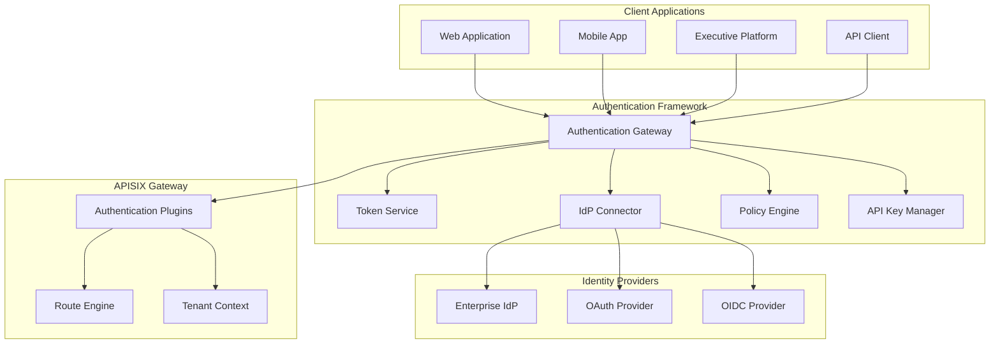
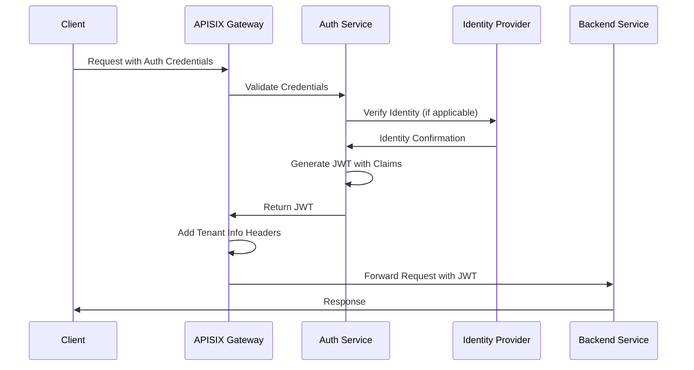
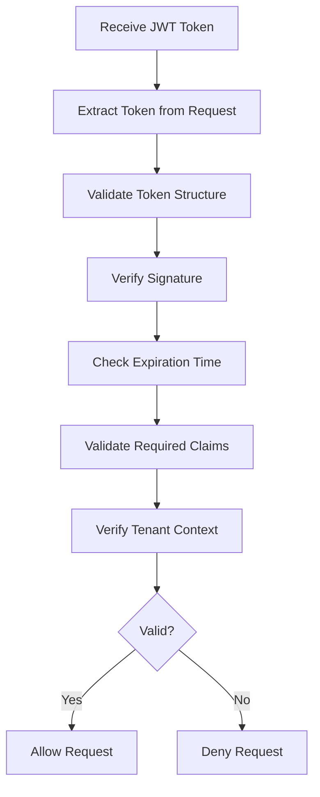
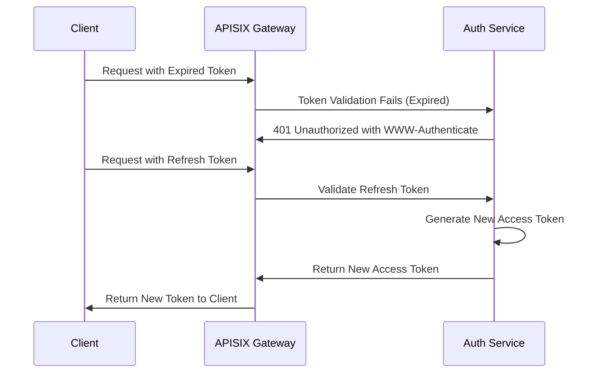
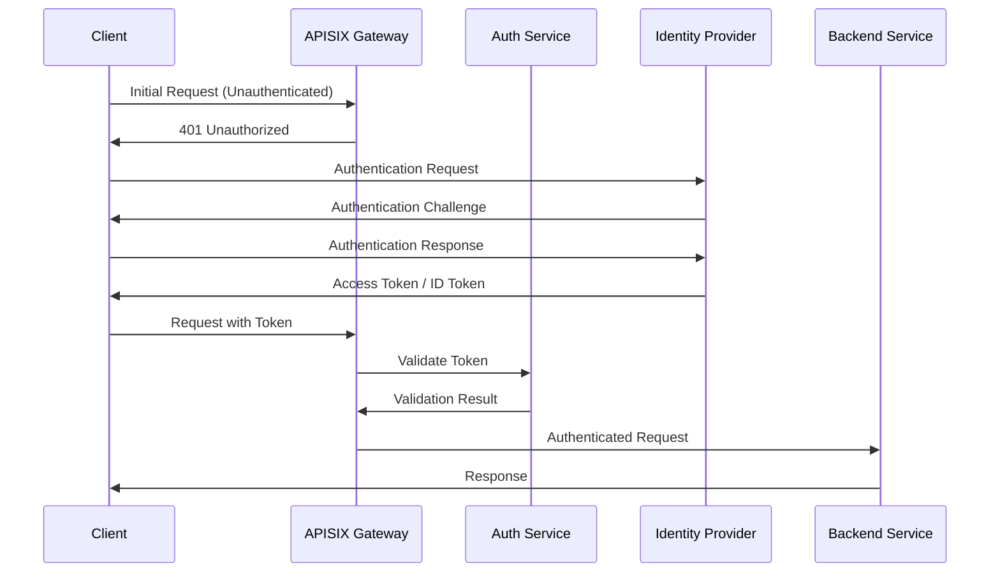
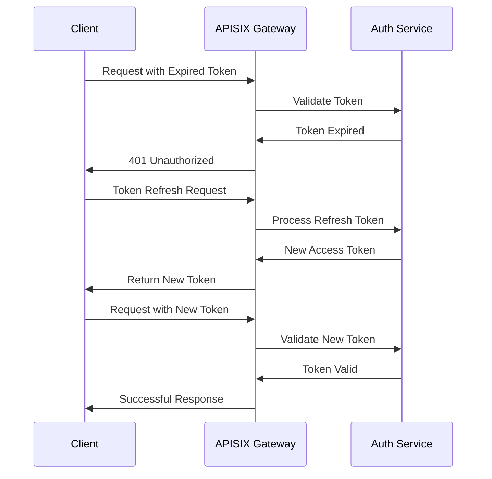
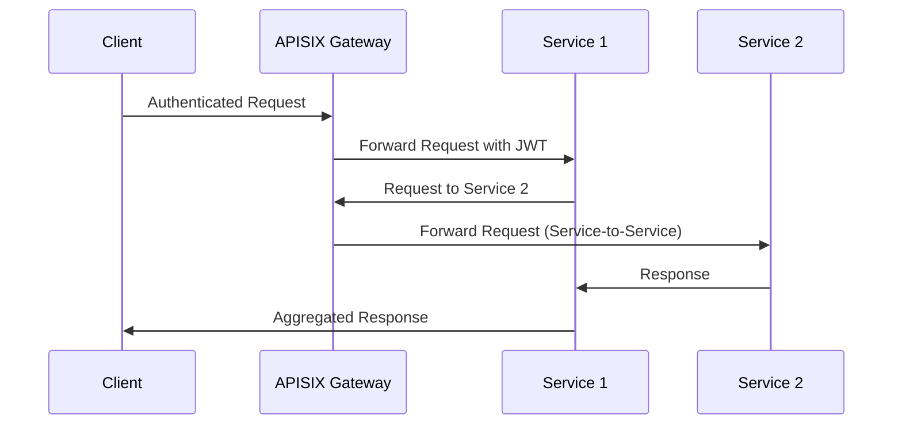
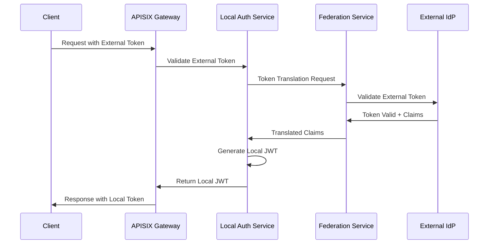
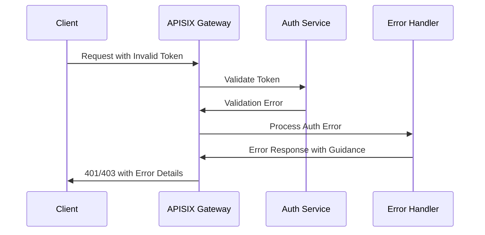

# Authentication Framework

## Introduction

The authentication framework in the APISIX integration with the Enterprise Agentic AI Executive Platform provides a robust, flexible, and centralized approach to authentication and authorization. This document provides a comprehensive overview of the framework, including its architecture, integration with various authentication providers, token handling mechanisms, and configuration examples.

### Key Goals and Benefits

- **Unified Authentication**: Centralized authentication for all platform components
- **Multiple Authentication Methods**: Support for API Keys, JWT, OAuth 2.0, OIDC, and mTLS
- **Enterprise-Grade Security**: Integration with enterprise identity providers
- **Granular Access Control**: Fine-grained permissions based on roles and tenants
- **Developer-Friendly**: Simplified integration with clear authentication flows
- **Audit Capabilities**: Comprehensive logging of authentication events

### Enterprise Security Integration

The authentication framework is designed to integrate seamlessly with existing enterprise security infrastructure, including:

- Enterprise identity providers (IdPs)
- Single sign-on (SSO) systems
- Corporate directory services
- Security monitoring and alerting systems
- Compliance and audit frameworks

## Authentication Framework Architecture

The authentication framework consists of several interconnected components that work together to provide a comprehensive authentication solution.

### Component Overview



### Integration Points

The authentication framework integrates with the APISIX gateway and the Enterprise Agentic AI Executive Platform through the following key integration points:

1. **APISIX Authentication Plugins**: Leverages APISIX's built-in authentication plugins with custom extensions for platform-specific requirements
2. **Token Service API**: Provides endpoints for token issuance, validation, and refresh
3. **Identity Provider Connectors**: Standardized interfaces for connecting to various identity providers
4. **Policy Decision Points**: Integration with route configuration for authorization decisions
5. **Tenant Context Propagation**: Authentication information provides tenant context for multi-tenancy support

### Authentication Service Interactions

The following diagram illustrates the interactions between authentication services during a typical authentication flow:



### Token Management Infrastructure

The token management infrastructure handles the lifecycle of authentication tokens, including:

- Token generation and signing
- Token validation and verification
- Token revocation
- Token refresh mechanisms
- Token storage and caching

## Authentication Providers

The authentication framework supports multiple authentication providers to accommodate various use cases and security requirements. Each provider is implemented with equal consideration for security, performance, and usability.

### API Key Authentication

API key authentication provides a simple and efficient method for service-to-service communication and programmatic access to APIs.

#### Features

- Simple implementation and usage
- Support for multiple keys per client
- Automatic key rotation and expiration
- Key scoping to specific routes or services
- Rate limiting per API key

#### Implementation

API keys are implemented using APISIX's `key-auth` plugin with custom extensions for enterprise requirements:

```yaml
# APISIX Route Configuration for API Key Authentication
routes:
  - id: data_api_route
    uri: /data/*
    plugins:
      key-auth:
        header: "X-API-Key"
        hide_credentials: true
        expire_time: 3600  # Optional expiration in seconds
      custom-key-validator:
        scope_verification: true
```

### JWT Token Authentication

JWT (JSON Web Token) provides stateless authentication with rich claim support, making it ideal for web applications and services.

#### Features

- Stateless authentication with cryptographic verification
- Support for standard and custom claims
- Role and permission encoding
- Tenant context embedding
- Configurable token expiration

#### Implementation

JWT authentication is implemented using APISIX's `jwt-auth` plugin:

```yaml
# APISIX Route Configuration for JWT Authentication
routes:
  - id: user_api_route
    uri: /api/user/*
    plugins:
      jwt-auth:
        header: "Authorization"
        query: "token"
        cookie: "jwt"
        key: "user-key"
        secret: "change-this-secret"
        exp: 3600  # Token expiration in seconds
        base64_secret: false
        lifetime_grace_period: 30  # Grace period in seconds
```

### OAuth 2.0 Authentication

OAuth 2.0 provides delegated authentication for third-party applications, supporting various grant types for different scenarios.

#### Features

- Standard OAuth 2.0 grant types (authorization code, client credentials, etc.)
- Token introspection with resource servers
- Scope-based access control
- Integration with external OAuth providers
- Refresh token support

#### Implementation

OAuth 2.0 is implemented using APISIX's `oauth` plugin with custom extensions:

```yaml
# APISIX Route Configuration for OAuth Authentication
routes:
  - id: protected_api_route
    uri: /protected/*
    plugins:
      oauth:
        client_id: "platform-client"
        client_secret: "client-secret"
        auth_url: "https://auth.enterprise.com/authorize"
        token_url: "https://auth.enterprise.com/token"
        scope: "read write"
        bearer_only: false
        realm: "Enterprise Platform"
        introspection_endpoint: "https://auth.enterprise.com/introspect"
```

### OpenID Connect (OIDC) Authentication

OIDC extends OAuth 2.0 with standardized identity layer, making it ideal for enterprise single sign-on scenarios.

#### Features

- Standard OIDC discovery and authentication flow
- ID token validation and verification
- User information retrieval
- Integration with enterprise identity providers
- Single sign-on support

#### Implementation

OIDC is implemented using APISIX's `openid-connect` plugin:

```yaml
# APISIX Route Configuration for OIDC Authentication
routes:
  - id: web_application_route
    uri: /app/*
    plugins:
      openid-connect:
        client_id: "platform-web-app"
        client_secret: "web-app-secret"
        discovery: "https://identity.enterprise.com/.well-known/openid-configuration"
        scope: "openid profile email"
        bearer_only: false
        realm: "Enterprise Platform"
        redirect_uri: "https://platform.enterprise.com/callback"
        logout_path: "/logout"
        post_logout_redirect_uri: "https://platform.enterprise.com"
```

### TLS Client Certificate Authentication

Mutual TLS (mTLS) authentication provides high-security service-to-service authentication with certificate validation.

#### Features

- Two-way TLS authentication
- Certificate validation against trusted CA
- Certificate revocation checking
- Certificate subject validation
- Strong cryptographic security

#### Implementation

mTLS authentication is implemented using APISIX's `mtls-auth` plugin:

```yaml
# APISIX Route Configuration for mTLS Authentication
routes:
  - id: secure_service_route
    uri: /secure-service/*
    plugins:
      mtls-auth:
        client_certificate_verify_depth: 3
        client_certificate_trusted_ca: "/path/to/ca/cert.pem"
        client_certificate_crl: "/path/to/crl.pem"  # Optional CRL
        client_certificate_required: true
```

## Token Validation and Handling

Token validation is a critical aspect of the authentication framework, ensuring that only valid and authorized tokens are accepted for API access.

### JWT Validation Process

The following diagram illustrates the JWT token validation process:



### Token Issuance and Lifecycle

Tokens follow a well-defined lifecycle:

1. **Issuance**: Token created upon successful authentication
2. **Active Use**: Token used for API access
3. **Refresh**: Near expiration, token can be refreshed if allowed
4. **Expiration**: Token becomes invalid after expiration time
5. **Revocation**: Token can be explicitly invalidated before expiration

### Refresh Token Handling

The framework supports refresh token flows for maintaining sessions without requiring re-authentication:



### Token Revocation Mechanisms

Tokens can be revoked through several mechanisms:

1. **Explicit Revocation**: API call to revoke specific token
2. **User Logout**: Revocation of all user tokens upon logout
3. **Security Event**: Automatic revocation upon security events
4. **Admin Action**: Administrative revocation for security concerns

### Security Considerations

Several security considerations are built into token handling:

- **Token Storage**: Secure storage recommendations for clients
- **Transport Security**: Always use TLS for token transmission
- **Token Leakage**: Handling procedures for compromised tokens
- **Signature Security**: Regular rotation of signing keys
- **Token Size**: Balancing information content vs. performance

## Configuration Examples

The following examples illustrate how to configure various authentication mechanisms for different scenarios.

### API Key Configuration for Service-to-Service Communication

```yaml
# Configuration for service-to-service API key authentication
consumers:
  - username: internal-service
    plugins:
      key-auth:
        key: "very-secure-service-key"

routes:
  - id: internal_data_service
    uri: /internal/data/*
    upstream:
      type: roundrobin
      nodes:
        "data-service:8080": 1
    plugins:
      key-auth:
        header: "X-Service-Key"
      response-rewrite:
        headers:
          set:
            X-Service-Auth: "Verified"
```

### JWT Configuration with Role-Based Access

```yaml
# Configuration for JWT with role-based access control
consumers:
  - username: platform-user
    plugins:
      jwt-auth:
        key: "user-jwt-key"
        secret: "shared-jwt-secret"
        algorithm: "HS256"
        exp: 3600
        base64_secret: false
        lifetime_grace_period: 30

routes:
  - id: user_management_api
    uri: /api/users/*
    plugins:
      jwt-auth:
        header: "Authorization"
        query: "token"
      access-control:
        allowedRoles:
          - admin
          - user_manager
        requiredClaims:
          - tenant_id
```

### OAuth Configuration with External Provider

```yaml
# Configuration for OAuth 2.0 with external provider
routes:
  - id: oauth_protected_api
    uri: /api/protected/*
    plugins:
      oauth:
        client_id: "platform-client"
        client_secret: "${OAUTH_CLIENT_SECRET}" # Environment variable
        auth_url: "https://auth.enterprise.com/authorize"
        token_url: "https://auth.enterprise.com/token"
        scope: "read write"
        bearer_only: true
        realm: "Enterprise Platform"
        keepalive: 10000
        timeout: 3000
        ssl_verify: true
        introspection:
          endpoint: "https://auth.enterprise.com/introspect"
          timeout: 3000
          keepalive: 10000
```

### OIDC Configuration with Azure AD

```yaml
# Configuration for OIDC with Azure AD
routes:
  - id: platform_web_app
    uri: /app/*
    plugins:
      openid-connect:
        client_id: "azure-ad-client-id"
        client_secret: "${OIDC_CLIENT_SECRET}" # Environment variable
        discovery: "https://login.microsoftonline.com/{tenant-id}/v2.0/.well-known/openid-configuration"
        scope: "openid profile email"
        bearer_only: false
        realm: "Enterprise Platform"
        redirect_uri: "https://platform.enterprise.com/callback"
        logout_path: "/logout"
        post_logout_redirect_uri: "https://platform.enterprise.com"
        session:
          secret: "${SESSION_SECRET}" # Environment variable
          cookie_name: "platform_session"
          cookie_secure: true
          cookie_httponly: true
          cookie_same_site: "lax"
```

### mTLS Configuration for High-Security Services

```yaml
# Configuration for mutual TLS authentication
ssl:
  - id: secure_api_ssl
    cert: "/path/to/server/cert.pem"
    key: "/path/to/server/key.pem"
    client_ca_cert: "/path/to/ca/cert.pem"
    client_ca_depth: 3
    client_crl: "/path/to/crl.pem"
    sni: "secure-api.enterprise.com"

routes:
  - id: secure_financial_api
    uri: /api/financial/*
    host: secure-api.enterprise.com
    upstream:
      type: roundrobin
      nodes:
        "financial-service:8443": 1
      scheme: https
    plugins:
      proxy-rewrite:
        headers:
          set:
            X-Client-DN: "$ssl_client_s_dn"
            X-Verified: "$ssl_client_verify"
```

### Custom Authentication Plugin Implementation

For specialized authentication needs, custom plugins can be developed:

```lua
-- Example of a custom authentication plugin for APISIX
local core = require("apisix.core")
local plugin_name = "custom-enterprise-auth"

local schema = {
    type = "object",
    properties = {
        header_name = {type = "string", default = "X-Enterprise-Auth"},
        cache_ttl = {type = "integer", default = 3600},
        auth_service_url = {type = "string"},
    },
    required = {"auth_service_url"},
}

local _M = {
    version = 0.1,
    priority = 2500,
    name = plugin_name,
    schema = schema,
}

function _M.check_schema(conf)
    return core.schema.check(schema, conf)
end

function _M.rewrite(conf, ctx)
    local auth_header = core.request.header(ctx, conf.header_name)
    if not auth_header then
        return 401, {message = "Missing authentication header"}
    end

    -- Implement custom validation logic here
    -- ...

    -- Set authentication information in ctx for other plugins
    ctx.user_id = user_id
    ctx.tenant_id = tenant_id
end

return _M
```

## Authentication Flows

This section provides detailed flow diagrams for various authentication scenarios to help developers understand and implement the correct authentication pattern for their use case.

### Initial Authentication Flow



### Token Refresh Flow



### Cross-Service Authentication Flow



### Federation Authentication Flow



### Error Handling Flow



## Conclusion

The authentication framework provides a comprehensive solution for securing API access to the Enterprise Agentic AI Executive Platform. By supporting multiple authentication methods, integrating with enterprise identity providers, and implementing robust token handling, the framework ensures that only authorized users and services can access platform resources.

Key recommendations for implementation:

1. Use JWT tokens for user-facing applications
2. Use mTLS for critical service-to-service communications
3. Integrate with enterprise identity providers via OIDC
4. Implement proper token lifecycle management
5. Apply defense-in-depth with multiple security controls

For detailed implementation guidelines, refer to the authentication provider-specific documentation and the APISIX plugin documentation.
