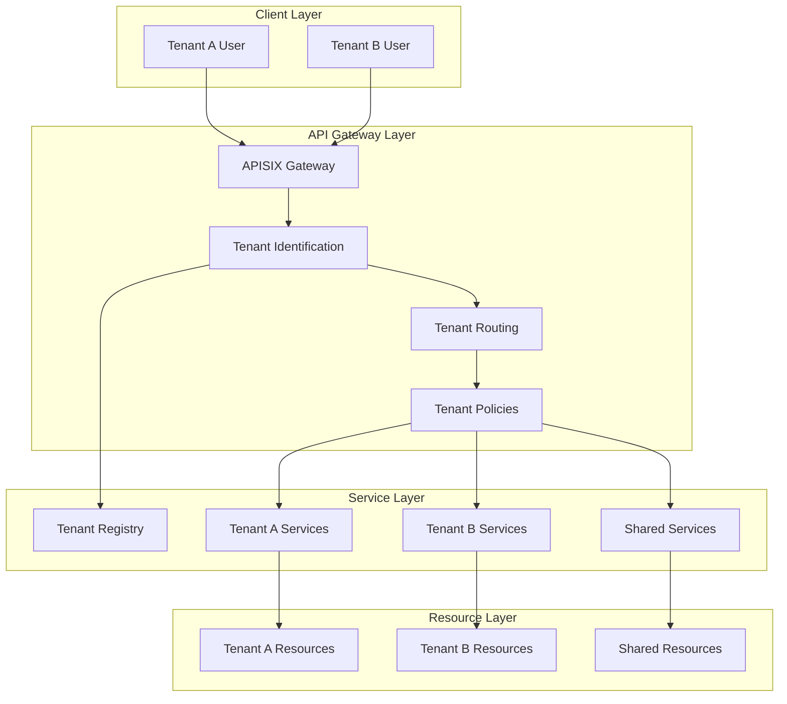
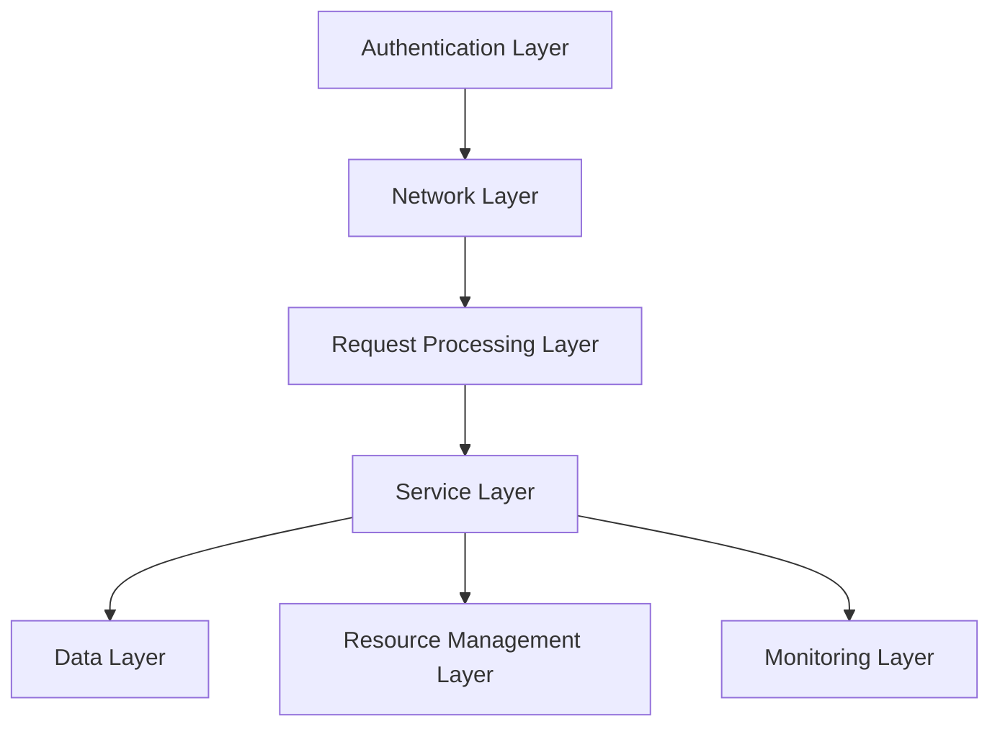
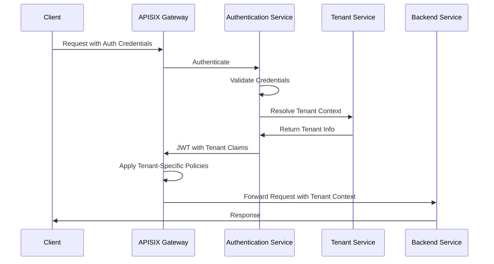
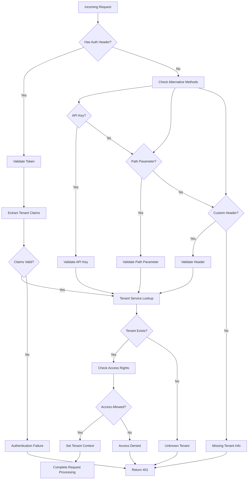
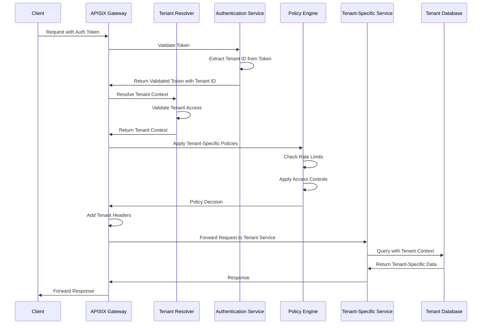

# Multi-Tenancy Architecture

## Introduction

Multi-tenancy is a fundamental architectural approach in the Enterprise Agentic AI Executive Platform that enables the system to serve multiple customer organizations (tenants) from a single deployment. This document describes the multi-tenancy architecture implemented through the APISIX integration, including the overall design, tenant isolation mechanisms, tenant context resolution, resource allocation, and request processing flow.

### Multi-Tenancy Concept

Multi-tenancy in the Enterprise Agentic AI Executive Platform refers to the ability of the system to:

1. **Segregate Resources**: Maintain strict isolation between tenant data and resources
2. **Customize Experiences**: Provide tenant-specific configurations and policies
3. **Manage Resources**: Allocate and control resource usage per tenant
4. **Scale Independently**: Allow tenants to scale based on their specific needs
5. **Administer Separately**: Enable separate administrative controls per tenant

### Benefits and Challenges

#### Benefits

- **Cost Efficiency**: Shared infrastructure reduces operational costs
- **Simplified Management**: Centralized updates and maintenance
- **Rapid Provisioning**: Faster tenant onboarding
- **Resource Optimization**: Balanced resource allocation across tenants
- **Consistent Security**: Universal application of security policies

#### Challenges

- **Resource Isolation**: Preventing resource leakage between tenants
- **Performance Guarantees**: Ensuring quality of service for each tenant
- **Security Boundaries**: Maintaining strict security isolation
- **Customization Balance**: Allowing flexibility while maintaining maintainability
- **Operational Complexity**: Managing multi-tenant operations and troubleshooting

### Multi-Tenancy Models

The platform supports multiple multi-tenancy models to accommodate different deployment scenarios and security requirements:

1. **Shared Everything**: All tenants share the same application instances, databases, and infrastructure components (highest density, lowest isolation)
2. **Shared Application, Separated Data**: Tenants share application instances but maintain separate databases (balanced approach)
3. **Isolated Application, Shared Infrastructure**: Tenants have dedicated application instances but share underlying infrastructure (higher isolation)
4. **Complete Isolation**: Each tenant has fully dedicated resources (highest isolation, lowest density)

This document focuses primarily on the architecture for complete tenant isolation with dedicated resources per tenant, as this provides the strongest security boundaries and is the preferred approach for enterprise deployments.

## Multi-Tenancy Architecture Overview

The multi-tenancy architecture in the Enterprise Agentic AI Executive Platform consists of several layers working together to provide comprehensive tenant isolation.

### High-Level Architecture



### Tenant Isolation Layers

The multi-tenancy architecture implements isolation across multiple layers to ensure comprehensive tenant separation:



Each layer implements specific isolation mechanisms that work together to provide comprehensive tenant separation.

### Integration with Authentication Framework

Multi-tenancy is tightly integrated with the authentication framework, which provides the foundation for tenant identification and context propagation:



## Tenant Isolation Mechanisms

The platform implements several tenant isolation mechanisms to ensure complete tenant separation.

### Tenant Identification Methods

Tenant identification is the foundation of the multi-tenancy architecture, determining which tenant a request belongs to:

1. **JWT Claims-Based Identification**
   - Tenant information embedded in JWT token claims
   - Claims validated during authentication
   - Tamper-proof and cryptographically secured

   ```json
   {
     "sub": "user123",
     "tenant_id": "tenant-a",
     "tenant_name": "Tenant A",
     "tenant_tier": "enterprise",
     "roles": ["admin", "user"],
     "exp": 1619884800
   }
   ```

2. **Header-Based Identification**
   - Tenant ID passed in an HTTP header
   - Requires validation against authenticated user
   - Used for service-to-service communication

   ```
   X-Tenant-ID: tenant-a
   ```

3. **API Key-Based Identification**
   - API keys associated with specific tenants
   - Single API key can only access one tenant's resources
   - Used for programmatic access

   ```yaml
   # Example APISIX consumer configuration
   consumers:
     - username: tenant-a-api
       plugins:
         key-auth:
           key: "tenant-a-api-key"
         tenant-context:
           tenant_id: "tenant-a"
   ```

4. **URL Path-Based Identification**
   - Tenant ID included in URL path
   - Provides explicit tenant context in API design
   - Routes structured to enforce tenant boundaries

   ```
   /tenants/{tenant_id}/resources/{resource_id}
   ```

### Network-Level Isolation

Network-level isolation ensures that traffic between tenants remains separated:

1. **Virtual Network Segregation**
   - Separate network segments per tenant
   - Traffic isolation through network policies
   - Prevention of lateral movement between tenant networks

2. **Ingress/Egress Controls**
   - Tenant-specific traffic routing rules
   - Controlled exit points for tenant traffic
   - Prevention of unauthorized cross-tenant communication

3. **Network Policy Enforcement**
   - Kubernetes network policies for pod-to-pod isolation
   - Service mesh traffic policies
   - Application-level firewall rules

### Resource-Level Isolation

Resource-level isolation ensures fair allocation and prevents resource contention:

1. **Dedicated Resource Pools**
   - Tenant-specific compute resources
   - Isolation of CPU, memory, and storage
   - Prevention of noisy neighbor problems

2. **Resource Quotas and Limits**
   - Hard limits on resource consumption per tenant
   - Quota enforcement at multiple levels
   - Prevention of resource exhaustion attacks

3. **Quality of Service Controls**
   - Prioritization of resources based on tenant tier
   - Guaranteed minimum resource availability
   - Fair sharing during resource contention

### Data-Level Isolation

Data-level isolation ensures tenant data remains strictly separated:

1. **Tenant-Specific Databases**
   - Dedicated database instances or schemas per tenant
   - Separate database credentials per tenant
   - Database-level access controls

2. **Data Encryption**
   - Tenant-specific encryption keys
   - Encrypted data at rest and in transit
   - Key management isolation

3. **Data Access Controls**
   - Row-level security policies
   - Tenant context in database queries
   - Prevention of unauthorized data access

### Computational Isolation

Computational isolation ensures processing remains separated:

1. **Tenant-Specific Services**
   - Dedicated service instances per tenant
   - Tenant-specific processing environments
   - Isolation of tenant-specific business logic

2. **Process Isolation**
   - Containerization of tenant workloads
   - Runtime environment isolation
   - Prevention of shared memory or IPC leakage

3. **Execution Context Boundaries**
   - Tenant context maintained throughout execution
   - Context-aware permissions checking
   - Tenant affinity for process scheduling

## Tenant Context Resolution Process

The tenant context resolution process identifies the tenant associated with each request and propagates this context throughout the request lifecycle.

### Tenant Identification Process



### JWT Claims-Based Identification

JWT claims provide a secure method for tenant identification:

1. JWT token is validated during authentication
2. Tenant claims are extracted from the validated token
3. Tenant existence and status are verified
4. Tenant context is established for the request

Example JWT payload with tenant information:

```json
{
  "sub": "user@example.com",
  "iss": "https://auth.enterprise.com",
  "iat": 1619798400,
  "exp": 1619884800,
  "tenant_id": "tenant-a",
  "tenant_tier": "enterprise",
  "tenant_features": ["advanced_analytics", "custom_models"],
  "roles": ["admin"]
}
```

### Header-Based Identification

Header-based tenant identification workflow:

1. Extract tenant ID from the specified header (e.g., `X-Tenant-ID`)
2. Validate the tenant ID against the authenticated user's permissions
3. Verify tenant existence and status
4. Establish tenant context for the request

APISIX configuration example:

```yaml
routes:
  - id: api_route_with_header_tenant
    uri: /api/*
    plugins:
      tenant-resolver:
        header_name: "X-Tenant-ID"
        required: true
        validate_against_jwt: true
        jwt_claim_name: "tenant_id"
```

### Path Parameter-Based Identification

Path parameter-based tenant identification workflow:

1. Extract tenant ID from the URL path (e.g., `/tenants/{tenant_id}/resources`)
2. Validate the tenant ID against the authenticated user's permissions
3. Verify tenant existence and status
4. Establish tenant context for the request

APISIX configuration example:

```yaml
routes:
  - id: api_route_with_path_tenant
    uri: /tenants/*
    plugins:
      tenant-resolver:
        path_pattern: "/tenants/{tenant_id}/*"
        validate_against_jwt: true
        jwt_claim_name: "tenant_id"
```

### Context Propagation Between Services

Tenant context must be propagated between services to maintain isolation:

1. **HTTP Header Propagation**
   - Internal headers for tenant context (`X-Tenant-ID`, `X-Tenant-Context`)
   - Headers added by APISIX after tenant resolution
   - Propagation enforced by service mesh policies

2. **JWT Token Propagation**
   - JWT tokens containing tenant claims
   - Token passed between services
   - Token validation at service boundaries

3. **Context Object Propagation**
   - Tenant context included in service invocation context
   - Context passed through service interfaces
   - Context propagation across asynchronous boundaries

## Tenant Routing and Resource Allocation

### Dedicated Resources Per Tenant

The architecture provides dedicated resources for each tenant:

1. **Dedicated Service Deployments**
   - Separate Kubernetes deployments per tenant
   - Tenant-specific service instances
   - Isolated runtime environments

   Example Kubernetes deployment with tenant affinity:

   ```yaml
   apiVersion: apps/v1
   kind: Deployment
   metadata:
     name: tenant-a-service
     labels:
       app: executive-service
       tenant: tenant-a
   spec:
     replicas: 3
     selector:
       matchLabels:
         app: executive-service
         tenant: tenant-a
     template:
       metadata:
         labels:
           app: executive-service
           tenant: tenant-a
       spec:
         affinity:
           nodeAffinity:
             requiredDuringSchedulingIgnoredDuringExecution:
               nodeSelectorTerms:
               - matchExpressions:
                 - key: tenant
                   operator: In
                   values:
                   - tenant-a
         containers:
         - name: executive-service
           image: executive-service:1.0.0
           env:
           - name: TENANT_ID
             value: tenant-a
   ```

2. **Tenant-Specific Databases**
   - Separate database instances or schemas
   - Tenant-specific connection pools
   - Database-level resource controls

3. **Tenant-Specific Storage**
   - Isolated storage volumes
   - Tenant-specific access credentials
   - Storage quota enforcement

### Route Configuration for Tenant-Specific Endpoints

APISIX routes can be configured to direct traffic to tenant-specific endpoints:

```yaml
# Example APISIX route configuration for tenant-specific endpoints
routes:
  - id: tenant_a_api
    uri: /api/executive/*
    host: tenant-a.api.enterprise.com
    vars:
      - ["tenant_id", "==", "tenant-a"]
    upstream:
      type: roundrobin
      nodes:
        "tenant-a-executive-service:8080": 1
    plugins:
      tenant-context:
        tenant_id: "tenant-a"
        propagate_headers: true
```

### Tenant-Specific Plugin Chains

APISIX supports tenant-specific plugin configurations:

```yaml
# Example of tenant-specific plugin configuration
plugin_configs:
  - id: tenant_a_policies
    plugins:
      rate-limit:
        count: 1000
        time_window: 60
        rejected_code: 429
        key: remote_addr
      request-validation:
        body_schema:
          type: object
          required: ["action", "parameters"]
      response-rewrite:
        headers:
          set:
            X-Tenant: "tenant-a"

routes:
  - id: tenant_a_api
    uri: /api/executive/*
    plugin_config_id: tenant_a_policies
```

### Resource Quotas and Limits

The platform enforces resource quotas and limits at multiple levels:

1. **API Request Limits**
   - Tenant-specific rate limiting
   - Request quota per time window
   - Concurrent request limits

   ```yaml
   # APISIX rate limiting configuration
   plugins:
     limit-req:
       rate: 500  # requests per second
       burst: 50
       rejected_code: 429
       key: "$tenant_id"
       key_type: "var"
   ```

2. **Computational Resource Limits**
   - Kubernetes resource quotas per tenant namespace
   - Container resource limits
   - CPU and memory constraints

   ```yaml
   # Kubernetes tenant namespace resource quota
   apiVersion: v1
   kind: ResourceQuota
   metadata:
     name: tenant-a-quota
     namespace: tenant-a
   spec:
     hard:
       requests.cpu: "20"
       requests.memory: 100Gi
       limits.cpu: "40"
       limits.memory: 200Gi
       pods: "100"
   ```

3. **Storage Quotas**
   - Volume size limits
   - IOPS limitations
   - Storage class restrictions

   ```yaml
   # Kubernetes storage quota
   apiVersion: v1
   kind: ResourceQuota
   metadata:
     name: tenant-a-storage-quota
     namespace: tenant-a
   spec:
     hard:
       persistentvolumeclaims: "50"
       requests.storage: "1Ti"
   ```

### Load Balancing Per Tenant

Tenant-specific load balancing ensures fair resource allocation:

1. **Tenant-Specific Upstream Policies**
   - Dedicated upstream groups per tenant
   - Tenant-specific load balancing algorithms
   - Health check customization per tenant

2. **Service Mesh Integration**
   - Traffic routing rules per tenant
   - Tenant-aware load balancing
   - Retry and timeout policies per tenant

## Multi-Tenant Request Flow

The multi-tenant request flow follows a specific path through the system to maintain tenant isolation:

### Request Processing Steps



### Tenant Context Propagation

Tenant context is propagated throughout the request lifecycle:

1. **APISIX Gateway Layer**
   - Tenant ID extracted during authentication
   - Tenant context validated and enriched
   - Tenant headers added to the request

2. **Service-to-Service Communication**
   - Tenant context headers propagated between services
   - JWT tokens with tenant claims passed between services
   - Service mesh ensures header propagation

3. **Data Access Layer**
   - Tenant context used for data access filtering
   - Database queries include tenant ID in conditions
   - ORM layers enforce tenant separation

### Error Handling in Multi-Tenant Scenarios

Special considerations apply to error handling in multi-tenant environments:

1. **Tenant-Specific Error Responses**
   - Customized error messages per tenant
   - Tenant-specific error handling policies
   - Localization based on tenant preferences

2. **Tenant Context in Error Logs**
   - Error logs tagged with tenant ID
   - Tenant-specific log streams
   - Error aggregation by tenant

3. **Cross-Tenant Error Isolation**
   - Errors in one tenant don't affect others
   - Tenant-specific circuit breaking
   - Graceful degradation per tenant

### Audit Logging with Tenant Context

Comprehensive audit logging records all actions with tenant context:

1. **Tenant-Specific Audit Trails**
   - All actions tagged with tenant ID
   - Tenant-specific audit log storage
   - Retained according to tenant-specific policies

2. **Compliance Reporting**
   - Tenant-specific compliance reports
   - Audit log access controlled by tenant
   - Immutable audit storage

## Conclusion

The multi-tenancy architecture in the Enterprise Agentic AI Executive Platform provides a comprehensive approach to tenant isolation, ensuring that each tenant's data, resources, and execution environment remain strictly separated. By implementing multi-layered isolation mechanisms and maintaining tenant context throughout the request lifecycle, the platform delivers enterprise-grade security and resource management in a multi-tenant environment.

Key principles to remember when working with the multi-tenancy architecture:

1. Tenant context must be validated and propagated at all system boundaries
2. Resource isolation must be enforced at all layers of the stack
3. Tenant identification should be cryptographically secured when possible
4. All operations must consider tenant context in authorization decisions
5. Cross-tenant interaction should be explicitly managed through well-defined interfaces
