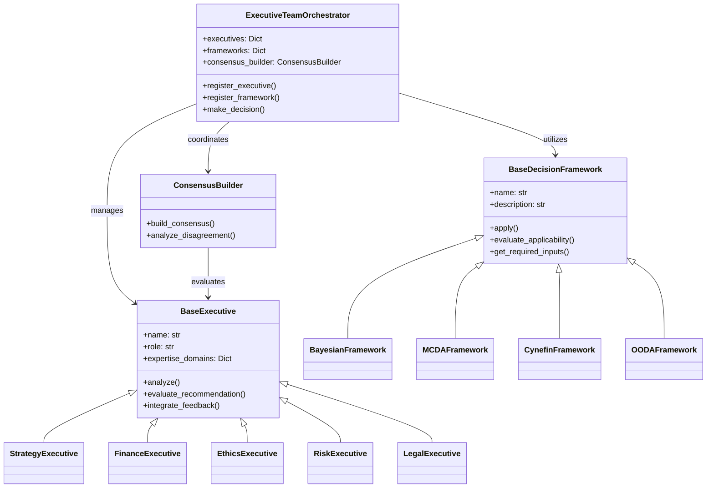

# Developer Guide

This comprehensive guide provides developers with the information needed to understand, extend, and contribute to the Enterprise Agentic AI Executive Platform.

## Table of Contents

- [Development Environment Setup](#development-environment-setup)
- [Codebase Organization](#codebase-organization)
- [Core Concepts](#core-concepts)
- [Extending the Platform](#extending-the-platform)
- [Testing Guidelines](#testing-guidelines)
- [Coding Standards](#coding-standards)
- [Documentation Guidelines](#documentation-guidelines)
- [Contribution Workflow](#contribution-workflow)
- [Build and Deployment](#build-and-deployment)
- [Performance Considerations](#performance-considerations)

## Development Environment Setup

### Prerequisites

- **Python 3.10+**: Primary development language
- **Git**: Version control
- **VSCode** or **PyCharm**: Recommended IDEs
- **Docker**: For containerized development and testing
- **Make** (optional): For using build scripts

### Setting Up the Development Environment

1. **Clone the repository**
   ```bash
   git clone https://github.com/your-organization/enterprise-ai-executive.git
   cd enterprise-ai-executive
   ```

2. **Set up a virtual environment**
   ```bash
   # Using virtualenv
   python -m venv venv
   source venv/bin/activate  # On Windows: venv\Scripts\activate
   
   # Using conda
   conda create -n ai-executive python=3.11
   conda activate ai-executive
   ```

3. **Install development dependencies**
   ```bash
   pip install -r requirements.txt
   pip install -r requirements-dev.txt
   ```

4. **Configure pre-commit hooks**
   ```bash
   pre-commit install
   ```

5. **Set up environment variables**
   ```bash
   cp .env.example .env
   # Edit .env with your development settings
   ```

### IDE Setup

#### VSCode Configuration

For optimal development in VSCode:

1. Install recommended extensions:
   - Python extension
   - Pylance
   - Python Type Hint
   - Python Docstring Generator
   - Markdown All in One
   - Mermaid Preview

2. Use the provided workspace settings in `.vscode/settings.json`:
   ```json
   {
     "python.linting.enabled": true,
     "python.linting.pylintEnabled": true,
     "python.linting.flake8Enabled": true,
     "python.formatting.provider": "black",
     "editor.formatOnSave": true,
     "editor.rulers": [88],
     "python.testing.pytestEnabled": true
   }
   ```

#### PyCharm Configuration

For PyCharm users:

1. Open the project directory in PyCharm
2. Configure the Python interpreter to use your virtual environment
3. Install plugins:
   - Pydantic
   - Mypy
   - Black formatter

4. Set up code style preferences:
   - Use PEP 8 convention
   - Set max line length to 88 (Black default)
   - Enable auto-formatting on save

## Codebase Organization

### Directory Structure

```
enterprise-ai-executive/
├── src/                        # Source code
│   ├── executive_agents/       # AI executive agent implementations
│   │   ├── base_executive.py   # Base executive class
│   │   └── ...                 # Specialized executives
│   ├── decision_frameworks/    # Decision framework implementations
│   │   ├── base_framework.py   # Base framework class
│   │   └── ...                 # Specific frameworks
│   ├── consensus/              # Consensus building mechanisms
│   │   └── ...                 # Consensus implementations
│   ├── visualization/          # Visualization components
│   │   └── ...                 # Visualization tools
│   ├── governance/             # Governance controls
│   │   └── ...                 # Governance implementations
│   └── executive_team_orchestrator.py # Central orchestration
├── tests/                      # Test suite
│   ├── unit/                   # Unit tests
│   ├── integration/            # Integration tests
│   └── e2e/                    # End-to-end tests
├── docs/                       # Documentation
│   ├── api_reference.md        # API documentation
│   ├── developer_guide.md      # Developer documentation
│   ├── installation_guide.md   # Installation instructions
│   └── ...                     # Other documentation
├── examples/                   # Example usage scenarios
│   └── ...                     # Various examples
├── scripts/                    # Utility scripts
│   └── ...                     # Helper scripts
├── requirements.txt            # Core dependencies
├── requirements-dev.txt        # Development dependencies
├── Dockerfile                  # Container definition
├── .env.example                # Example environment configuration
├── .gitignore                  # Git ignore patterns
├── pyproject.toml              # Python project configuration
├── setup.py                    # Package setup script
└── README.md                   # Project overview
```

### Module Relationships



## Core Concepts

### Executive Agents

Executive agents are specialized AI personas that analyze decisions from domain-specific perspectives. Each agent implements the `BaseExecutive` abstract class, which defines the core interface:

```python
async def analyze(self, context: ExecutiveContext) -> ExecutiveRecommendation:
    """Analyze the context and produce a recommendation"""
    
async def evaluate_recommendation(self, recommendation: ExecutiveRecommendation) -> Dict[str, Any]:
    """Evaluate another executive's recommendation"""
    
async def integrate_feedback(self, recommendation: ExecutiveRecommendation, feedback: List[Dict[str, Any]]) -> ExecutiveRecommendation:
    """Integrate feedback to improve a recommendation"""
```

Key concepts for executive agents:
- Each has explicit expertise domains with confidence levels
- They maintain their own decision history
- They can both generate and evaluate recommendations
- They can integrate feedback from other executives

### Decision Frameworks

Decision frameworks provide structured methodologies for analyzing decisions. Each framework implements the `BaseDecisionFramework` abstract class:

```python
async def apply(self, context: DecisionContext) -> DecisionRecommendation:
    """Apply the framework to the decision context"""
    
def evaluate_applicability(self, context: DecisionContext) -> Dict[str, Any]:
    """Evaluate how applicable this framework is to the context"""
    
def get_required_inputs(self) -> Dict[str, str]:
    """Get information about required inputs"""
```

Key concepts for decision frameworks:
- Each framework is optimized for specific decision types
- Frameworks provide explicit evaluation of their applicability
- They define structured inputs and outputs
- They support uncertainty quantification

### Consensus Building

The consensus building module facilitates agreement between executives and resolves conflicts. The main interface is:

```python
async def build_consensus(
    self,
    recommendation: ExecutiveRecommendation,
    executive_evaluations: List[ConsensusEvaluation],
    decision_context: Dict[str, Any],
    participating_executives: List[DecisionParticipation]
) -> ConsensusOutcome:
    """Build consensus around a recommendation"""
```

Key concepts for consensus building:
- Evaluates weighted agreement across executives
- Detects specific conflicts between executives
- Selects appropriate conflict resolution methods
- Provides metrics about consensus quality
- Supports multiple resolution attempts

### Orchestration

The `ExecutiveTeamOrchestrator` coordinates the entire decision process:

```python
async def make_decision(self, request: DecisionRequest) -> DecisionOutcome:
    """Orchestrate the full decision-making process"""
```

Key orchestration concepts:
- Selects relevant executives based on decision domains
- Chooses appropriate decision framework
- Manages the consensus building process
- Handles executive feedback integration
- Produces comprehensive decision outcomes

## Extending the Platform

### Creating Custom Executive Agents

To create a new executive agent:

1. Create a new file in `src/executive_agents/` (e.g., `technology_executive.py`)
2. Implement the `BaseExecutive` abstract class:

```python
from src.executive_agents.base_executive import (
    BaseExecutive,
    ExecutiveRecommendation,
    ExecutiveContext,
    ExpertiseLevel
)

class TechnologyExecutive(BaseExecutive):
    """AI executive specializing in technology decisions."""
    
    def __init__(self, name: str = "Technology Executive"):
        # Define expertise domains
        expertise_domains = {
            "technology_strategy": ExpertiseLevel.EXPERT,
            "digital_transformation": ExpertiseLevel.EXPERT,
            "technology_architecture": ExpertiseLevel.ADVANCED,
            # Add more expertise domains...
        }
        
        super().__init__(name, "Chief Technology Officer", expertise_domains)
    
    async def analyze(self, context: ExecutiveContext) -> ExecutiveRecommendation:
        # Implement technology-specific analysis logic
        ...
        
    async def evaluate_recommendation(self, recommendation: ExecutiveRecommendation) -> Dict[str, Any]:
        # Implement technology-specific evaluation logic
        ...
        
    async def integrate_feedback(self, recommendation: ExecutiveRecommendation, feedback: List[Dict[str, Any]]) -> ExecutiveRecommendation:
        # Implement feedback integration logic
        ...
```

### Implementing Custom Decision Frameworks

To create a new decision framework:

1. Create a new file in `src/decision_frameworks/` (e.g., `mcda_framework.py`)
2. Implement the `BaseDecisionFramework` abstract class:

```python
from src.decision_frameworks.base_framework import (
    BaseDecisionFramework,
    DecisionContext,
    DecisionRecommendation
)

class MCDAFramework(BaseDecisionFramework):
    """Multi-Criteria Decision Analysis framework implementation."""
    
    def __init__(self, criteria_weights: Dict[str, float] = None):
        super().__init__(
            name="Multi-Criteria Decision Analysis",
            description="A framework for evaluating alternatives against multiple weighted criteria."
        )
        self.criteria_weights = criteria_weights or {}
    
    async def apply(self, context: DecisionContext) -> DecisionRecommendation:
        # Implement MCDA logic
        ...
        
    def evaluate_applicability(self, context: DecisionContext) -> Dict[str, Any]:
        # Evaluate how applicable MCDA is to this context
        ...
        
    def get_required_inputs(self) -> Dict[str, str]:
        # Define required inputs for MCDA
        ...
```

### Customizing Consensus Mechanisms

To customize consensus building:

1. Extend the `ConsensusBuilder` class in `src/consensus/`
2. Override the methods you want to modify:

```python
from src.consensus.consensus_builder import ConsensusBuilder

class EnhancedConsensusBuilder(ConsensusBuilder):
    """Enhanced consensus builder with additional resolution strategies."""
    
    async def build_consensus(self, recommendation, executive_evaluations, decision_context, participating_executives):
        # Custom consensus building logic
        ...
        
    def _select_resolution_method(self, conflicts):
        # Custom resolution method selection
        ...
```

## Testing Guidelines

### Test Structure

The project uses pytest for testing, with tests organized into three categories:

1. **Unit Tests** (`tests/unit/`): Test individual components in isolation
2. **Integration Tests** (`tests/integration/`): Test component interactions
3. **End-to-End Tests** (`tests/e2e/`): Test complete decision workflows

### Writing Tests

Test files should follow these conventions:

- Name test files with `test_` prefix (e.g., `test_strategy_executive.py`)
- Group related tests in classes prefixed with `Test` (e.g., `TestStrategyExecutive`)
- Use descriptive test method names (e.g., `test_analysis_with_market_expansion_context`)
- Include docstrings explaining the test purpose

Example test:

```python
import pytest
from src.executive_agents.strategy_executive import StrategyExecutive

class TestStrategyExecutive:
    """Tests for the Strategy Executive agent."""
    
    @pytest.fixture
    def strategy_exec(self):
        """Create a strategy executive for testing."""
        return StrategyExecutive("Test Strategy Executive")
    
    @pytest.fixture
    def sample_context(self):
        """Create a sample executive context."""
        return {
            "query": "Should we expand into a new market?",
            "background_information": {"market_size": "$1B"},
            "constraints": ["Budget limited to $5M"],
            "available_data": {},
            "previous_decisions": {},
            "organizational_priorities": ["growth"],
            "relevant_metrics": {}
        }
    
    async def test_analysis_produces_valid_recommendation(self, strategy_exec, sample_context):
        """Test that analysis produces a valid recommendation."""
        recommendation = await strategy_exec.analyze(sample_context)
        
        assert recommendation.title is not None
        assert recommendation.summary is not None
        assert len(recommendation.supporting_evidence) > 0
        assert recommendation.confidence is not None
```

### Mocking LLM Interactions

For testing without LLM API calls:

```python
import pytest
from unittest.mock import patch, AsyncMock

@pytest.mark.asyncio
@patch("src.utils.llm.call_llm", new_callable=AsyncMock)
async def test_strategy_analysis_with_mocked_llm(mock_call_llm, strategy_exec, sample_context):
    """Test strategy analysis with a mocked LLM."""
    # Configure the mock to return a predefined response
    mock_call_llm.return_value = {
        "title": "Market Expansion Strategy",
        "summary": "Recommend phased expansion approach",
        # more fields...
    }
    
    # Execute the test
    recommendation = await strategy_exec.analyze(sample_context)
    
    # Assert the mock was called
    mock_call_llm.assert_called_once()
    
    # Assert on the recommendation
    assert "Expansion" in recommendation.title
```

### Running Tests

```bash
# Run all tests
pytest

# Run specific test categories
pytest tests/unit/
pytest tests/integration/
pytest tests/e2e/

# Run tests with coverage report
pytest --cov=src --cov-report=html
```

## Coding Standards

The project follows these coding standards:

### Style Guide

- **PEP 8**: General Python style guide
- **Black**: Code formatting with 88 character line length
- **isort**: Import sorting
- **Flake8**: Linting with customized rules

### Type Annotations

Use type annotations for all function parameters and return values:

```python
def calculate_agreement(
    evaluations: List[ConsensusEvaluation],
    weights: Dict[str, float]
) -> float:
    """
    Calculate weighted agreement score.
    
    Args:
        evaluations: List of executive evaluations
        weights: Dictionary mapping executive IDs to weights
        
    Returns:
        Weighted agreement score between 0.0 and 1.0
    """
    # Implementation...
```

### Documentation

- Use docstrings for all modules, classes, and functions
- Follow Google-style docstring format
- Include Args, Returns, and Raises sections where appropriate

### Error Handling

- Use explicit exception types
- Handle exceptions at appropriate levels
- Provide informative error messages
- Log exceptions with context

### Asynchronous Code

- Use `async`/`await` for I/O bound operations
- Avoid blocking the event loop
- Use proper exception handling in async code
- Consider using asyncio primitives for coordination

## Documentation Guidelines

### Code Documentation

- Document all public APIs with comprehensive docstrings
- Include usage examples in docstrings for complex functions
- Document parameters, return values, and exceptions
- Explain complex algorithms and design decisions in comments

### Project Documentation

- Update README.md with significant changes
- Maintain API reference documentation
- Document architecture decisions
- Update guides when adding new features

### Documentation Generation

The project uses Sphinx for documentation generation:

```bash
# Generate documentation
cd docs
make html
```

## Contribution Workflow

### Development Workflow

1. **Feature Planning**
   - Create a feature proposal issue
   - Get feedback from maintainers
   - Define acceptance criteria

2. **Development**
   - Create a feature branch: `feature/your-feature-name`
   - Develop incrementally with regular commits
   - Add tests and documentation

3. **Code Review**
   - Submit a pull request
   - Address review feedback
   - Ensure all tests pass

4. **Merge**
   - Squash and merge after approval
   - Delete the feature branch

### Git Workflow

```bash
# Create a feature branch
git checkout -b feature/your-feature-name

# Make changes and commit
git add .
git commit -m "Add your-feature functionality"

# Push changes
git push -u origin feature/your-feature-name

# Update with main branch changes
git checkout main
git pull
git checkout feature/your-feature-name
git rebase main
```

### Pull Request Guidelines

Pull requests should:

- Have a clear, descriptive title
- Include a detailed description of changes
- Reference related issues
- Include test coverage for new functionality
- Pass all CI checks
- Have documentation updates if needed

## Build and Deployment

### Building the Package

```bash
# Build the distribution package
python -m build
```

### Building Docker Container

```bash
# Build the Docker image
docker build -t ai-executive-platform:latest .

# Run the container
docker run -p 8000:8000 --env-file .env ai-executive-platform:latest
```

### Deployment Options

#### API Deployment

The platform can be deployed as a RESTful API:

```bash
# Start the API server
uvicorn src.api.main:app --host 0.0.0.0 --port 8000
```

#### Integration Deployment

For integration with existing systems:

1. Install the package in your environment
2. Import and use the `ExecutiveTeamOrchestrator` class

#### Serverless Deployment

Configuration for AWS Lambda:

```bash
# Install serverless framework
npm install -g serverless

# Deploy using serverless
serverless deploy
```

## Performance Considerations

### Optimization Strategies

- **Parallel Processing**: Execute executive analyses in parallel
- **Caching**: Cache LLM responses for similar queries
- **Batch Processing**: Batch LLM requests where possible
- **Resource Management**: Limit concurrent LLM calls to avoid rate limits

### Scaling Guidelines

- **Horizontal Scaling**: Deploy multiple instances behind a load balancer
- **Vertical Scaling**: Increase resources for compute-intensive operations
- **Database Scaling**: Use sharding for high-volume decision storage
- **Async Processing**: Use message queues for asynchronous processing

### Monitoring and Profiling

- Monitor LLM API response times
- Profile memory usage during complex decisions
- Track decision processing times
- Identify bottlenecks in the process flow

For detailed performance analysis, use the built-in profiling tools:

```bash
# Run with profiling
python -m cProfile -o output.prof src/example_usage.py

# Analyze profile results
python -m pstats output.prof
```

### Advanced Optimization Techniques

- **Model Quantization**: Use quantized models for faster local inference
- **Prompt Optimization**: Refine prompts for more efficient LLM usage
- **Context Window Management**: Optimize token usage in LLM contexts
- **Selective Computation**: Only involve relevant executives and frameworks