# Enterprise Agentic AI Executive Platform: Architecture Overview

This architecture document provides a comprehensive explanation of the Enterprise Agentic AI Executive Platform's design, components, interactions, and technical considerations.

## Table of Contents

- [System Overview](#system-overview)
- [Core Architecture](#core-architecture)
- [Component Specifications](#component-specifications)
- [Data Flow Architecture](#data-flow-architecture)
- [Interaction Patterns](#interaction-patterns)
- [Technical Integration](#technical-integration)
- [Scalability Architecture](#scalability-architecture)
- [Security Architecture](#security-architecture)
- [Observability Architecture](#observability-architecture)
- [Governance Architecture](#governance-architecture)

## System Overview

The Enterprise Agentic AI Executive Platform creates a sophisticated decision intelligence system by simulating a high-performance executive team through specialized AI agents. The platform orchestrates interactions between these AI executives, each with distinct expertise domains, leveraging formal decision frameworks and robust consensus mechanisms to produce comprehensive, well-reasoned strategic decisions.

### Core Capabilities

1. **Distributed Expertise**: Simulates a diverse executive team with domain-specific knowledge
2. **Framework-Driven Analysis**: Applies formal decision frameworks to structure analysis
3. **Collaborative Decision-Making**: Facilitates consensus building and conflict resolution
4. **Traceable Logic**: Documents complete decision rationale and alternatives considered
5. **Governance Integration**: Enforces compliance and ethical standards throughout the process

### Design Principles

- **Modularity**: Clear separation of concerns with well-defined interfaces
- **Extensibility**: Easy addition of new executives, frameworks, and capabilities
- **Explainability**: Full transparency into decision rationale and processes
- **Governance by Design**: Built-in compliance and ethical controls
- **Resilience**: Graceful handling of conflicts, uncertainty, and errors

## Core Architecture

The platform employs a modular, component-based architecture designed for flexibility, extensibility, and enterprise integration.

```mermaid
graph TD
    classDef core fill:#f9f,stroke:#333,stroke-width:2px;
    classDef component fill:#bbf,stroke:#333,stroke-width:1px;
    classDef external fill:#bfb,stroke:#333,stroke-width:1px;

    User[User Interface] --> Orchestrator[Executive Team Orchestrator]:::core
    Orchestrator --> ExecAgents[Executive Agents Module]:::component
    Orchestrator --> DecFrameworks[Decision Frameworks Module]:::component
    Orchestrator --> ConsensusModule[Consensus Building Module]:::component
    
    ExecAgents --> StrategyExec[Strategy Executive]:::component
    ExecAgents --> FinanceExec[Finance Executive]:::component
    ExecAgents --> EthicsExec[Ethics Executive]:::component
    ExecAgents --> RiskExec[Risk Management Executive]:::component
    ExecAgents --> LegalExec[Legal Executive]:::component
    ExecAgents --> TechExec[Technology Executive]:::component
    
    DecFrameworks --> BayesianDF[Bayesian Decision Framework]:::component
    DecFrameworks --> MCDADF[Multi-Criteria Decision Analysis]:::component
    DecFrameworks --> CynefinDF[Cynefin Framework]:::component
    DecFrameworks --> OODADF[OODA Loop Framework]:::component
    
    ConsensusModule --> ConflictDetection[Conflict Detection]:::component
    ConsensusModule --> ConflictResolution[Conflict Resolution]:::component
    ConsensusModule --> ConsensusMetrics[Consensus Metrics]:::component
    
    Orchestrator --> Governance[Governance Controls]:::component
    Governance --> AuditTrail[Audit Trail]:::component
    Governance --> Compliance[Compliance Checks]:::component
    Governance --> HumanOversight[Human Oversight Integration]:::component
    
    DataServices[Enterprise Data Services]:::external --> Orchestrator
    LLMProviders[LLM Providers]:::external --> ExecAgents
    
    Visualization[Visualization Services]:::component --> Orchestrator
```

### Architectural Layers

The system is organized into the following architectural layers:

1. **Orchestration Layer**: Coordinates the overall decision process
2. **Executive Layer**: Specialized AI agents with domain expertise
3. **Framework Layer**: Decision methodologies and structures
4. **Consensus Layer**: Agreement facilitation and conflict resolution
5. **Governance Layer**: Compliance and ethical controls
6. **Integration Layer**: Connections to external systems
7. **Presentation Layer**: Interfaces for user interaction

## Component Specifications

### Executive Team Orchestrator

The central coordination system that manages the entire decision process.

**Responsibilities**:
- Executive agent selection based on decision domain
- Decision framework selection based on context
- Coordination of the consensus building process
- Management of the decision workflow
- Decision outcome documentation and delivery

**Interfaces**:
- **Input**: Decision requests with query and context
- **Output**: Comprehensive decision outcomes with recommendations
- **Integration**: Connects to all other system components

**Technical Details**:
- Implemented as an asynchronous service for parallel processing
- Event-driven architecture for flexible process flow
- State management for long-running decisions
- Configurable through environment variables and configuration files

### Executive Agents Module

Specialized AI agents that analyze decisions from domain-specific perspectives.

**Components**:
- **Base Executive**: Abstract interface for all executives
- **Strategy Executive**: Strategic planning and positioning
- **Finance Executive**: Financial implications and analysis
- **Ethics Executive**: Ethical considerations and impacts
- **Legal Executive**: Legal and regulatory analysis
- **Risk Executive**: Risk assessment and mitigation
- **Technology Executive**: Technical implications and implementation

**Interfaces**:
- **Input**: Decision context and queries
- **Output**: Domain-specific recommendations and evaluations
- **Integration**: LLM providers for reasoning capabilities

**Technical Details**:
- Object-oriented design with inheritance from base class
- Asynchronous methods for concurrent operation
- Domain-specific analysis logic
- Explicit modeling of expertise domains and confidence levels

### Decision Frameworks Module

Formal methodologies that structure the decision analysis process.

**Components**:
- **Base Framework**: Abstract interface for all frameworks
- **Bayesian Framework**: Probabilistic decision theory
- **MCDA Framework**: Multi-criteria decision analysis
- **Cynefin Framework**: Complexity-based decision making
- **OODA Framework**: Observe-Orient-Decide-Act loop

**Interfaces**:
- **Input**: Decision context and alternatives
- **Output**: Structured analysis and recommendations
- **Integration**: Executive orchestrator for framework selection

**Technical Details**:
- Declarative framework definitions
- Explicit modeling of framework applicability
- Mathematical models for decision evaluation
- Support for uncertainty quantification

### Consensus Building Module

Mechanisms for reaching agreement between executive perspectives.

**Components**:
- **Consensus Builder**: Core agreement facilitation
- **Conflict Detection**: Identification of disagreements
- **Conflict Resolution**: Methods to resolve conflicts
- **Consensus Metrics**: Measurement of agreement levels

**Interfaces**:
- **Input**: Multiple executive evaluations
- **Output**: Consensus outcome with support metrics
- **Integration**: Executive orchestrator for coordination

**Technical Details**:
- Statistical methods for measuring agreement
- Classification of conflict types
- Strategy selection for conflict resolution
- Iterative consensus building process

### Governance Controls

Systems ensuring decisions adhere to organizational policies and standards.

**Components**:
- **Audit Trail**: Comprehensive decision documentation
- **Compliance Checks**: Verification against policies
- **Human Oversight**: Integration of human judgment
- **Ethical Guards**: Protection against harmful decisions

**Interfaces**:
- **Input**: Decision process and outcomes
- **Output**: Compliance verification and audit records
- **Integration**: Authentication and authorization systems

**Technical Details**:
- Immutable audit logging
- Policy-based compliance checks
- Escalation pathways for human review
- Ethical boundary enforcement

## Data Flow Architecture

The following diagram illustrates the data flow through the Enterprise Agentic AI Executive Platform:

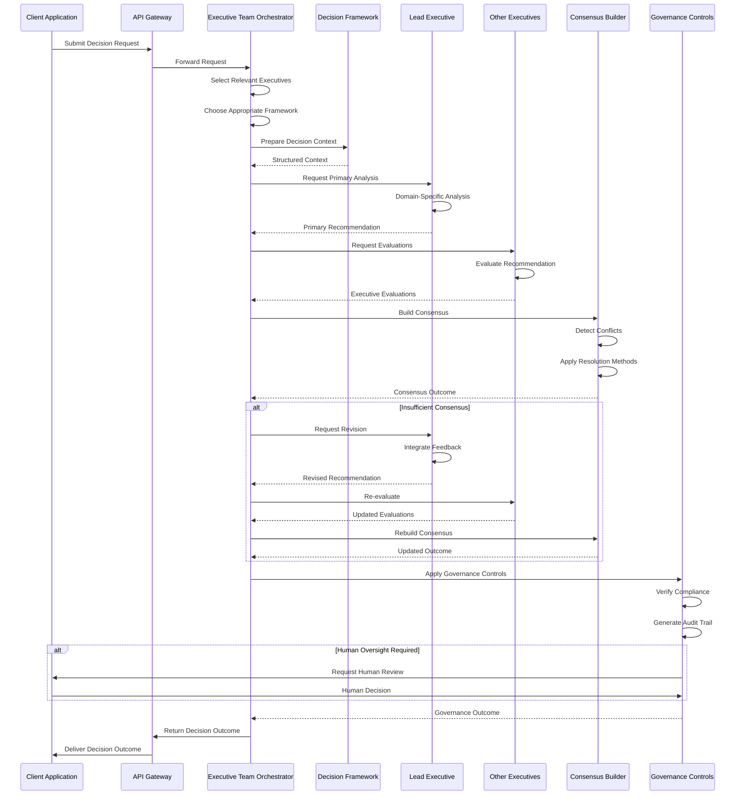

### Key Data Structures

1. **DecisionRequest**:
   ```json
   {
     "decision_id": "unique-id",
     "query": "Should we expand into the European market?",
     "context": {
       "background": "Company background...",
       "alternatives": [
         {
           "id": "alternative1",
           "name": "Full Market Entry",
           "description": "...",
           "outcomes": [...]
         }
       ],
       "constraints": ["Budget limited to $5M", ...],
       "stakeholders": ["shareholders", "employees", ...],
       "values": {"growth": 0.4, "stability": 0.3, ...}
     },
     "required_domains": ["strategic", "financial", ...],
     "urgency": 3,
     "importance": 4,
     "complexity_level": "complicated"
   }
   ```

2. **ExecutiveRecommendation**:
   ```json
   {
     "title": "Phased European Market Entry",
     "summary": "Recommend a phased approach...",
     "detailed_description": "Detailed analysis...",
     "supporting_evidence": ["Market analysis", ...],
     "confidence": "HIGH",
     "alternatives_considered": [...],
     "risks": [...],
     "stakeholder_impacts": [...],
     "resource_requirements": {...},
     "implementation_timeline": {...},
     "domain_specific_analyses": {
       "strategic": {...},
       "financial": {...}
     }
   }
   ```

3. **ConsensusOutcome**:
   ```json
   {
     "consensus_level": "GENERAL_CONSENSUS",
     "support_percentage": 0.82,
     "supporting_executives": ["Strategy", "Finance", ...],
     "opposing_executives": ["Risk"],
     "key_conflicts": [
       {
         "type": "risk_assessment",
         "description": "Disagreement on market risk level"
       }
     ],
     "resolution_method": "weighted_voting",
     "modified_from_original": true,
     "modification_summary": "Adjusted risk mitigation strategy"
   }
   ```

4. **DecisionOutcome**:
   ```json
   {
     "decision_id": "unique-id",
     "query": "Should we expand into the European market?",
     "recommendation": {...},
     "consensus": {...},
     "participating_executives": ["Strategy", "Finance", ...],
     "selected_framework": "Bayesian Decision Theory",
     "resolution_attempts": 2,
     "escalated_to_human": false,
     "decision_metrics": {...},
     "timestamp": "2023-10-15T14:30:45Z"
   }
   ```

## Interaction Patterns

The system employs several key interaction patterns:

### 1. Request-Response Pattern

Used for synchronous decision-making:

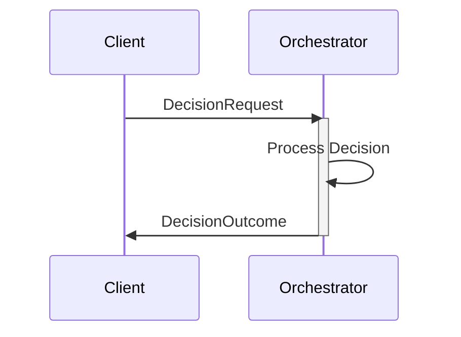

### 2. Publish-Subscribe Pattern

Used for asynchronous notifications:

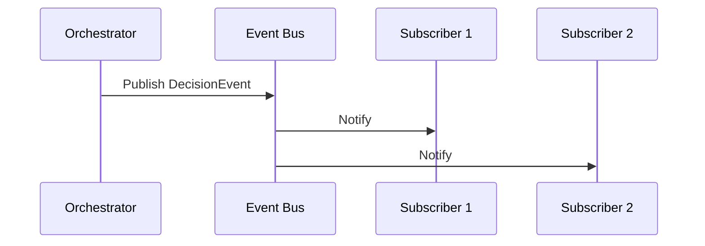

### 3. Chain of Responsibility Pattern

Used for governance checks:

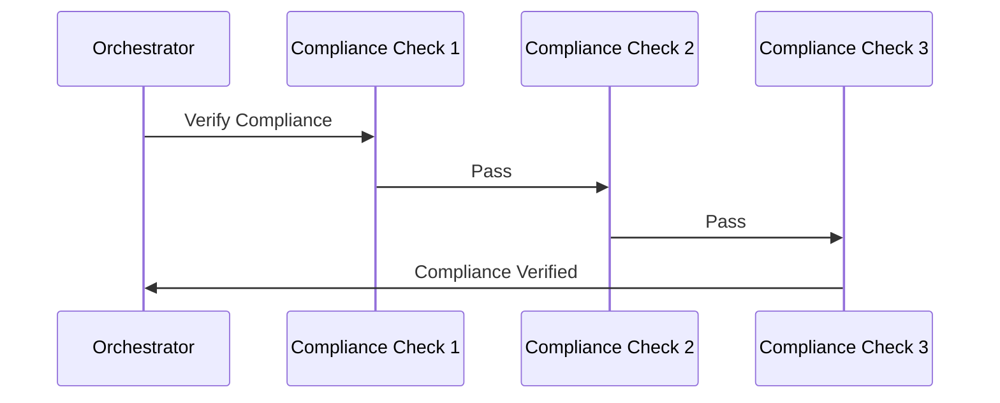

### 4. Observer Pattern

Used for monitoring and metrics:

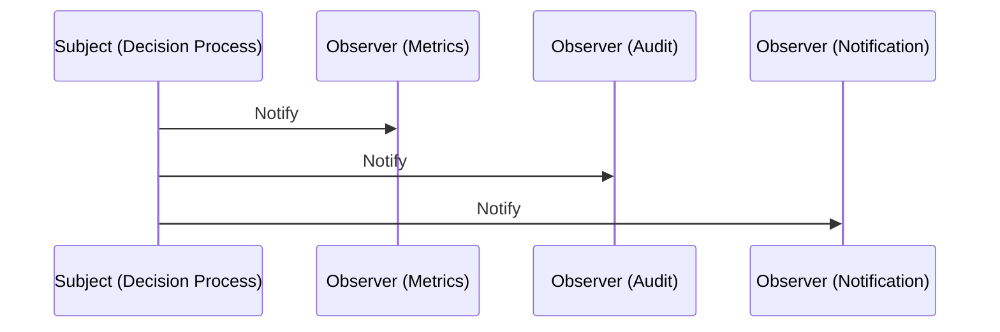

## Technical Integration

### LLM Integration Architecture

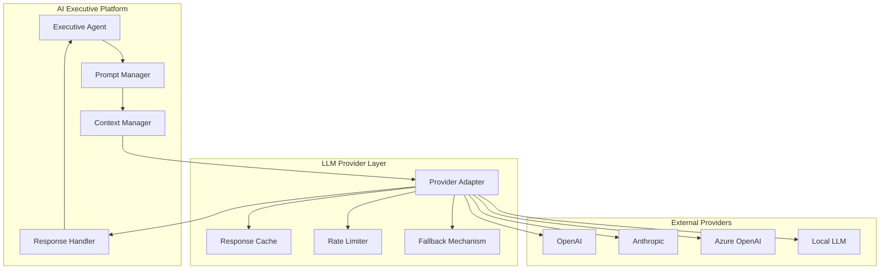

### Enterprise Data Integration

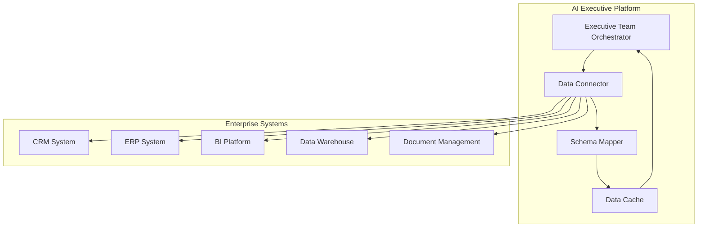

### API Integration

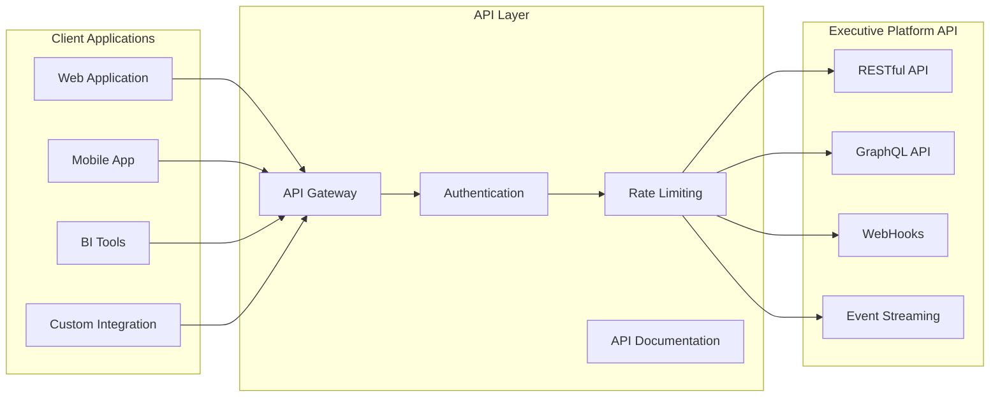

## Scalability Architecture

### Horizontal Scaling

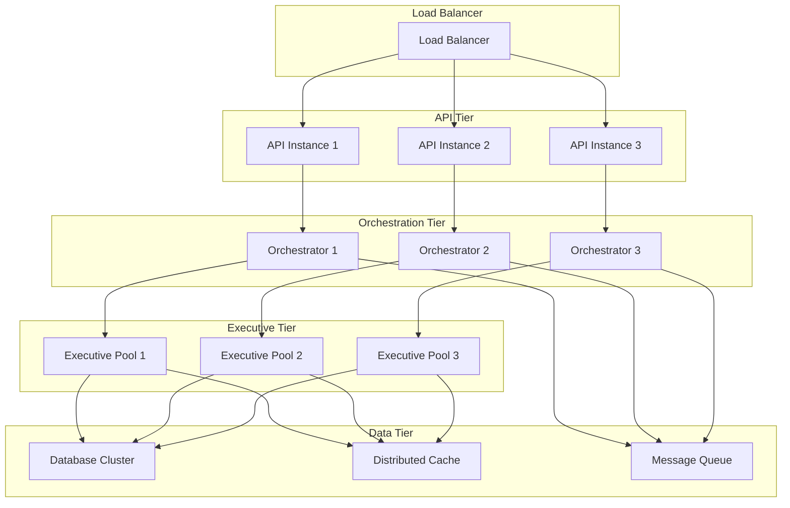

### Caching Architecture

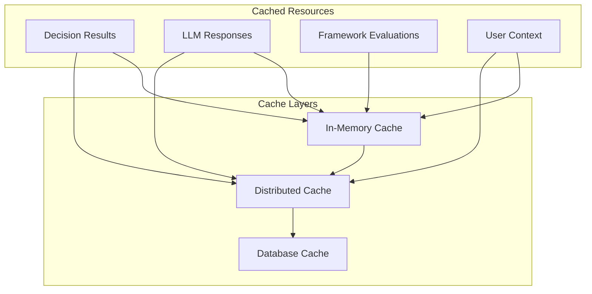

## Security Architecture

### Authentication and Authorization

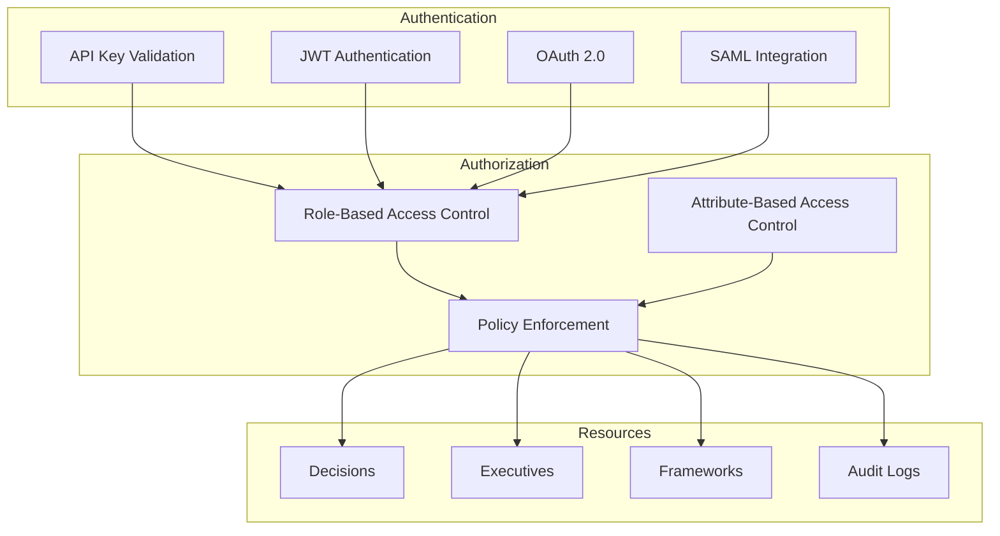

### Data Protection

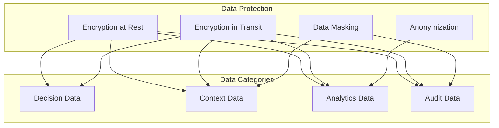

## Observability Architecture

### Monitoring Infrastructure

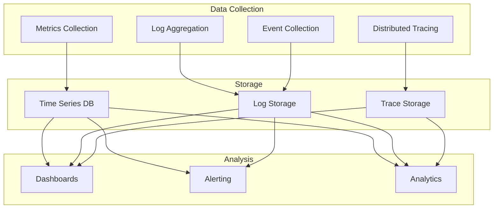

### Logging Architecture

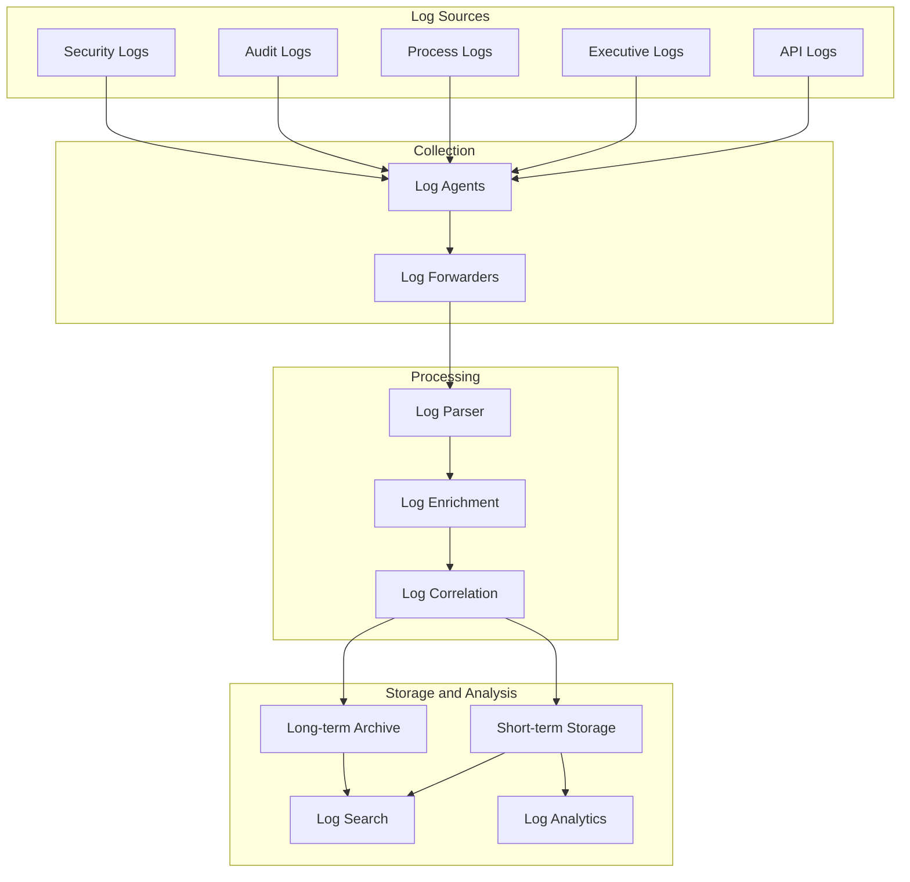

## Governance Architecture

### Compliance Framework

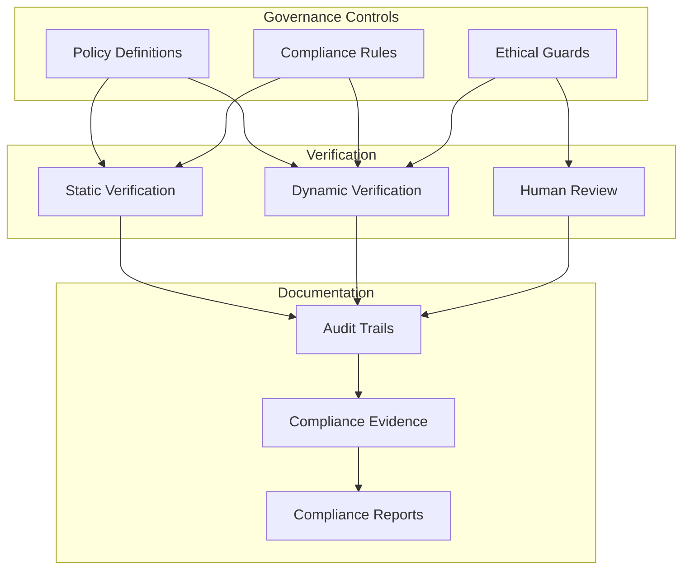

### Decision Auditability

```mermaid
graph TD
    subgraph "Decision Process"
        Request[Decision Request]
        Analysis[Executive Analysis]
        Framework[Framework Application]
        Consensus[Consensus Building]
        Resolution[Conflict Resolution]
        Outcome[Decision Outcome]
    end
    
    subgraph "Audit Trail"
        Capture[Event Capture]
        Storage[Immutable Storage]
        Indexing[Audit Indexing]
    end
    
    subgraph "Verification"
        Retrieval[Audit Retrieval]
        Verification[Verification Process]
        Reporting[Audit Reporting]
    end
    
    Request --> Capture
    Analysis --> Capture
    Framework --> Capture
    Consensus --> Capture
    Resolution --> Capture
    Outcome --> Capture
    
    Capture --> Storage
    Storage --> Indexing
    
    Indexing --> Retrieval
    Retrieval --> Verification
    Verification --> Reporting
```

### Human Oversight Integration

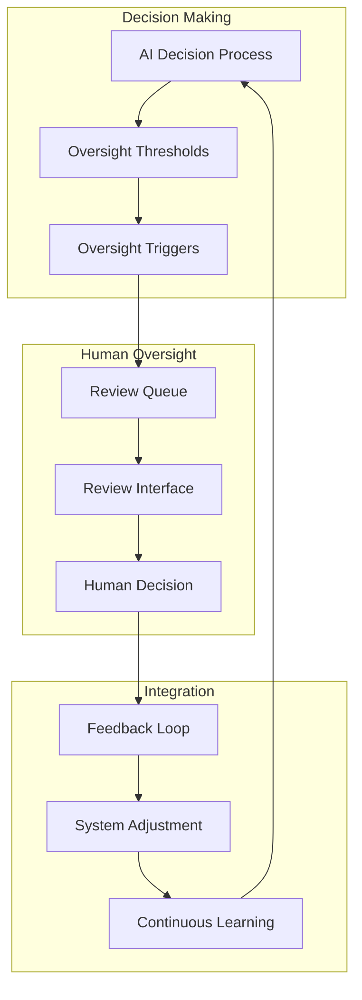

This architecture document provides a comprehensive reference for understanding, implementing, and extending the Enterprise Agentic AI Executive Platform. The modular, component-based design enables flexibility and customization while maintaining robust governance and security controls.