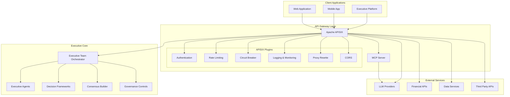
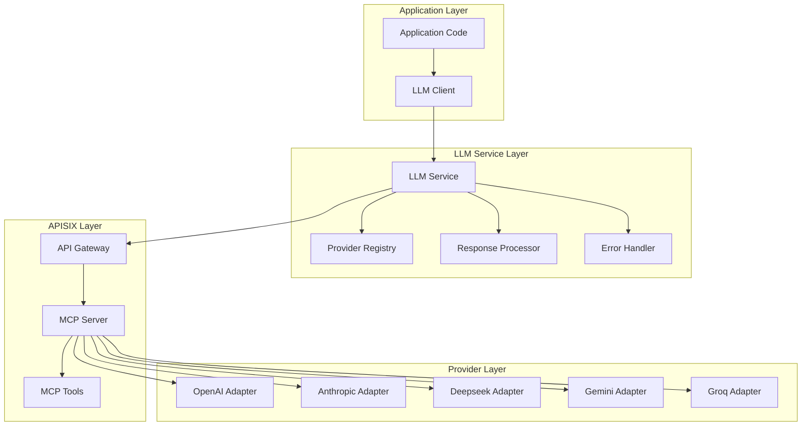
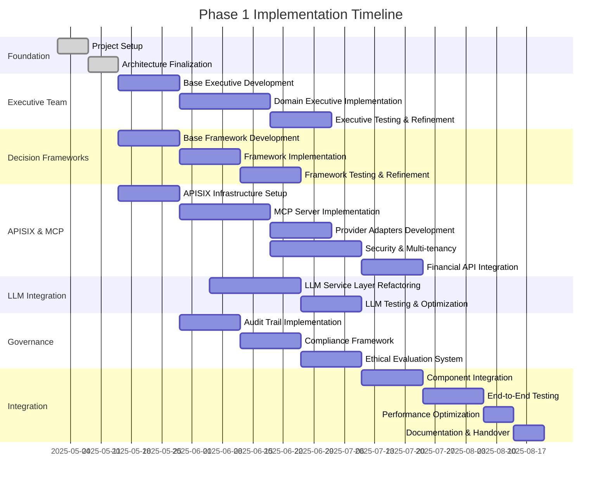

# Enterprise Agentic AI Executive Platform: Phase 1 Implementation Plan

## Executive Summary

This document outlines the Phase 1 implementation plan for the Enterprise Agentic AI Executive Platform, integrating the Apache APISIX API gateway to enhance the platform's capabilities. Phase 1 focuses on establishing the core platform foundations while incorporating the API gateway layer to provide enterprise-grade security, scalability, and standardized integration points.

## Implementation Objectives

Phase 1 aims to accomplish the following objectives:

1. Create a functional AI executive team with domain-specific expertise
2. Implement core decision frameworks to structure executive team analysis
3. Establish robust LLM integration with standardized interfaces through Apache APISIX
4. Develop foundational governance controls for compliance and ethical operation
5. Deploy Apache APISIX as an API gateway layer to enhance security, observability, and integration capabilities

## Revised Core Components

### 1. Executive Team Completion

**Description**:
Development of specialized AI executive agents that provide domain-specific expertise for comprehensive decision analysis.

**Key Deliverables**:
- Base Executive Agent architecture with common functionality
- Strategy Executive implementation
- Finance Executive implementation
- Risk Executive implementation
- Ethics Executive implementation
- Legal Executive implementation
- Technical Executive implementation

**Technical Approach**:
- Object-oriented design with inheritance from base executive class
- Domain-specific prompt engineering and response processing
- Expertise modeling and confidence calculation
- Interaction protocols for executive collaboration

**Success Criteria**:
- Each executive demonstrates domain-specific reasoning
- Executives can evaluate alternatives within their expertise domain
- Executives can contribute to consensus-building process
- Explicit confidence levels with appropriate escalation

### 2. Decision Framework Development

**Description**:
Implementation of formal decision frameworks that provide structured methodologies for analyzing complex decisions.

**Key Deliverables**:
- Base Decision Framework architecture
- Bayesian Decision Framework implementation
- Multi-Criteria Decision Analysis (MCDA) Framework implementation
- Cynefin Framework implementation
- OODA Loop Framework implementation

**Technical Approach**:
- Framework selection logic based on decision attributes
- Structured inputs and outputs for consistent application
- Framework-specific analysis methods and evaluations
- Integration with executive agent reasoning

**Success Criteria**:
- Frameworks provide structure appropriate to decision types
- Selection criteria correctly match frameworks to decisions
- Frameworks produce consistent, structured analyses
- Executives can effectively apply frameworks to decisions

### 3. LLM Integration with APISIX Gateway

**Description**:
Implementation of a standardized LLM service layer leveraging Apache APISIX as an API gateway to manage provider integrations, enhance security, and provide a unified interface through MCP (Model Context Protocol).

**Key Deliverables**:
- APISIX gateway infrastructure setup and configuration
- Central LLM service with standardized interface
- MCP server implementation for provider standardization
- Provider adapters for multiple LLM providers
- Response processing and error handling capabilities
- Security and rate limiting configuration
- Observability and monitoring integration

**Technical Approach**:
- Refactor existing LLM service to utilize APISIX gateway
- Implement MCP server for standardized model interactions
- Develop provider adapters for each supported LLM
- Configure APISIX for authentication, rate limiting, and logging
- Implement caching and fallback strategies for reliability
- Establish monitoring and observability dashboards

**Success Criteria**:
- Successful routing of LLM requests through APISIX gateway
- Standardized interfaces across different LLM providers
- Enhanced security with authentication and rate limiting
- Improved observability with comprehensive logging and monitoring
- Resilience through caching and failover mechanisms

### 4. Governance Controls Development

**Description**:
Implementation of compliance mechanisms, ethical guardrails, and audit capabilities to ensure responsible AI operation.

**Key Deliverables**:
- Audit trail implementation for decision transparency
- Compliance verification system for regulatory requirements
- Ethical evaluation framework for decision analysis
- Human oversight integration for critical decisions
- Risk assessment and tracking capabilities

**Technical Approach**:
- Immutable audit logging with cryptographic verification
- Rules-based compliance checking against configurable policies
- Explicit ethical consideration in decision processes
- Escalation pathways for human review
- Risk scoring and mitigation tracking

**Success Criteria**:
- Complete, verifiable audit trails for all decisions
- Automated compliance verification with policy rules
- Explicit ethical considerations in decision outputs
- Appropriate escalation of decisions requiring human oversight
- Comprehensive risk assessment with mitigation strategies

### 5. APISIX Enterprise API Gateway

**Description**:
Deployment of Apache APISIX as a comprehensive API gateway layer to provide centralized management, security, observability, and standardized integration points for external services.

**Key Deliverables**:
- APISIX core infrastructure deployment
- API routing configuration for all service endpoints
- Authentication and authorization framework
- Multi-tenant isolation capabilities
- Rate limiting and traffic management
- Observability and monitoring setup
- Financial API integration configuration
- External service integration

**Technical Approach**:
- Containerized APISIX deployment with high availability
- Configuration management with versioning and CI/CD
- Plugin-based security features implementation
- Tenant-specific routing and policy configuration
- Comprehensive logging and monitoring setup
- Financial API connector development and integration
- Service resilience patterns implementation

**Success Criteria**:
- Single entry point for all external service interactions
- Consistent authentication and authorization
- Comprehensive logging and monitoring
- Successful routing of requests to appropriate services
- Enhanced security with multiple protection layers
- Successful integration with financial data services

## Technical Architecture

The integrated Phase 1 architecture incorporates Apache APISIX as a central component for managing API interactions:

## Revised LLM Service Architecture

The LLM service architecture is updated to leverage the APISIX gateway and MCP server:

## Work Packages for Distributed Development

The implementation is structured as work packages that can be assigned to different development teams:

### WP1: Executive Team Development

**Dependencies**: None

**Responsibilities**:
- Base Executive Agent development
- Domain-specific executive implementations
- Executive collaboration protocols
- Executive knowledge representation

**Deliverables**:
- Executable executive agents for each domain
- Unit and integration tests
- Documentation and usage examples
- Interface definitions for orchestrator integration

### WP2: Decision Frameworks Implementation

**Dependencies**: None

**Responsibilities**:
- Base framework architecture
- Framework-specific implementations
- Framework selection logic
- Framework application utilities

**Deliverables**:
- Executable decision frameworks
- Selection algorithm implementation
- Framework test cases and validation
- Documentation and usage examples

### WP3: APISIX Infrastructure & MCP Integration

**Dependencies**: None

**Responsibilities**:
- APISIX installation and configuration
- Infrastructure setup and networking
- MCP server implementation
- Provider adapter development
- Integration testing with LLM providers

**Deliverables**:
- Functional APISIX gateway deployment
- Operational MCP server
- Provider-specific adapters
- Configuration management approach
- Load balancing and scaling setup
- Monitoring dashboards
- Infrastructure documentation

### WP4: LLM Service Implementation

**Dependencies**: WP3

**Responsibilities**:
- Refactor existing LLM service layer
- Provider registry implementation
- Response processing enhancements
- Error handling and retry mechanisms
- Caching and performance optimization

**Deliverables**:
- Enhanced LLM service with APISIX routing
- Integration tests and documentation
- Performance benchmarks and optimization
- Fallback and resilience mechanisms

### WP5: Governance Controls Implementation

**Dependencies**: None

**Responsibilities**:
- Audit trail implementation
- Compliance checking mechanisms
- Ethical evaluation framework
- Human oversight integration
- Risk assessment tooling

**Deliverables**:
- Audit logging system
- Policy compliance verification
- Escalation workflows
- Risk scoring and tracking
- Governance documentation

### WP6: Security & Multi-tenancy

**Dependencies**: WP3

**Responsibilities**:
- Authentication and authorization implementation
- Multi-tenant isolation
- Security policy configuration
- Rate limiting and quota management
- Security testing and documentation

**Deliverables**:
- Authentication framework
- Multi-tenant routing rules
- Security policies and configurations
- Testing and validation reports
- Security documentation

### WP7: Financial & External API Integration

**Dependencies**: WP3, WP6

**Responsibilities**:
- Financial API routing configuration
- External service integration
- Response transformation
- Caching strategies
- Service reliability patterns

**Deliverables**:
- API routes configuration
- Transformation plugins
- Caching policies
- Failover configurations
- Integration documentation

### WP8: Executive Team Orchestrator

**Dependencies**: WP1, WP2, WP4, WP5

**Responsibilities**:
- Orchestrator core implementation
- Component integration and coordination
- Decision workflow management
- State management and persistence
- Performance optimization

**Deliverables**:
- Functional orchestrator implementation
- Integration with all components
- End-to-end test cases
- Performance metrics and optimization
- User documentation

## Implementation Timeline

The Phase 1 implementation is planned for a 16-week timeline:

## Critical Path and Dependencies

The critical path for Phase 1 implementation includes:

1. **APISIX Infrastructure Setup** → This is a foundation for the LLM Integration and API Integration
2. **MCP Server Implementation** → Required for standardized LLM provider interactions
3. **LLM Service Layer Refactoring** → Depends on APISIX and MCP setup
4. **Component Integration** → Depends on all individual components being ready
5. **End-to-End Testing** → Final validation before release

The Executive Team, Decision Frameworks, and Governance Controls development can proceed in parallel with the APISIX infrastructure work, as they have limited dependencies on the API gateway layer initially.

## Integration Strategy

To successfully integrate APISIX with the existing components:

1. **Phased Integration Approach**:
   - Begin with APISIX infrastructure setup early in the timeline
   - Initially implement with basic routing functionality
   - Gradually add advanced features (security, multi-tenancy, etc.)

2. **LLM Service Transition**:
   - Implement the new LLM Service architecture while maintaining compatibility
   - Create adapters for the existing LLM code to work with the new architecture
   - Shift traffic gradually to the new implementation

3. **API Gateway as Central Hub**:
   - Position APISIX as the entry point for all external interactions
   - Route internal component requests through the gateway for consistent handling
   - Implement uniform authentication and monitoring across all services

## Phase Boundaries and Deferrals

While most APISIX functionality is included in Phase 1, the following aspects are deferred to future phases:

1. **Advanced Analytics and Observability**:
   - Complex metrics aggregation and visualization
   - Advanced anomaly detection
   - Custom dashboards beyond basic monitoring

2. **Complex Transformation Plugins**:
   - Advanced data transformation between services
   - Custom protocol adapters beyond standard REST/JSON

3. **Global Deployment and Geographic Routing**:
   - Multi-region deployment architecture
   - Geo-based routing and failover
   - Global load balancing

4. **Advanced Multi-tenancy Features**:
   - Tenant-specific customizations beyond basic isolation
   - Tenant-level analytics and reporting
   - Custom tenant policy engines

## Risk Management

Key risks for the integrated implementation plan include:

1. **Integration Complexity**:
   - *Risk*: APISIX integration may increase overall system complexity
   - *Mitigation*: Start with minimal viable integration and expand incrementally

2. **Performance Impact**:
   - *Risk*: Additional API gateway layer could impact response times
   - *Mitigation*: Implement performance testing early and optimize as needed

3. **Learning Curve**:
   - *Risk*: Team may need time to become proficient with APISIX
   - *Mitigation*: Begin training early, allocate time for experimentation

4. **Security Configuration**:
   - *Risk*: Improper security configuration could create vulnerabilities
   - *Mitigation*: Engage security specialists for review, implement security testing

## Recommended Next Steps

1. Finalize the architecture design with APISIX integration
2. Begin infrastructure setup for APISIX deployment
3. Initiate Executive Team and Decision Framework development in parallel
4. Develop training materials for APISIX and MCP concepts
5. Establish CI/CD pipelines for automated testing and deployment

## Conclusion

This integrated Phase 1 implementation plan successfully incorporates Apache APISIX as a key component while maintaining focus on the core platform foundations. The revised plan enhances the original four components with enterprise-grade API management capabilities, standardized LLM integration through MCP, and improved security and observability. The work packages are designed for distributed development with clear dependencies and timelines.
