# Tenant Administration Front-End Architecture

This document outlines the comprehensive architecture for the Tenant Administration front-end, which provides administrators with a centralized, intuitive, visually rich interface to manage multiple tenant contexts within an agentic SaaS ecosystem.

## Table of Contents

- [Tenant Administration Front-End Architecture](#tenant-administration-front-end-architecture)
  - [Table of Contents](#table-of-contents)
  - [Core Objectives and Principles](#core-objectives-and-principles)
  - [System Architecture Overview](#system-architecture-overview)
  - [Frontend Component Architecture](#frontend-component-architecture)
  - [Data Model](#data-model)
  - [API Design](#api-design)
    - [Tenant Management API](#tenant-management-api)
    - [Agent Shadow Copy API](#agent-shadow-copy-api)
    - [Security \& RBAC API](#security--rbac-api)
    - [Federation \& Sharing API](#federation--sharing-api)
    - [Template Store API](#template-store-api)
  - [Backend Services Architecture](#backend-services-architecture)
  - [Multi-Tenancy Implementation Strategy](#multi-tenancy-implementation-strategy)
  - [Security Architecture](#security-architecture)
  - [Federation and Trust Model](#federation-and-trust-model)
  - [Comprehensive Event System](#comprehensive-event-system)
  - [Identity and Access Management](#identity-and-access-management)
  - [Flexible Compliance Framework](#flexible-compliance-framework)
  - [Monitoring Dashboard](#monitoring-dashboard)
  - [Template Marketplace](#template-marketplace)
  - [Simulation Environment](#simulation-environment)
  - [Project Documentation Framework](#project-documentation-framework)
  - [Implementation Phases](#implementation-phases)
    - [Phase 1: Core Tenant Infrastructure \& Identity (Months 1-2)](#phase-1-core-tenant-infrastructure--identity-months-1-2)
    - [Phase 2: Agent Configuration \& Compliance (Months 2-3)](#phase-2-agent-configuration--compliance-months-2-3)
    - [Phase 3: Security, Governance \& Monitoring (Months 3-4)](#phase-3-security-governance--monitoring-months-3-4)
    - [Phase 4: Integration \& Event System (Months 4-5)](#phase-4-integration--event-system-months-4-5)
    - [Phase 5: Simulation \& Visualization (Months 5-6)](#phase-5-simulation--visualization-months-5-6)
    - [Phase 6: Federation \& Marketplace (Months 6-7)](#phase-6-federation--marketplace-months-6-7)
  - [Technology Stack](#technology-stack)
    - [Frontend](#frontend)
    - [Backend](#backend)
    - [DevOps](#devops)
  - [Key Technical Challenges and Solutions](#key-technical-challenges-and-solutions)
    - [Challenge 1: Tenant Isolation](#challenge-1-tenant-isolation)
    - [Challenge 2: Agent Shadow Copies](#challenge-2-agent-shadow-copies)
    - [Challenge 3: Federation Security](#challenge-3-federation-security)
    - [Challenge 4: Performance at Scale](#challenge-4-performance-at-scale)
    - [Challenge 5: Visualization Complexity](#challenge-5-visualization-complexity)
  - [Governance and Compliance](#governance-and-compliance)
  - [Analytics and Insights](#analytics-and-insights)
  - [Technical Recommendations](#technical-recommendations)
  - [Next Steps](#next-steps)

## Core Objectives and Principles

The Tenant Administration front-end ensures:

- **Intuitive Usability**: Clean, responsive interface enabling quick tenant creation and administration.
- **Contextual Isolation**: Robust multi-tenancy isolation (legal, operational, experiential).
- **Dynamic Configuration**: Flexible, modular configuration of tenants and agent attributes.
- **Comprehensive Observability**: Transparent and interactive visualizations of data flows and interactions.
- **Security and Compliance**: Strong access controls, audit logs, and traceable governance policies.

## System Architecture Overview

The system follows a layered architecture approach with clear separation of concerns:

```mermaid
graph TD
    subgraph "Client Layer"
        WebApp[Web Application]
        MobileApp[Mobile Application]
    end

    subgraph "Frontend Layer"
        TenantUI[Tenant Admin UI]
        ConfigUI[Configuration UI]
        VisualizationUI[Visualization UI]
        SecurityUI[Security & Governance UI]
        TemplateMarketUI[Template Marketplace UI]
        SimulationUI[Simulation Environment UI]
    end

    subgraph "API Layer"
        TenantAPI[Tenant Management API]
        AgentAPI[Agent Configuration API]
        SecurityAPI[Security & RBAC API]
        FederationAPI[Federation & Sharing API]
        MarketplaceAPI[Marketplace API]
        WebhookAPI[Webhook & Event API]
    end

    subgraph "Service Layer"
        TenantService[Tenant Service]
        AgentShadowService[Agent Shadow Copy Service]
        TemplateService[Organization Template Service]
        FederationService[Federation Service]
        GovernanceService[Governance Service]
        PolicyService[Policy as Code Service]
        SimulationService[Simulation Service]
    end

    subgraph "Data Layer"
        AuthDB[(Authentication DB)]
        TenantDB[(Tenant Configuration DB)]
        AgentDB[(Agent Shadow Copies DB)]
        AuditDB[(Audit & Governance DB)]
        MarketplaceDB[(Marketplace DB)]
        MetricsDB[(Metrics & Analytics DB)]
    end

    subgraph "Identity Providers"
        SupabaseAuth[Supabase Auth]
        AzureAD[Azure AD]
        Okta[Okta]
        GoogleAuth[Google Auth]
    end

    subgraph "Executive Platform Core"
        ExecutiveOrchestrator[Executive Team Orchestrator]
        ExecutiveAgents[Executive Agents]
        DecisionFrameworks[Decision Frameworks]
        ConsensusBuilder[Consensus Builder]
    end

    WebApp --> TenantUI
    MobileApp --> TenantUI

    TenantUI --> TenantAPI
    TenantUI --> AgentAPI
    TenantUI --> SecurityAPI
    TenantUI --> FederationAPI

    ConfigUI --> AgentAPI
    VisualizationUI --> TenantAPI
    SecurityUI --> SecurityAPI
    TemplateMarketUI --> MarketplaceAPI
    SimulationUI --> AgentAPI

    TenantAPI --> TenantService
    AgentAPI --> AgentShadowService
    SecurityAPI --> GovernanceService
    FederationAPI --> FederationService
    MarketplaceAPI --> TemplateService
    WebhookAPI --> PolicyService

    TenantService --> TenantDB
    AgentShadowService --> AgentDB
    GovernanceService --> AuditDB
    FederationService --> TenantDB
    TemplateService --> MarketplaceDB
    SimulationService --> AgentDB

    TenantService --> ExecutiveOrchestrator
    AgentShadowService --> ExecutiveAgents
    AgentShadowService --> DecisionFrameworks
    SimulationService --> ExecutiveOrchestrator

    TenantService --> AuthDB
    GovernanceService --> AuthDB

    AuthDB --> SupabaseAuth
    AuthDB --> AzureAD
    AuthDB --> Okta
    AuthDB --> GoogleAuth
```

## Frontend Component Architecture

The frontend is built using React and TypeScript, with a modular component architecture:

```mermaid
graph TD
    subgraph "Core Components"
        AppShell[App Shell]
        AuthModule[Authentication Module]
        Navigation[Navigation System]
        TenantContext[Tenant Context Provider]
    end

    subgraph "Tenant & Subtenant Management"
        TenantDashboard[Tenant Dashboard]
        TenantCreator[Tenant Creator/Editor]
        ContextIsolator[Context Isolation Configurator]
        HierarchyGraph[Hierarchical Visualization]
        TenantSettings[Tenant Settings]
    end

    subgraph "Agent Personality & Configuration"
        PersonalityEditor[Personality Graph Editor]
        RoleManager[Role Management]
        ExperientialHistory[Experiential History Viewer]
        FrameworkSelector[Decision Framework Selector]
        AgentSettings[Agent Settings]
    end

    subgraph "Security & Governance"
        RBACManager[RBAC Management]
        AuditLogger[Audit Log Dashboard]
        PolicyEditor[Policy Editor]
        ComplianceChecker[Compliance Checker]
    end

    subgraph "API Integrations & Channels"
        APIManager[API Integration Manager]
        ChannelConfig[Channel Configuration]
        WebhookManager[Webhook Manager]
    end

    subgraph "Branding & Customization"
        ThemeEditor[Theme Editor]
        LogoManager[Logo Manager]
        UICustomizer[UI Customization Dashboard]
    end

    subgraph "Observability & Visualization"
        FlowVisualizer[Data Flow Visualizer]
        MetricsDashboard[Metrics Dashboard]
        RealTimeMonitor[Real-time Monitor]
        AgentInteractionGraph[Agent Interaction Graph]
    end

    subgraph "Federation & Trust Management"
        TrustConfig[Trust Configuration]
        SharingRules[Sharing Rules Manager]
        PartnerIntegration[Partner Integration]
    end

    subgraph "Template Store"
        TemplateExplorer[Template Explorer]
        TemplateEditor[Template Editor]
        OrgStructureDesigner[Org Structure Designer]
    end

    AppShell --> AuthModule
    AppShell --> Navigation
    AppShell --> TenantContext

    TenantContext --> TenantDashboard
    TenantContext --> PersonalityEditor
    TenantContext --> RBACManager
    TenantContext --> APIManager
    TenantContext --> ThemeEditor
    TenantContext --> FlowVisualizer
    TenantContext --> TrustConfig
    TenantContext --> TemplateExplorer

    TenantDashboard --> TenantCreator
    TenantDashboard --> ContextIsolator
    TenantDashboard --> HierarchyGraph
    TenantDashboard --> TenantSettings

    PersonalityEditor --> RoleManager
    PersonalityEditor --> ExperientialHistory
    PersonalityEditor --> FrameworkSelector
    PersonalityEditor --> AgentSettings

    RBACManager --> AuditLogger
    RBACManager --> PolicyEditor
    RBACManager --> ComplianceChecker

    APIManager --> ChannelConfig
    APIManager --> WebhookManager

    ThemeEditor --> LogoManager
    ThemeEditor --> UICustomizer

    FlowVisualizer --> MetricsDashboard
    FlowVisualizer --> RealTimeMonitor
    FlowVisualizer --> AgentInteractionGraph

    TrustConfig --> SharingRules
    TrustConfig --> PartnerIntegration

    TemplateExplorer --> TemplateEditor
    TemplateExplorer --> OrgStructureDesigner
```

## Data Model

The data model supports multi-tenancy, shadow agent copies, and complex hierarchical relationships:

```mermaid
erDiagram
    Tenant ||--o{ Subtenant : "contains"
    Tenant {
        string id PK
        string name
        string description
        json settings
        datetime created_at
        datetime updated_at
        bool is_active
        json branding
    }

    Subtenant {
        string id PK
        string tenant_id FK
        string name
        string description
        json isolation_settings
        bool is_active
    }

    Tenant ||--o{ AgentShadowCopy : "configures"
    AgentShadowCopy {
        string id PK
        string tenant_id FK
        string base_agent_id
        string name
        string role
        json personality_config
        json framework_settings
        json expertise_levels
        bool is_active
    }

    Tenant ||--o{ Role : "defines"
    Role {
        string id PK
        string tenant_id FK
        string name
        string description
        json permissions
        json veto_rights
    }

    Tenant ||--o{ User : "has"
    User {
        string id PK
        string email
        string name
        datetime created_at
        bool is_active
    }

    User }o--o{ Role : "assigned"

    Tenant ||--o{ API_Integration : "configures"
    API_Integration {
        string id PK
        string tenant_id FK
        string name
        string api_type
        json config
        bool is_active
    }

    Tenant ||--o{ Federation : "participates"
    Federation {
        string id PK
        string source_tenant_id FK
        string target_tenant_id FK
        json sharing_rules
        bool is_active
        datetime created_at
    }

    Tenant ||--o{ BrandingSettings : "has"
    BrandingSettings {
        string id PK
        string tenant_id FK
        string logo_url
        json theme_colors
        json typography
        json custom_css
    }

    Tenant ||--o{ DecisionRecord : "owns"
    DecisionRecord {
        string id PK
        string tenant_id FK
        string query
        json context
        json recommendation
        json consensus
        datetime created_at
        string created_by_user_id FK
    }

    Tenant ||--o{ OrganizationTemplate : "uses"
    OrganizationTemplate {
        string id PK
        string tenant_id FK
        string name
        string description
        json structure
        json roles
        json agent_mappings
        bool is_public
    }

    AuditLog }o--{ Tenant : "records"
    AuditLog {
        string id PK
        string tenant_id FK
        string user_id FK
        string action
        json details
        datetime timestamp
        string ip_address
    }
```

## API Design

### Tenant Management API

```
/api/tenants
  GET / - List all tenants (for super admin)
  POST / - Create a new tenant
  GET /:id - Get tenant details
  PUT /:id - Update tenant details
  DELETE /:id - Deactivate tenant

/api/tenants/:tenantId/subtenants
  GET / - List all subtenants for a tenant
  POST / - Create a new subtenant
  GET /:id - Get subtenant details
  PUT /:id - Update subtenant details
  DELETE /:id - Deactivate subtenant
```

### Agent Shadow Copy API

```
/api/tenants/:tenantId/agents
  GET / - List all agent shadow copies for tenant
  POST / - Create a new agent shadow copy
  GET /:id - Get agent shadow copy details
  PUT /:id - Update agent shadow copy
  DELETE /:id - Deactivate agent shadow copy

/api/tenants/:tenantId/agents/:agentId/personality
  GET / - Get agent personality configuration
  PUT / - Update agent personality

/api/tenants/:tenantId/agents/:agentId/frameworks
  GET / - Get agent decision frameworks
  PUT / - Update agent decision frameworks

/api/tenants/:tenantId/agents/:agentId/experience
  GET / - Get agent experiential history
  POST / - Add new experience
  DELETE /:id - Remove specific experience
```

### Security & RBAC API

```
/api/tenants/:tenantId/roles
  GET / - List all roles for tenant
  POST / - Create a new role
  GET /:id - Get role details
  PUT /:id - Update role
  DELETE /:id - Delete role

/api/tenants/:tenantId/users
  GET / - List all users for tenant
  POST / - Add a user to tenant
  DELETE /:id - Remove user from tenant

/api/tenants/:tenantId/users/:userId/roles
  GET / - Get user roles
  PUT / - Update user roles

/api/tenants/:tenantId/audit
  GET / - Get audit logs for tenant
```

### Federation & Sharing API

```
/api/tenants/:tenantId/federation
  GET / - List all federation relationships
  POST / - Create a new federation relationship
  DELETE /:id - Remove federation relationship

/api/tenants/:tenantId/federation/:federationId/rules
  GET / - Get sharing rules
  PUT / - Update sharing rules

/api/tenants/:tenantId/shared-resources
  GET / - List resources shared with this tenant
  GET /shared - List resources this tenant is sharing
```

### Template Store API

```
/api/templates
  GET / - List all public templates
  POST / - Create a new template (tenant-specific or public)
  GET /:id - Get template details
  PUT /:id - Update template
  DELETE /:id - Delete template

/api/tenants/:tenantId/templates
  GET / - List all templates available to tenant
  POST /apply/:templateId - Apply template to tenant
```

## Backend Services Architecture

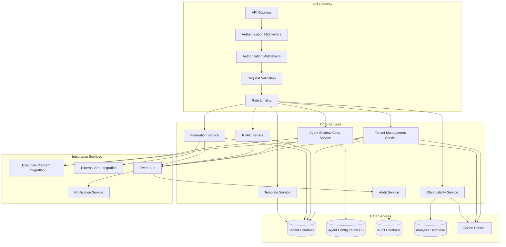

## Multi-Tenancy Implementation Strategy

The multi-tenancy model follows these key principles:

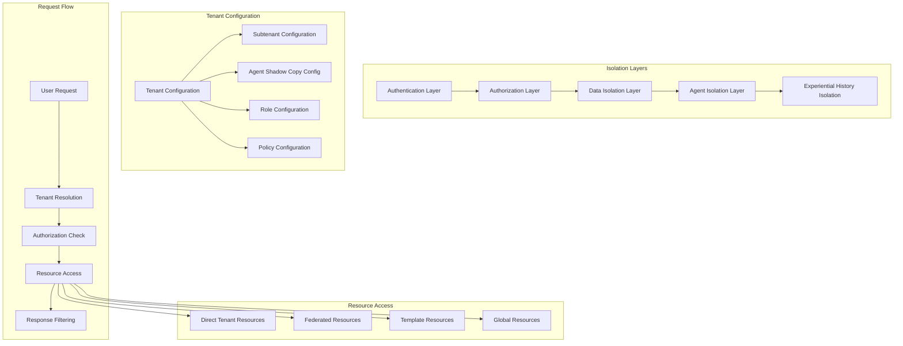

## Security Architecture

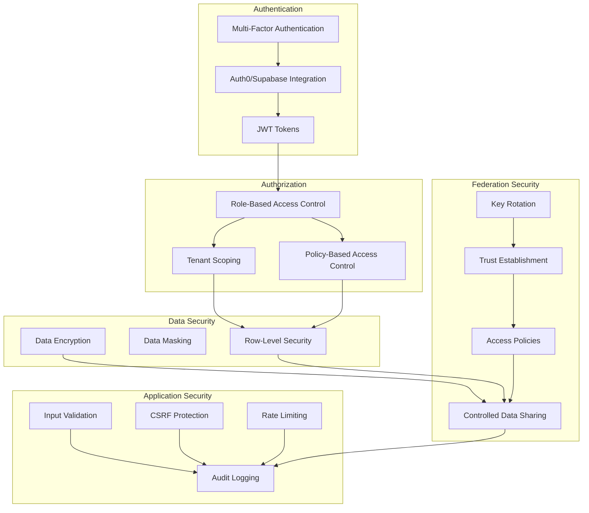

## Federation and Trust Model

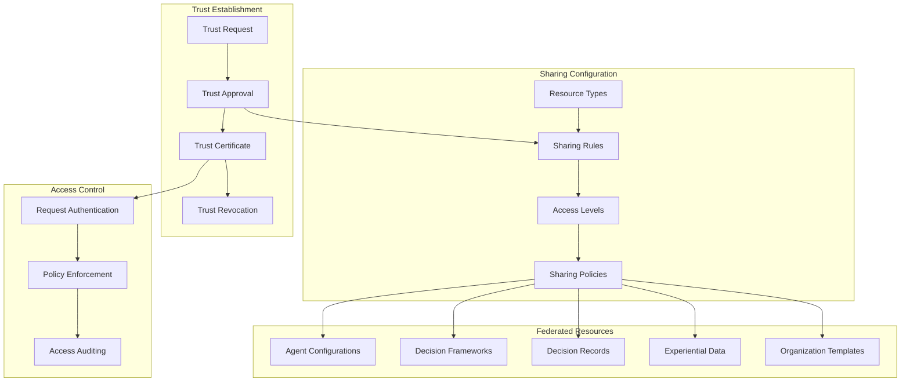

## Comprehensive Event System

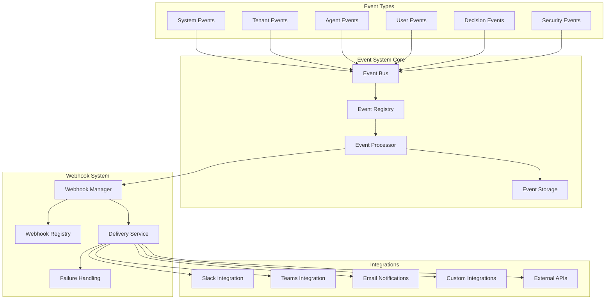

## Identity and Access Management

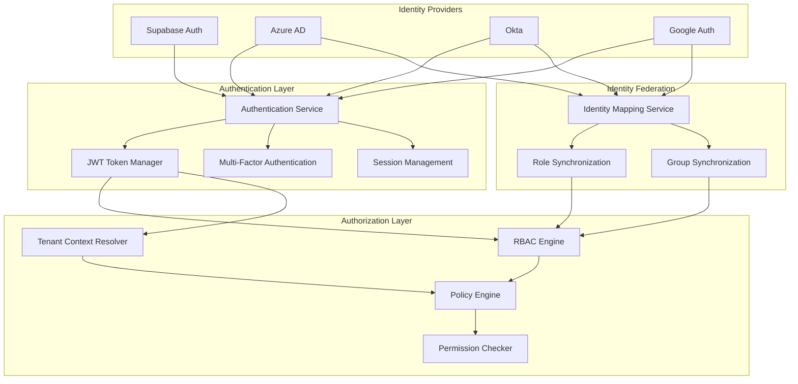

## Flexible Compliance Framework

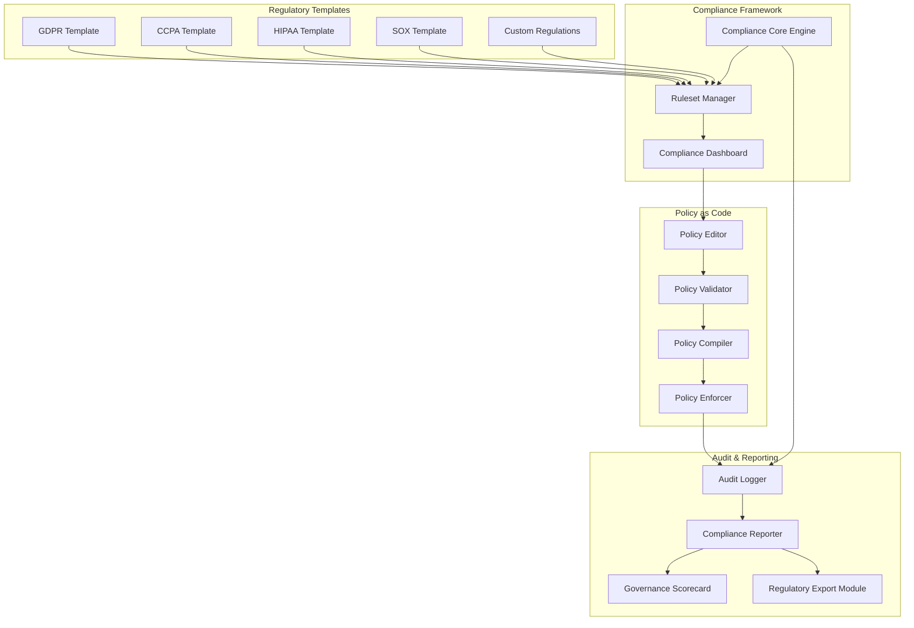

## Monitoring Dashboard

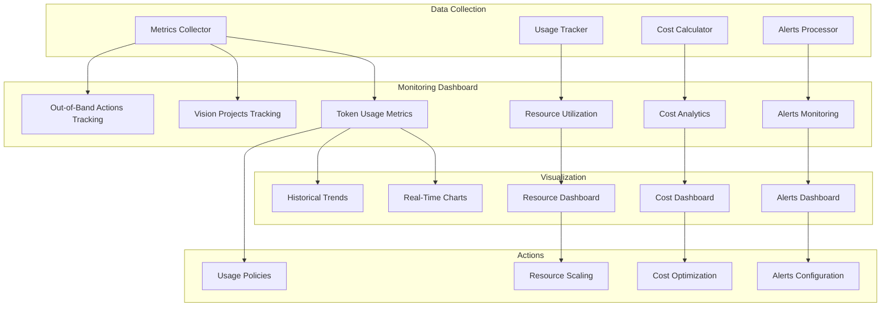

## Template Marketplace

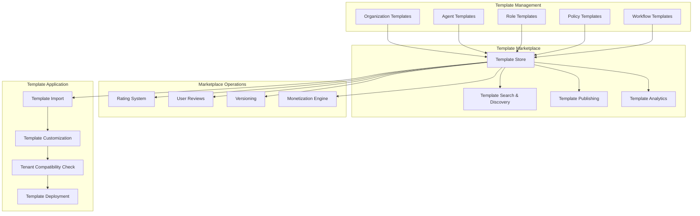

## Simulation Environment

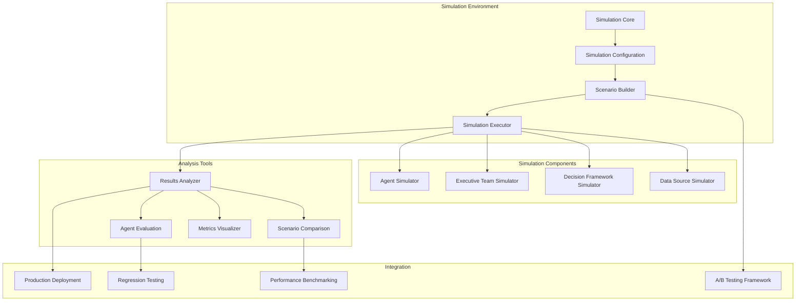

## Project Documentation Framework

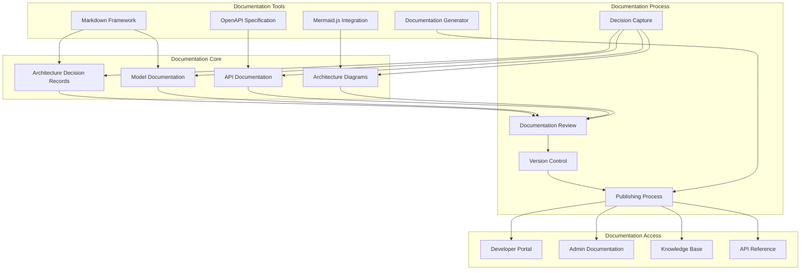

## Implementation Phases

### Phase 1: Core Tenant Infrastructure & Identity (Months 1-2)

- Tenant/subtenant data model implementation
- Basic tenant creation and management UI
- Integration with multiple identity providers (Supabase, Azure AD, Okta, Google)
- Basic agent shadow copy infrastructure
- Infrastructure for tenant isolation
- Documentation framework setup

### Phase 2: Agent Configuration & Compliance (Months 2-3)

- Personality graph editor implementation
- Role management system
- Experiential history viewer
- Decision framework configuration
- Agent settings UI
- Customizable compliance framework foundation
- Policy as code initial implementation

### Phase 3: Security, Governance & Monitoring (Months 3-4)

- RBAC management implementation
- Audit logging dashboard
- Policy editor and enforcement
- Comprehensive monitoring dashboard with specified metrics
- Security dashboard
- Governance scorecard implementation

### Phase 4: Integration & Event System (Months 4-5)

- API integration manager
- Comprehensive event system
- Webhook management and configuration
- Channel configuration
- Branding and theme editor
- UI customization tools

### Phase 5: Simulation & Visualization (Months 5-6)

- Simulation environment implementation
- Data flow visualization
- Real-time monitoring dashboard
- Metrics and analytics
- Agent interaction graph visualization
- System health monitoring

### Phase 6: Federation & Marketplace (Months 6-7)

- Federation framework implementation
- Trust configuration and management
- Sharing rules system
- Template marketplace implementation
- Organization structure designer
- Monetization engine

## Technology Stack

### Frontend

- React 18+ (Component-based UI)
- TypeScript (Type-safe code)
- Tailwind CSS (Styling)
- shadcn/ui (UI component library)
- Framer Motion (Animations)
- React Flow (Interactive graph visualization)
- Recharts/Visx (Data visualization)
- Mermaid.js (Markdown-based diagrams)
- React Query (Data fetching)
- Zustand (State management)

### Backend

- Deno (Secure TypeScript runtime)
- Oak (Web framework for Deno)
- PostgreSQL (Primary database)
- Supabase (Authentication and real-time features)
- Redis (Caching and pub/sub)
- TypeBox (Runtime type validation)
- JWT (Authentication tokens)

### DevOps

- Docker (Containerization)
- GitHub Actions (CI/CD)
- Deno Deploy (Edge deployment)
- Playwright (E2E testing)
- Vitest (Unit testing)

## Key Technical Challenges and Solutions

### Challenge 1: Tenant Isolation

**Solution:** Implement a robust middleware architecture that enforces tenant boundaries at multiple levels (request, database, agent) with hierarchical permission checking and row-level security in the database.

### Challenge 2: Agent Shadow Copies

**Solution:** Design a differential configuration system that only stores tenant-specific modifications to base agents, reducing storage and simplifying updates to base agent functionality.

### Challenge 3: Federation Security

**Solution:** Implement a certificate-based trust system with fine-grained access policies and comprehensive audit logging of all cross-tenant interactions.

### Challenge 4: Performance at Scale

**Solution:** Employ aggressive caching, database sharding by tenant, and read replicas for analytics to maintain performance as tenant count grows.

### Challenge 5: Visualization Complexity

**Solution:** Implement progressive loading and rendering of complex visualizations with level-of-detail controls to handle large agent interaction graphs.

## Governance and Compliance

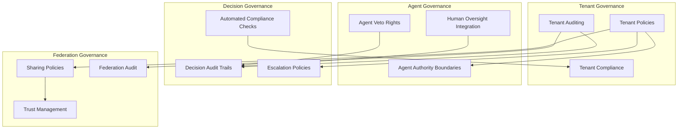

## Analytics and Insights

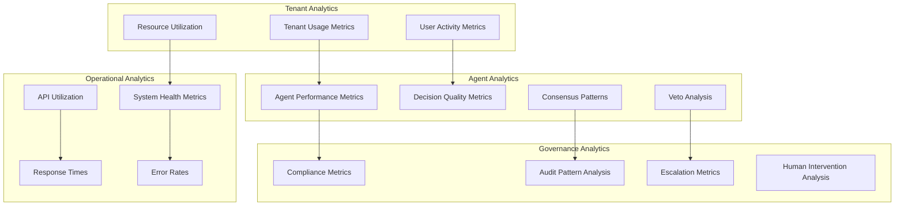

## Technical Recommendations

1. **Modular Architecture**: Implement a modular, microservices-based approach to allow for independent scaling and development of different components.

2. **Containerization**: Use containerization (Docker) for all services to ensure consistent deployment and isolation.

3. **API-First Development**: Design all components with clear API contracts first, enabling parallel frontend and backend development.

4. **Event-Driven Architecture**: Build the system on event-driven principles to enable loose coupling and extensibility.

5. **Documentation as Code**: Treat documentation as a first-class artifact in the development process, with the same rigor as code.

6. **Progressive Enhancement**: Design the UI to work with core functionality first, then enhance with advanced visualizations.

7. **Security by Design**: Implement security checks at every layer, not just at the authentication boundary.

8. **Test Automation**: Create automated tests for tenant isolation to ensure boundaries are properly enforced.

9. **Telemetry Integration**: Build comprehensive telemetry into all components for monitoring and analytics.

10. **Infrastructure as Code**: Use infrastructure as code for all deployments to ensure consistency and reproducibility.

## Next Steps

1. **Create Detailed Technical Specifications**: Develop detailed technical specifications for each component, starting with the core tenant infrastructure and identity integration.

2. **Build Proof of Concept**: Develop a proof of concept for the agent shadow copy architecture to validate the approach.

3. **Design System Creation**: Establish a design system that aligns with the branding customization requirements.

4. **API Contract Development**: Define the API contracts for the core services.

5. **Database Schema Design**: Finalize the database schema design with a focus on tenant isolation.

6. **Identity Provider Integration Research**: Research and document the specific requirements for each identity provider integration.
